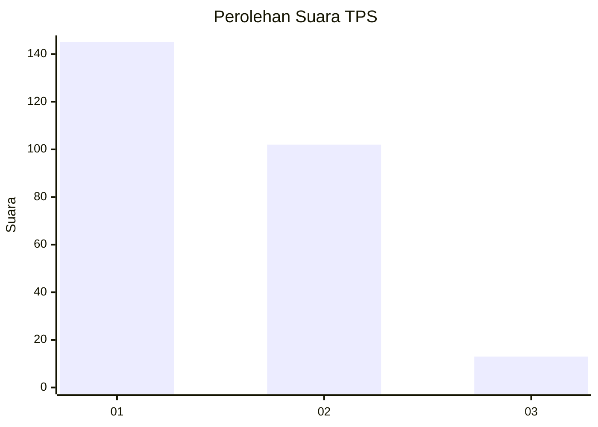
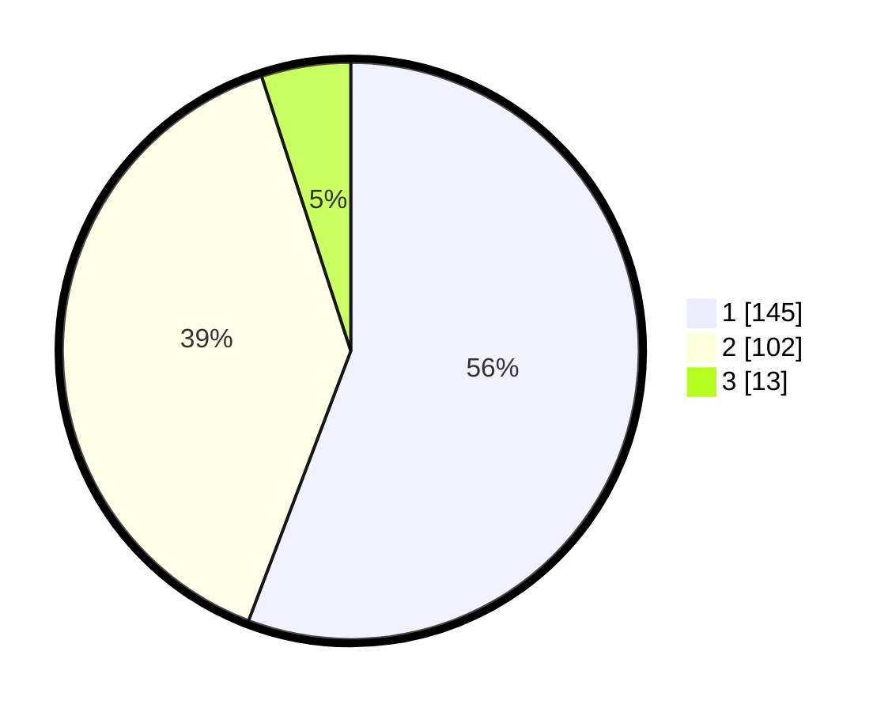

# Hasil

## Grafik

## Tabel

| No. | Nama Paslon    | Suara | Suara (raw) | Persentase |
|:--- |:-------------- | -----:| -----------:| ----------:|
| 1   | ANIES MUHAIMIN | 145   | [145][p-1]  | 55,77      |
| 2   | PRABOWO GIBRAN | 102   | [102][p-2]  | 39,23      |
| 3   | GANJAR MAHFUD  | 13    | [13][p-3]   | 5,00       |

[p-1]: https://github.com/gigit-pemilu/pemilu-2024-14-riau/blob/main/pilpres/hitung-suara/sub/14-riau/sub/06--rokan-hulu/sub/05-kepenuhan/sub/1001-kepenuhantengah/sub/010-tps/sub/paslon-1.txt
[p-2]: https://github.com/gigit-pemilu/pemilu-2024-14-riau/blob/main/pilpres/hitung-suara/sub/14-riau/sub/06--rokan-hulu/sub/05-kepenuhan/sub/1001-kepenuhantengah/sub/010-tps/sub/paslon-2.txt
[p-3]: https://github.com/gigit-pemilu/pemilu-2024-14-riau/blob/main/pilpres/hitung-suara/sub/14-riau/sub/06--rokan-hulu/sub/05-kepenuhan/sub/1001-kepenuhantengah/sub/010-tps/sub/paslon-3.txt

## Foto C Plano

https://sirekap-obj-formc.kpu.go.id/f447/pemilu/ppwp/14/06/05/10/01/1406051001010-20240216-103546--c294f544-4049-4f35-b7ab-fc15cda8497d.jpg

https://sirekap-obj-formc.kpu.go.id/f447/pemilu/ppwp/14/06/05/10/01/1406051001010-20240221-124053--6f1f3be6-7317-4baa-a9c5-9fe1c14f93e4.jpg

https://sirekap-obj-formc.kpu.go.id/f447/pemilu/ppwp/14/06/05/10/01/1406051001010-20240214-192946--5ae3cecd-c74b-43a2-9ccd-df0b2997eebc.jpg

## Metadata

| Key        | Value               |
| ---------- | ------------------- |
| Time Stamp | 2024-02-22 10:00:00 |

