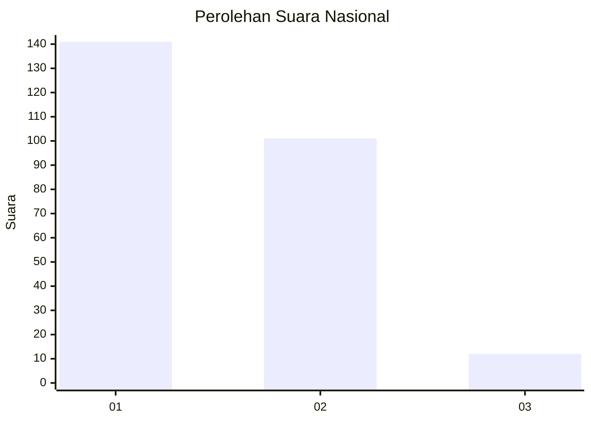
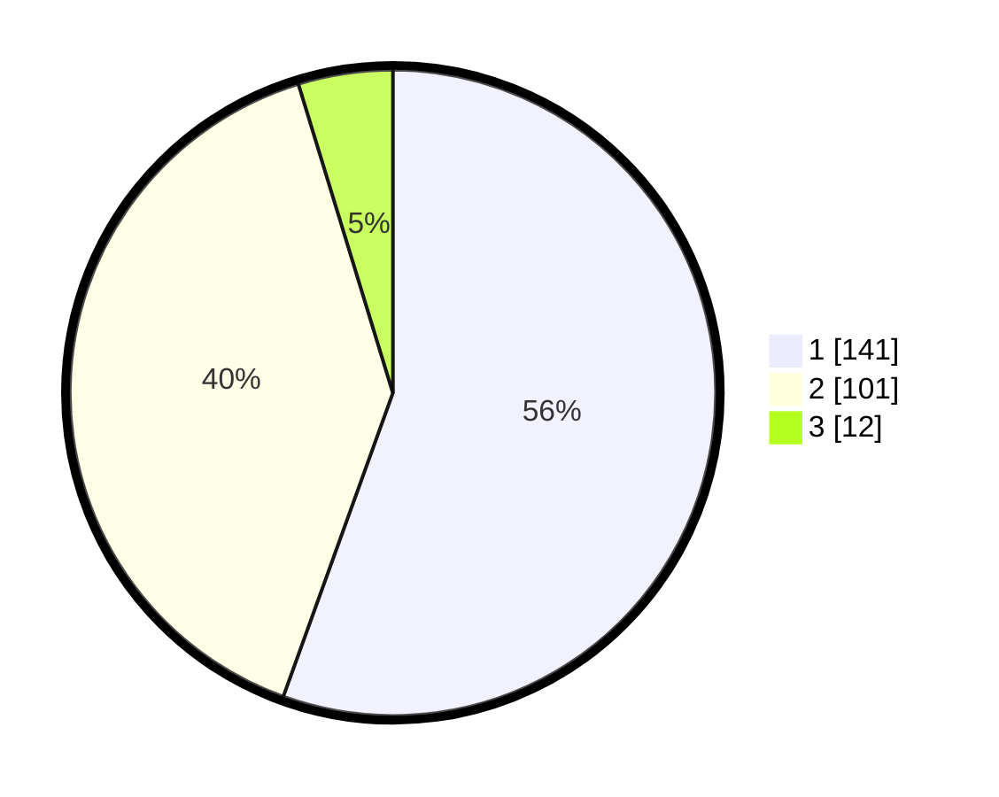

# Hasil

## Grafik

## Tabel

| No. | Nama Paslon    | Suara | Suara (raw) | Persentase |
|:--- |:-------------- | -----:| -----------:| ----------:|
| 1   | ANIES MUHAIMIN | 141   | [141][p-1]  | 55,51      |
| 2   | PRABOWO GIBRAN | 101   | [101][p-2]  | 39,76      |
| 3   | GANJAR MAHFUD  | 12    | [12][p-3]   | 4,72       |

[p-1]: https://github.com/gigit-pemilu/pemilu-2024/blob/main/pilpres/hitung-suara/sub/14-riau/sub/06--rokan-hulu/sub/05-kepenuhan/sub/2003-kepenuhan-barat/sub/006-tps/sub/paslon-1.txt
[p-2]: https://github.com/gigit-pemilu/pemilu-2024/blob/main/pilpres/hitung-suara/sub/14-riau/sub/06--rokan-hulu/sub/05-kepenuhan/sub/2003-kepenuhan-barat/sub/006-tps/sub/paslon-2.txt
[p-3]: https://github.com/gigit-pemilu/pemilu-2024/blob/main/pilpres/hitung-suara/sub/14-riau/sub/06--rokan-hulu/sub/05-kepenuhan/sub/2003-kepenuhan-barat/sub/006-tps/sub/paslon-3.txt

## Foto C Plano

https://sirekap-obj-formc.kpu.go.id/792c/pemilu/ppwp/14/06/05/20/03/1406052003006-20240217-101202--833972ee-2d76-4707-acc2-6cd90655a64a.jpg

https://sirekap-obj-formc.kpu.go.id/792c/pemilu/ppwp/14/06/05/20/03/1406052003006-20240217-102947--0bea5265-bd02-40d8-ad95-d6e32d32ccd5.jpg

https://sirekap-obj-formc.kpu.go.id/792c/pemilu/ppwp/14/06/05/20/03/1406052003006-20240217-104735--59cae99d-3acb-46b4-b06e-66ca6ee85089.jpg

## Metadata

| Key        | Value               |
| ---------- | ------------------- |
| Time Stamp | 2024-02-17 11:30:03 |

