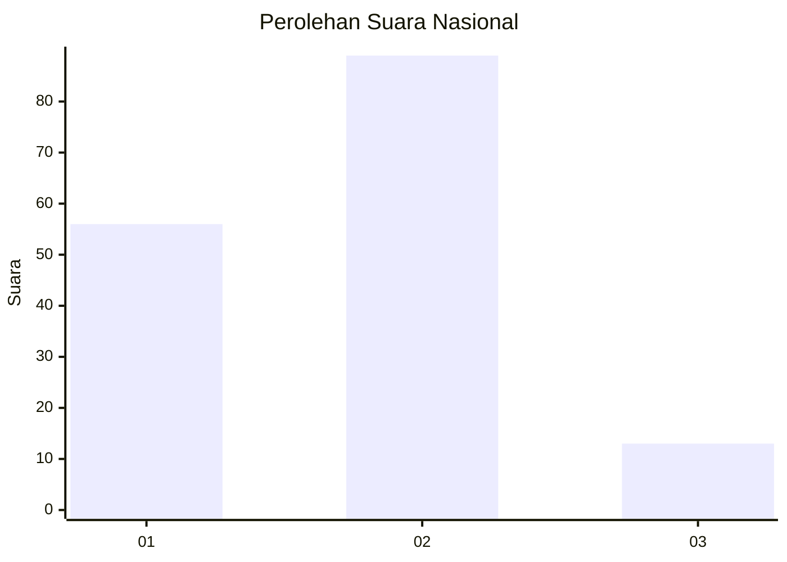
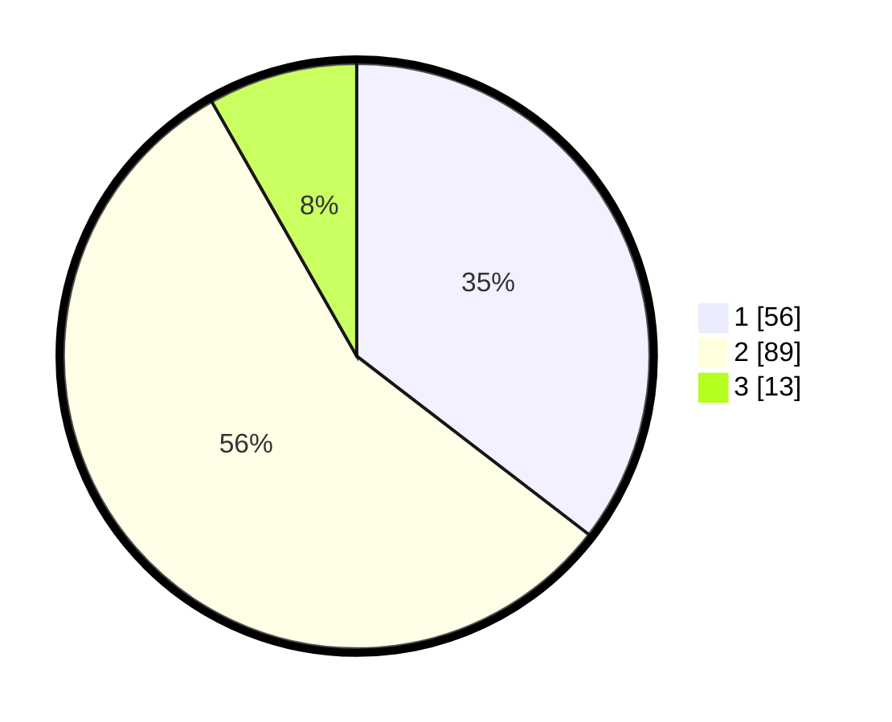

# Hasil

## Grafik

## Tabel

| No. | Nama Paslon    | Suara | Suara (raw) | Persentase |
|:--- |:-------------- | -----:| -----------:| ----------:|
| 1   | ANIES MUHAIMIN | 56    | [56][p-1]   | 35,44      |
| 2   | PRABOWO GIBRAN | 89    | [89][p-2]   | 56,33      |
| 3   | GANJAR MAHFUD  | 13    | [13][p-3]   | 8,23       |

[p-1]: https://github.com/gigit-pemilu/pemilu-2024/blob/main/pilpres/hitung-suara/sub/14-riau/sub/06--rokan-hulu/sub/05-kepenuhan/sub/2012-rantau-binuang-sakti/sub/002-tps/sub/paslon-1.txt
[p-2]: https://github.com/gigit-pemilu/pemilu-2024/blob/main/pilpres/hitung-suara/sub/14-riau/sub/06--rokan-hulu/sub/05-kepenuhan/sub/2012-rantau-binuang-sakti/sub/002-tps/sub/paslon-2.txt
[p-3]: https://github.com/gigit-pemilu/pemilu-2024/blob/main/pilpres/hitung-suara/sub/14-riau/sub/06--rokan-hulu/sub/05-kepenuhan/sub/2012-rantau-binuang-sakti/sub/002-tps/sub/paslon-3.txt

## Foto C Plano

https://sirekap-obj-formc.kpu.go.id/dd5f/pemilu/ppwp/14/06/05/20/12/1406052012002-20240217-105811--ad12ee52-91bb-4c6f-b47d-8d72fcf0c565.jpg

https://sirekap-obj-formc.kpu.go.id/dd5f/pemilu/ppwp/14/06/05/20/12/1406052012002-20240217-114943--df558db9-b85f-4c61-9d13-bdbb1aaa8d95.jpg

https://sirekap-obj-formc.kpu.go.id/dd5f/pemilu/ppwp/14/06/05/20/12/1406052012002-20240216-213651--1ec1c90e-579f-432e-ac30-b951a43e9095.jpg

## Metadata

| Key        | Value               |
| ---------- | ------------------- |
| Time Stamp | 2024-02-17 16:00:02 |

