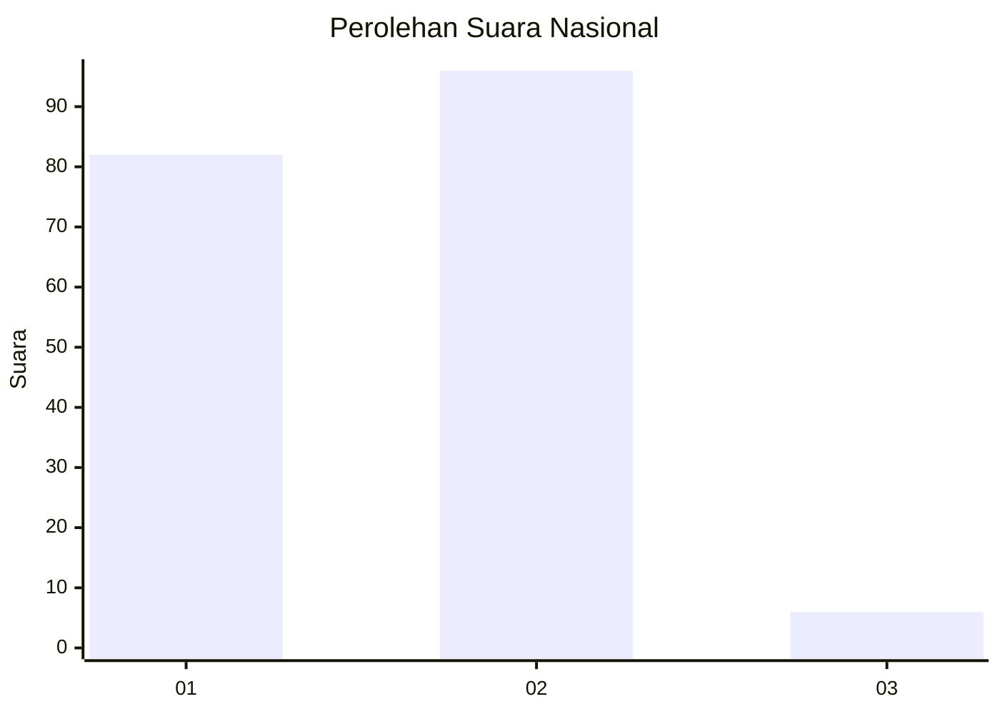
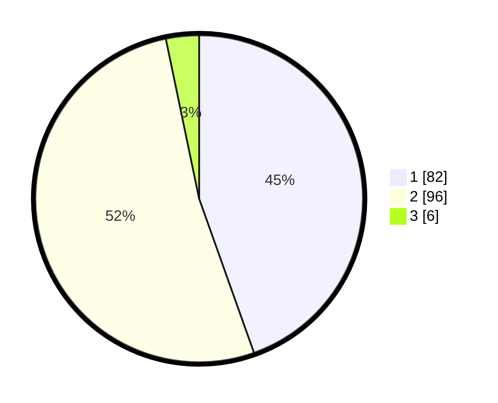

# Hasil

## Grafik

## Tabel

| No. | Nama Paslon    | Suara | Suara (raw) | Persentase |
|:--- |:-------------- | -----:| -----------:| ----------:|
| 1   | ANIES MUHAIMIN | 82    | [82][p-1]   | 44,57      |
| 2   | PRABOWO GIBRAN | 96    | [96][p-2]   | 52,17      |
| 3   | GANJAR MAHFUD  | 6     | [6][p-3]    | 3,26       |

[p-1]: https://github.com/gigit-pemilu/pemilu-2024/blob/main/pilpres/hitung-suara/sub/14-riau/sub/06--rokan-hulu/sub/06-kunto-darussalam/sub/1001-kota-lama/sub/001-tps/sub/paslon-1.txt
[p-2]: https://github.com/gigit-pemilu/pemilu-2024/blob/main/pilpres/hitung-suara/sub/14-riau/sub/06--rokan-hulu/sub/06-kunto-darussalam/sub/1001-kota-lama/sub/001-tps/sub/paslon-2.txt
[p-3]: https://github.com/gigit-pemilu/pemilu-2024/blob/main/pilpres/hitung-suara/sub/14-riau/sub/06--rokan-hulu/sub/06-kunto-darussalam/sub/1001-kota-lama/sub/001-tps/sub/paslon-3.txt

## Foto C Plano

https://sirekap-obj-formc.kpu.go.id/6733/pemilu/ppwp/14/06/06/10/01/1406061001001-20240215-014635--a72efc5e-4cb5-4453-a348-59e6da61fef9.jpg

https://sirekap-obj-formc.kpu.go.id/6733/pemilu/ppwp/14/06/06/10/01/1406061001001-20240215-014828--5ace52f5-f38e-438d-bc6e-c9983b1f0bc6.jpg

https://sirekap-obj-formc.kpu.go.id/6733/pemilu/ppwp/14/06/06/10/01/1406061001001-20240215-015016--69252770-ea55-46c7-a5b7-ad2cf861d836.jpg

## Metadata

| Key        | Value               |
| ---------- | ------------------- |
| Time Stamp | 2024-02-15 21:30:27 |

