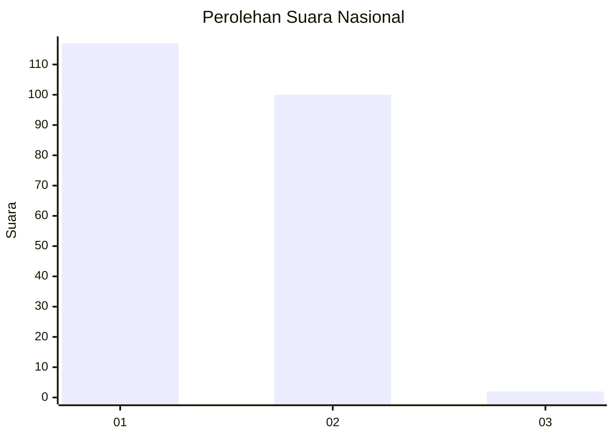
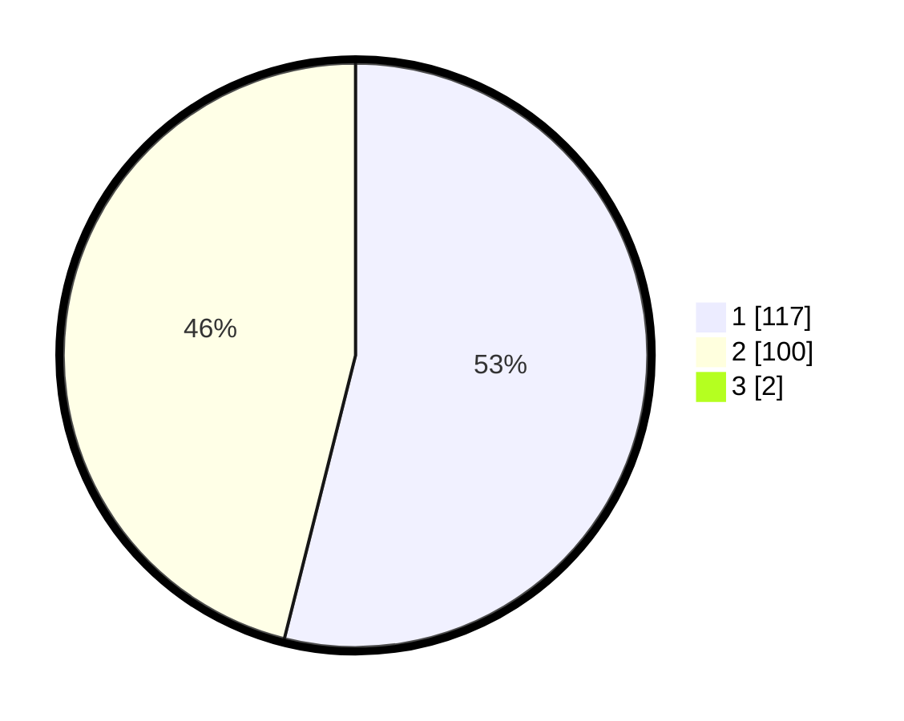

# Hasil

## Grafik

## Tabel

| No. | Nama Paslon    | Suara | Suara (raw) | Persentase |
|:--- |:-------------- | -----:| -----------:| ----------:|
| 1   | ANIES MUHAIMIN | 117   | [117][p-1]  | 53,42      |
| 2   | PRABOWO GIBRAN | 100   | [100][p-2]  | 45,66      |
| 3   | GANJAR MAHFUD  | 2     | [2][p-3]    | 0,91       |

[p-1]: https://github.com/gigit-pemilu/pemilu-2024/blob/main/pilpres/hitung-suara/sub/14-riau/sub/06--rokan-hulu/sub/07-rambah-samo/sub/2001-rambah-samo/sub/009-tps/sub/paslon-1.txt
[p-2]: https://github.com/gigit-pemilu/pemilu-2024/blob/main/pilpres/hitung-suara/sub/14-riau/sub/06--rokan-hulu/sub/07-rambah-samo/sub/2001-rambah-samo/sub/009-tps/sub/paslon-2.txt
[p-3]: https://github.com/gigit-pemilu/pemilu-2024/blob/main/pilpres/hitung-suara/sub/14-riau/sub/06--rokan-hulu/sub/07-rambah-samo/sub/2001-rambah-samo/sub/009-tps/sub/paslon-3.txt

## Foto C Plano

https://sirekap-obj-formc.kpu.go.id/6d1c/pemilu/ppwp/14/06/07/20/01/1406072001009-20240214-213011--1ee7bfa3-2277-42cc-8e07-d27c5a703920.jpg

https://sirekap-obj-formc.kpu.go.id/6d1c/pemilu/ppwp/14/06/07/20/01/1406072001009-20240214-213102--b0dbef8f-710e-4cdf-970c-3f43c7356af8.jpg

https://sirekap-obj-formc.kpu.go.id/6d1c/pemilu/ppwp/14/06/07/20/01/1406072001009-20240214-213121--1e9e7ebd-034e-4b80-a812-12d95f32c987.jpg

## Metadata

| Key        | Value               |
| ---------- | ------------------- |
| Time Stamp | 2024-02-15 15:30:25 |

