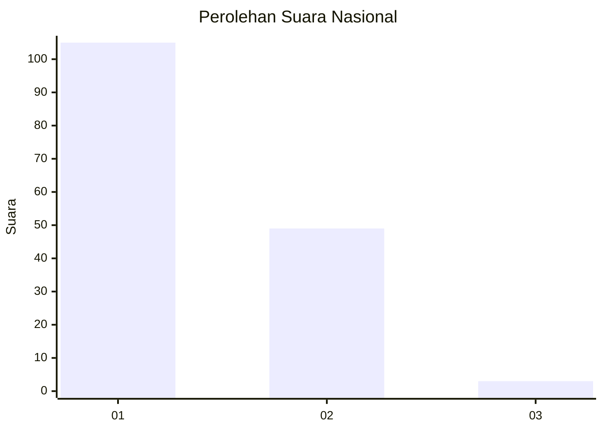
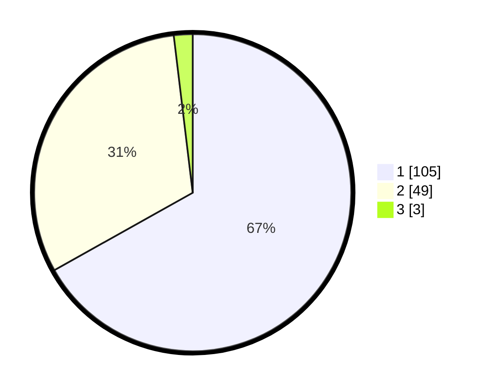

# Hasil

## Grafik

## Tabel

| No. | Nama Paslon    | Suara | Suara (raw) | Persentase |
|:--- |:-------------- | -----:| -----------:| ----------:|
| 1   | ANIES MUHAIMIN | 105   | [105][p-1]  | 66,88      |
| 2   | PRABOWO GIBRAN | 49    | [49][p-2]   | 31,21      |
| 3   | GANJAR MAHFUD  | 3     | [3][p-3]    | 1,91       |

[p-1]: https://github.com/gigit-pemilu/pemilu-2024/blob/main/pilpres/hitung-suara/sub/14-riau/sub/06--rokan-hulu/sub/07-rambah-samo/sub/2002-rambah-samo-barat/sub/004-tps/sub/paslon-1.txt
[p-2]: https://github.com/gigit-pemilu/pemilu-2024/blob/main/pilpres/hitung-suara/sub/14-riau/sub/06--rokan-hulu/sub/07-rambah-samo/sub/2002-rambah-samo-barat/sub/004-tps/sub/paslon-2.txt
[p-3]: https://github.com/gigit-pemilu/pemilu-2024/blob/main/pilpres/hitung-suara/sub/14-riau/sub/06--rokan-hulu/sub/07-rambah-samo/sub/2002-rambah-samo-barat/sub/004-tps/sub/paslon-3.txt

## Foto C Plano

https://sirekap-obj-formc.kpu.go.id/0278/pemilu/ppwp/14/06/07/20/02/1406072002004-20240215-032204--3b9352b9-ec17-4669-b4e0-72e619b41942.jpg

https://sirekap-obj-formc.kpu.go.id/0278/pemilu/ppwp/14/06/07/20/02/1406072002004-20240215-032013--dfb1a56c-3c10-4042-a3ba-94e04cad17ac.jpg

https://sirekap-obj-formc.kpu.go.id/0278/pemilu/ppwp/14/06/07/20/02/1406072002004-20240215-032318--586d339f-c6c9-40ab-b8ad-b241bb5a4511.jpg

## Metadata

| Key        | Value               |
| ---------- | ------------------- |
| Time Stamp | 2024-02-15 15:30:25 |

