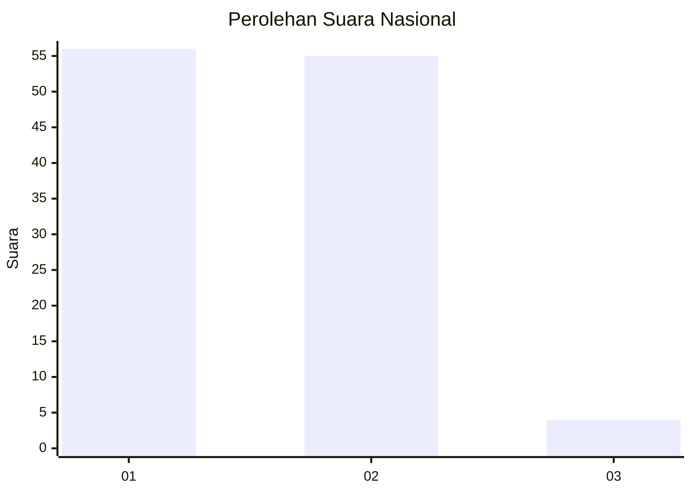
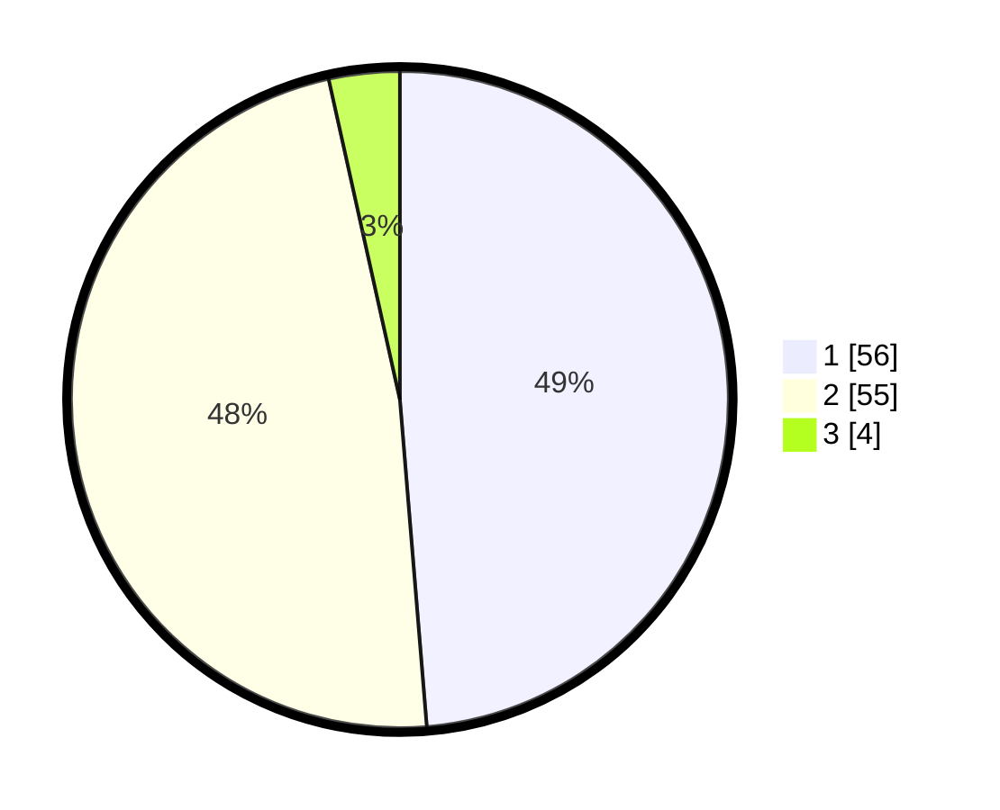

# Hasil

## Grafik

## Tabel

| No. | Nama Paslon    | Suara | Suara (raw) | Persentase |
|:--- |:-------------- | -----:| -----------:| ----------:|
| 1   | ANIES MUHAIMIN | 56    | [56][p-1]   | 48,70      |
| 2   | PRABOWO GIBRAN | 55    | [55][p-2]   | 47,83      |
| 3   | GANJAR MAHFUD  | 4     | [4][p-3]    | 3,48       |

[p-1]: https://github.com/gigit-pemilu/pemilu-2024/blob/main/pilpres/hitung-suara/sub/14-riau/sub/06--rokan-hulu/sub/07-rambah-samo/sub/2002-rambah-samo-barat/sub/012-tps/sub/paslon-1.txt
[p-2]: https://github.com/gigit-pemilu/pemilu-2024/blob/main/pilpres/hitung-suara/sub/14-riau/sub/06--rokan-hulu/sub/07-rambah-samo/sub/2002-rambah-samo-barat/sub/012-tps/sub/paslon-2.txt
[p-3]: https://github.com/gigit-pemilu/pemilu-2024/blob/main/pilpres/hitung-suara/sub/14-riau/sub/06--rokan-hulu/sub/07-rambah-samo/sub/2002-rambah-samo-barat/sub/012-tps/sub/paslon-3.txt

## Foto C Plano

https://sirekap-obj-formc.kpu.go.id/3881/pemilu/ppwp/14/06/07/20/02/1406072002012-20240214-191802--0f93492c-1f13-4ff6-a49c-d8a01d487c1c.jpg

https://sirekap-obj-formc.kpu.go.id/3881/pemilu/ppwp/14/06/07/20/02/1406072002012-20240214-191816--30af75e2-bd2b-4961-8fef-f8140501117b.jpg

https://sirekap-obj-formc.kpu.go.id/3881/pemilu/ppwp/14/06/07/20/02/1406072002012-20240214-191830--37d3796b-55b0-44a4-a268-c7a3a509b00d.jpg

## Metadata

| Key        | Value               |
| ---------- | ------------------- |
| Time Stamp | 2024-02-15 16:00:26 |

