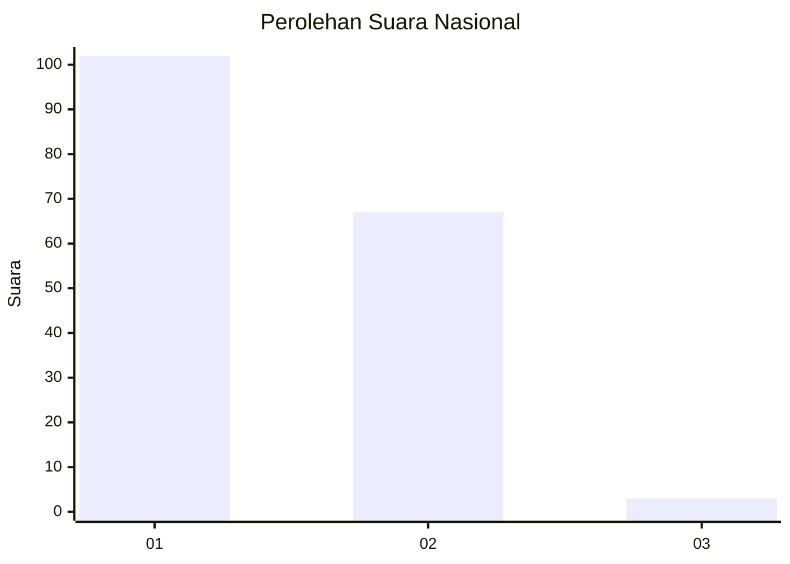
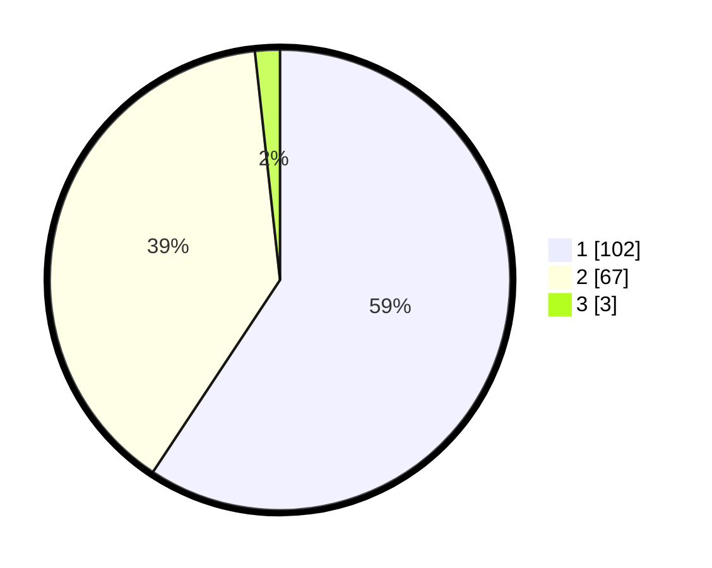

# Hasil

## Grafik

## Tabel

| No. | Nama Paslon    | Suara | Suara (raw) | Persentase |
|:--- |:-------------- | -----:| -----------:| ----------:|
| 1   | ANIES MUHAIMIN | 102   | [102][p-1]  | 59,30      |
| 2   | PRABOWO GIBRAN | 67    | [67][p-2]   | 38,95      |
| 3   | GANJAR MAHFUD  | 3     | [3][p-3]    | 1,74       |

[p-1]: https://github.com/gigit-pemilu/pemilu-2024/blob/main/pilpres/hitung-suara/sub/14-riau/sub/06--rokan-hulu/sub/08-rambah-hilir/sub/2001-rambah-hilir/sub/003-tps/sub/paslon-1.txt
[p-2]: https://github.com/gigit-pemilu/pemilu-2024/blob/main/pilpres/hitung-suara/sub/14-riau/sub/06--rokan-hulu/sub/08-rambah-hilir/sub/2001-rambah-hilir/sub/003-tps/sub/paslon-2.txt
[p-3]: https://github.com/gigit-pemilu/pemilu-2024/blob/main/pilpres/hitung-suara/sub/14-riau/sub/06--rokan-hulu/sub/08-rambah-hilir/sub/2001-rambah-hilir/sub/003-tps/sub/paslon-3.txt

## Foto C Plano

https://sirekap-obj-formc.kpu.go.id/6eb6/pemilu/ppwp/14/06/08/20/01/1406082001003-20240215-033958--33a23add-8fac-4f16-affc-492a65733e84.jpg

https://sirekap-obj-formc.kpu.go.id/6eb6/pemilu/ppwp/14/06/08/20/01/1406082001003-20240215-033747--a0845d75-65ef-4157-ac47-800eeedda0d1.jpg

https://sirekap-obj-formc.kpu.go.id/6eb6/pemilu/ppwp/14/06/08/20/01/1406082001003-20240214-213707--93b698ad-bbdc-465d-b9a7-4becdcc93e36.jpg

## Metadata

| Key        | Value               |
| ---------- | ------------------- |
| Time Stamp | 2024-02-15 15:00:29 |

