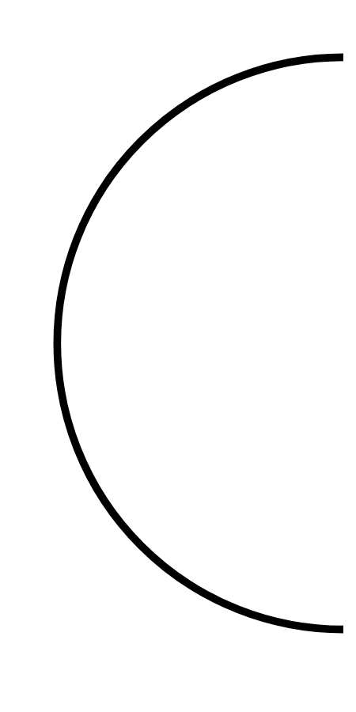

# Hasil

## Grafik

```mermaid
xychart-beta
    title "Perolehan Suara Nasional"
    x-axis []
    y-axis "Suara" 0 --> 0
    bar []
```



## Tabel

| No. | Nama Paslon | Suara | Suara (raw) | Persentase |
|:--- |:----------- | -----:| -----------:| ----------:|


[p-1]: https://github.com/gigit-pemilu/pemilu-2024/blob/main/pilpres/hitung-suara/sub/14-riau/sub/06--rokan-hulu/sub/08-rambah-hilir/sub/2002-rambah-hilir-tengah/sub/007-tps/sub/paslon-1.txt
[p-2]: https://github.com/gigit-pemilu/pemilu-2024/blob/main/pilpres/hitung-suara/sub/14-riau/sub/06--rokan-hulu/sub/08-rambah-hilir/sub/2002-rambah-hilir-tengah/sub/007-tps/sub/paslon-2.txt
[p-3]: https://github.com/gigit-pemilu/pemilu-2024/blob/main/pilpres/hitung-suara/sub/14-riau/sub/06--rokan-hulu/sub/08-rambah-hilir/sub/2002-rambah-hilir-tengah/sub/007-tps/sub/paslon-3.txt

## Foto C Plano

https://sirekap-obj-formc.kpu.go.id/9839/pemilu/ppwp/14/06/08/20/02/1406082002007-20240219-162350--0ac0e4f9-080e-4380-8930-a4f59babfa60.jpg

https://sirekap-obj-formc.kpu.go.id/9839/pemilu/ppwp/14/06/08/20/02/1406082002007-20240219-225142--1799376f-1c5b-408a-a6ee-2acb3ba9ab46.jpg

https://sirekap-obj-formc.kpu.go.id/9839/pemilu/ppwp/14/06/08/20/02/1406082002007-20240219-225737--766d580f-c218-4fa2-bf28-686deaa42932.jpg


## Metadata

| Key        | Value               |
| ---------- | ------------------- |
| Time Stamp | 2024-02-19 23:00:00 |


