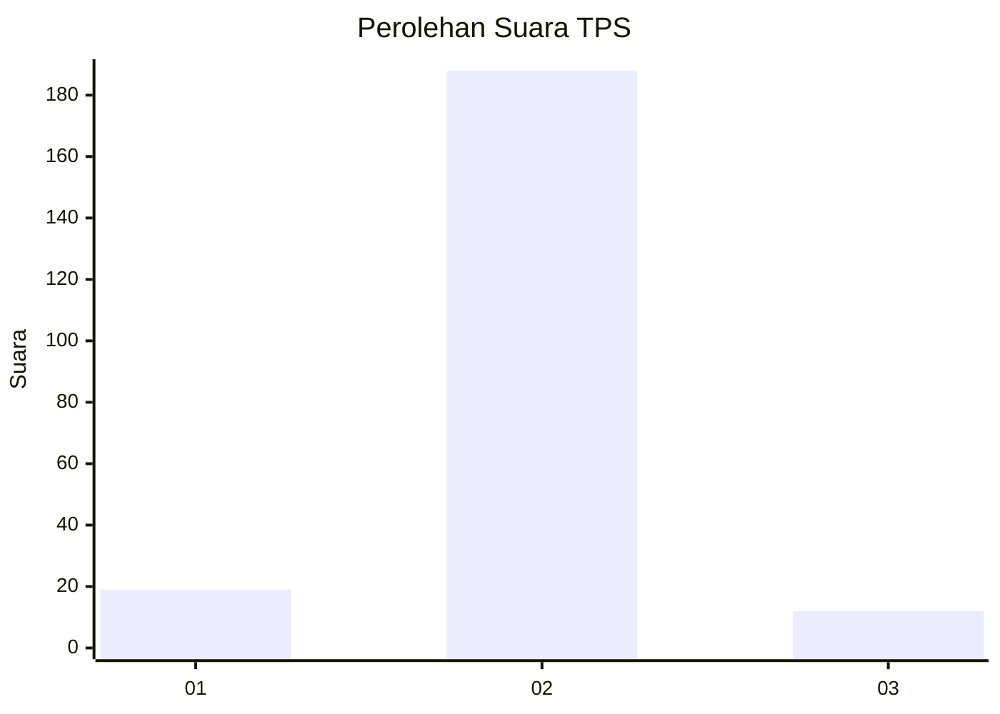
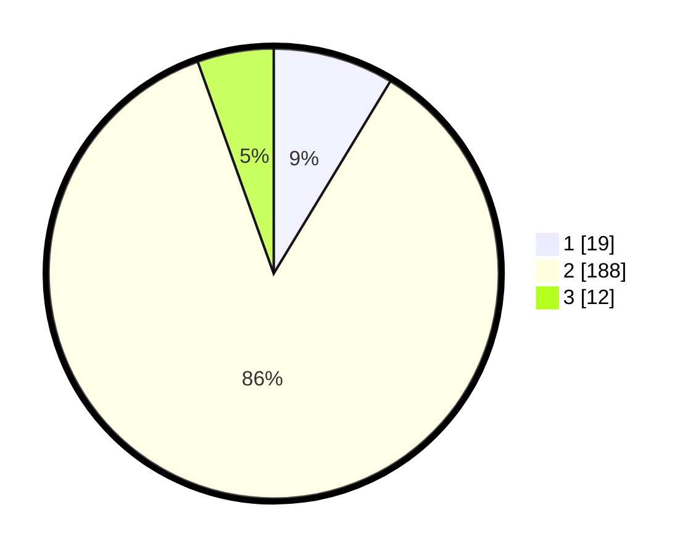

# Hasil

## Grafik

## Tabel

| No. | Nama Paslon    | Suara | Suara (raw) | Persentase |
|:--- |:-------------- | -----:| -----------:| ----------:|
| 1   | ANIES MUHAIMIN | 19    | [19][p-1]   | 8,68       |
| 2   | PRABOWO GIBRAN | 188   | [188][p-2]  | 85,84      |
| 3   | GANJAR MAHFUD  | 12    | [12][p-3]   | 5,48       |

[p-1]: https://github.com/gigit-pemilu/pemilu-2024-14-riau/blob/main/pilpres/hitung-suara/sub/14-riau/sub/06--rokan-hulu/sub/08-rambah-hilir/sub/2004-pasir-utama/sub/008-tps/sub/paslon-1.txt
[p-2]: https://github.com/gigit-pemilu/pemilu-2024-14-riau/blob/main/pilpres/hitung-suara/sub/14-riau/sub/06--rokan-hulu/sub/08-rambah-hilir/sub/2004-pasir-utama/sub/008-tps/sub/paslon-2.txt
[p-3]: https://github.com/gigit-pemilu/pemilu-2024-14-riau/blob/main/pilpres/hitung-suara/sub/14-riau/sub/06--rokan-hulu/sub/08-rambah-hilir/sub/2004-pasir-utama/sub/008-tps/sub/paslon-3.txt

## Foto C Plano

https://sirekap-obj-formc.kpu.go.id/8391/pemilu/ppwp/14/06/08/20/04/1406082004008-20240215-203232--ea3ad576-e764-4fee-b0c4-8dc182c7f773.jpg

https://sirekap-obj-formc.kpu.go.id/8391/pemilu/ppwp/14/06/08/20/04/1406082004008-20240216-074518--504c0e44-2622-4b23-82ae-69a20a260aa3.jpg

https://sirekap-obj-formc.kpu.go.id/8391/pemilu/ppwp/14/06/08/20/04/1406082004008-20240215-200017--35ab8b91-9554-4b72-b717-fba4d879bcc9.jpg

## Metadata

| Key        | Value               |
| ---------- | ------------------- |
| Time Stamp | 2024-02-16 09:00:28 |

