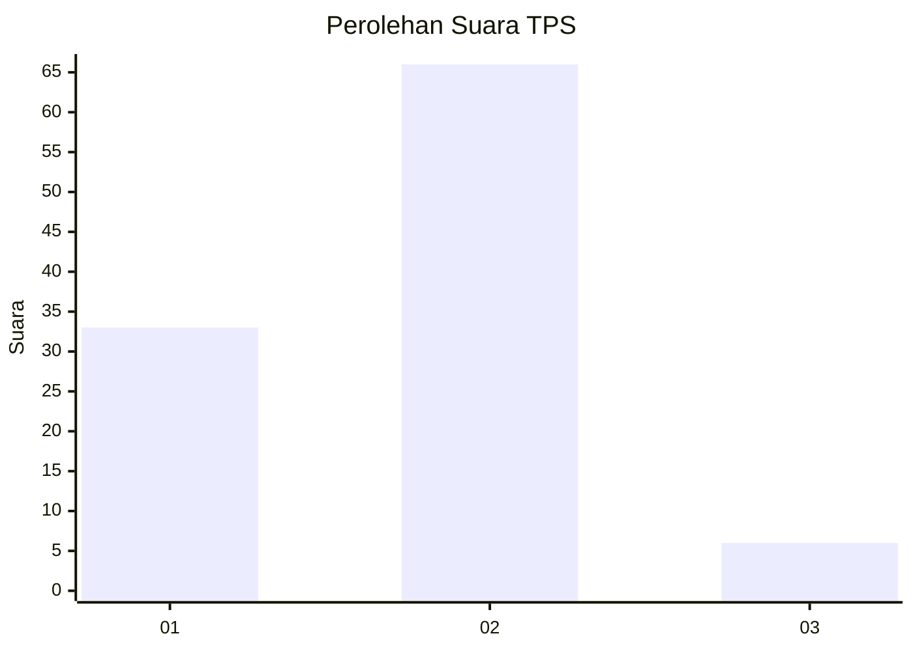
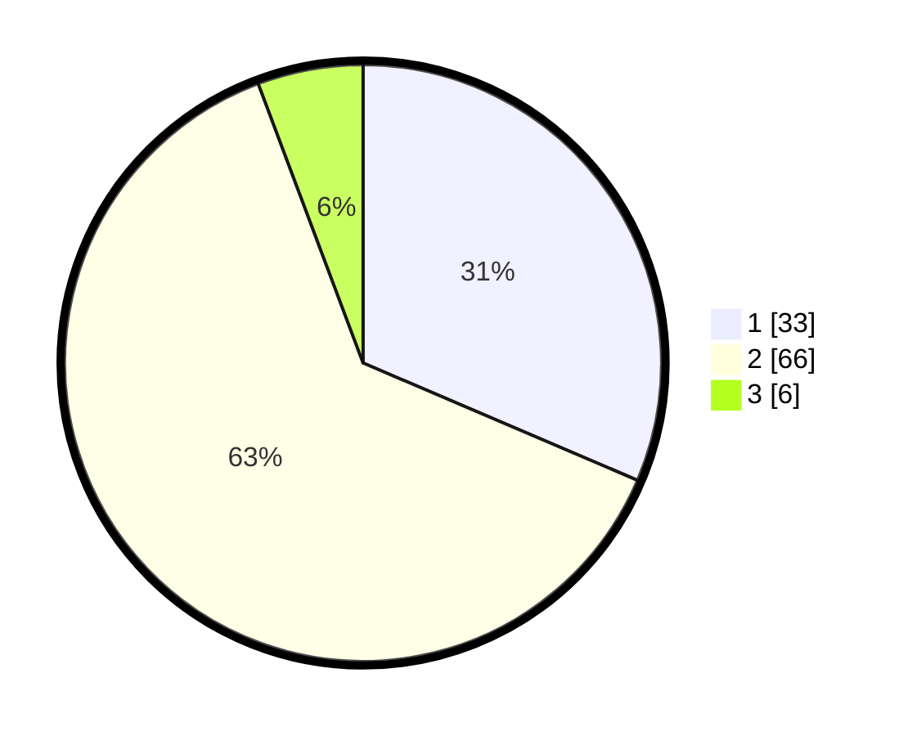

# Hasil

## Grafik

## Tabel

| No. | Nama Paslon    | Suara | Suara (raw) | Persentase |
|:--- |:-------------- | -----:| -----------:| ----------:|
| 1   | ANIES MUHAIMIN | 33    | [33][p-1]   | 31,43      |
| 2   | PRABOWO GIBRAN | 66    | [66][p-2]   | 62,86      |
| 3   | GANJAR MAHFUD  | 6     | [6][p-3]    | 5,71       |

[p-1]: https://github.com/gigit-pemilu/pemilu-2024-14-riau/blob/main/pilpres/hitung-suara/sub/14-riau/sub/06--rokan-hulu/sub/08-rambah-hilir/sub/2007-sungai-sitolang/sub/007-tps/sub/paslon-1.txt
[p-2]: https://github.com/gigit-pemilu/pemilu-2024-14-riau/blob/main/pilpres/hitung-suara/sub/14-riau/sub/06--rokan-hulu/sub/08-rambah-hilir/sub/2007-sungai-sitolang/sub/007-tps/sub/paslon-2.txt
[p-3]: https://github.com/gigit-pemilu/pemilu-2024-14-riau/blob/main/pilpres/hitung-suara/sub/14-riau/sub/06--rokan-hulu/sub/08-rambah-hilir/sub/2007-sungai-sitolang/sub/007-tps/sub/paslon-3.txt

## Foto C Plano

https://sirekap-obj-formc.kpu.go.id/2438/pemilu/ppwp/14/06/08/20/07/1406082007007-20240214-140951--38d3cbc5-3232-4752-9fef-06401c309216.jpg

https://sirekap-obj-formc.kpu.go.id/2438/pemilu/ppwp/14/06/08/20/07/1406082007007-20240214-141224--e1748d73-1321-4751-beaf-f9088cb6405c.jpg

https://sirekap-obj-formc.kpu.go.id/2438/pemilu/ppwp/14/06/08/20/07/1406082007007-20240214-141444--ad97e86b-cef6-466a-9498-d300480e79d2.jpg

## Metadata

| Key        | Value               |
| ---------- | ------------------- |
| Time Stamp | 2024-02-15 15:00:29 |

