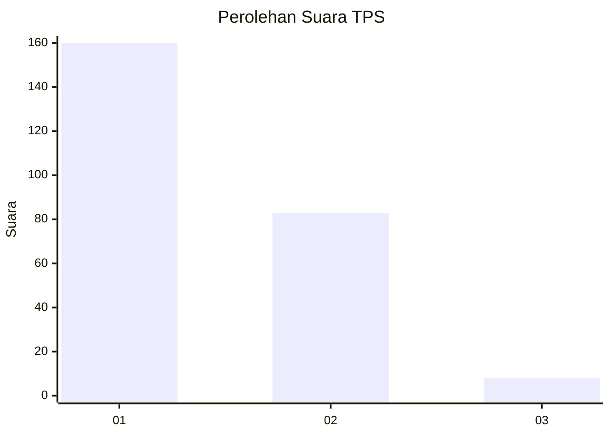
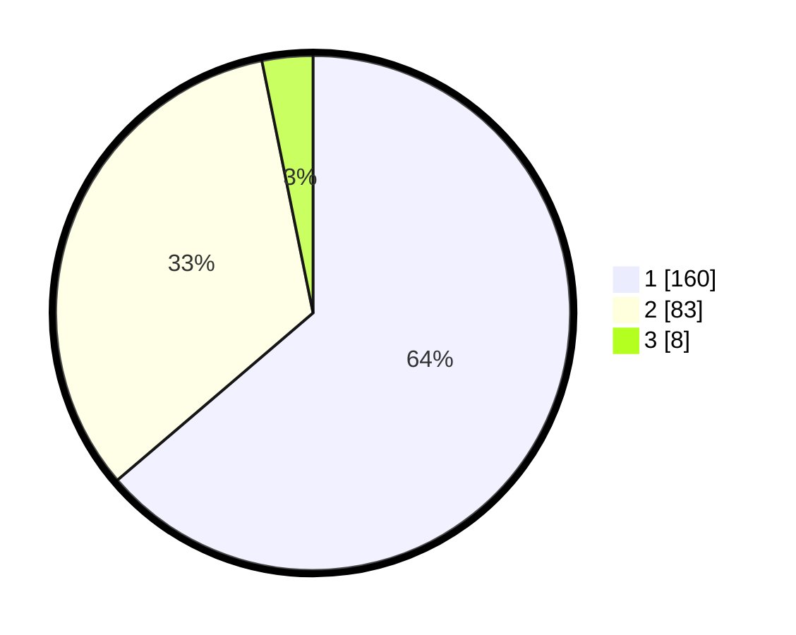

# Hasil

## Grafik

## Tabel

| No. | Nama Paslon    | Suara | Suara (raw) | Persentase |
|:--- |:-------------- | -----:| -----------:| ----------:|
| 1   | ANIES MUHAIMIN | 160   | [160][p-1]  | 63,75      |
| 2   | PRABOWO GIBRAN | 83    | [83][p-2]   | 33,07      |
| 3   | GANJAR MAHFUD  | 8     | [8][p-3]    | 3,19       |

[p-1]: https://github.com/gigit-pemilu/pemilu-2024-14-riau/blob/main/pilpres/hitung-suara/sub/14-riau/sub/06--rokan-hulu/sub/08-rambah-hilir/sub/2012-muara-musu/sub/003-tps/sub/paslon-1.txt
[p-2]: https://github.com/gigit-pemilu/pemilu-2024-14-riau/blob/main/pilpres/hitung-suara/sub/14-riau/sub/06--rokan-hulu/sub/08-rambah-hilir/sub/2012-muara-musu/sub/003-tps/sub/paslon-2.txt
[p-3]: https://github.com/gigit-pemilu/pemilu-2024-14-riau/blob/main/pilpres/hitung-suara/sub/14-riau/sub/06--rokan-hulu/sub/08-rambah-hilir/sub/2012-muara-musu/sub/003-tps/sub/paslon-3.txt

## Foto C Plano

https://sirekap-obj-formc.kpu.go.id/9c4d/pemilu/ppwp/14/06/08/20/12/1406082012003-20240215-034148--ed3e2370-3274-4119-a0d4-6d9c979442bb.jpg

https://sirekap-obj-formc.kpu.go.id/9c4d/pemilu/ppwp/14/06/08/20/12/1406082012003-20240215-034436--682d22a6-c11d-46d3-b5b9-5cbffd653bf3.jpg

https://sirekap-obj-formc.kpu.go.id/9c4d/pemilu/ppwp/14/06/08/20/12/1406082012003-20240215-034600--0edcbda4-9b14-40e5-8c47-7745dc7821d5.jpg

## Metadata

| Key        | Value               |
| ---------- | ------------------- |
| Time Stamp | 2024-02-15 22:30:27 |

