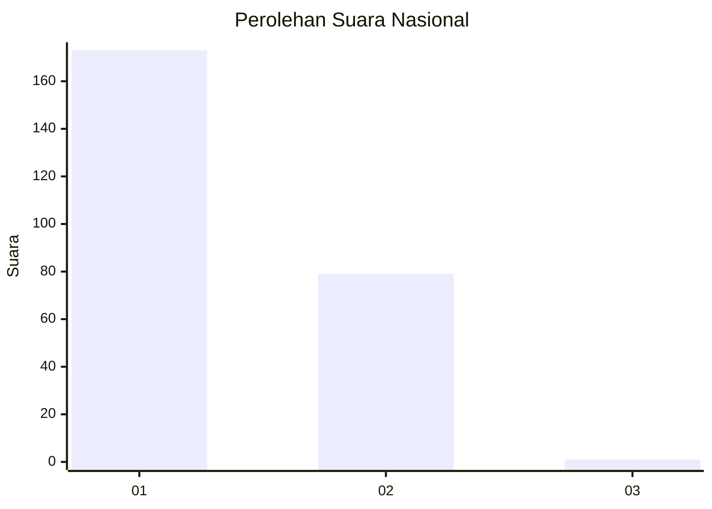
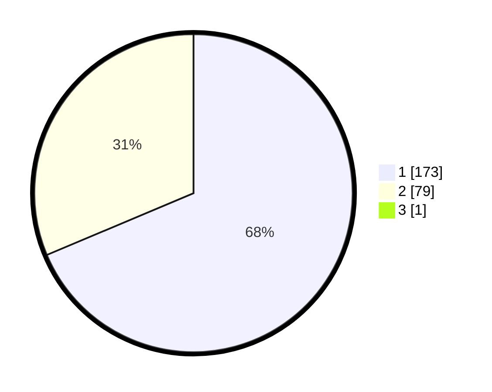

# Hasil

## Grafik

## Tabel

| No. | Nama Paslon    | Suara | Suara (raw) | Persentase |
|:--- |:-------------- | -----:| -----------:| ----------:|
| 1   | ANIES MUHAIMIN | 173   | [173][p-1]  | 68,38      |
| 2   | PRABOWO GIBRAN | 79    | [79][p-2]   | 31,23      |
| 3   | GANJAR MAHFUD  | 1     | [1][p-3]    | 0,40       |

[p-1]: https://github.com/gigit-pemilu/pemilu-2024/blob/main/pilpres/hitung-suara/sub/14-riau/sub/06--rokan-hulu/sub/08-rambah-hilir/sub/2013-sejati/sub/002-tps/sub/paslon-1.txt
[p-2]: https://github.com/gigit-pemilu/pemilu-2024/blob/main/pilpres/hitung-suara/sub/14-riau/sub/06--rokan-hulu/sub/08-rambah-hilir/sub/2013-sejati/sub/002-tps/sub/paslon-2.txt
[p-3]: https://github.com/gigit-pemilu/pemilu-2024/blob/main/pilpres/hitung-suara/sub/14-riau/sub/06--rokan-hulu/sub/08-rambah-hilir/sub/2013-sejati/sub/002-tps/sub/paslon-3.txt

## Foto C Plano

https://sirekap-obj-formc.kpu.go.id/ee74/pemilu/ppwp/14/06/08/20/13/1406082013002-20240215-030702--559d2ba4-dbc3-4ce4-ab84-804fb4d0f4a4.jpg

https://sirekap-obj-formc.kpu.go.id/ee74/pemilu/ppwp/14/06/08/20/13/1406082013002-20240215-030934--bf795cb1-dac8-4ff7-9ef0-507295bf9cfc.jpg

https://sirekap-obj-formc.kpu.go.id/ee74/pemilu/ppwp/14/06/08/20/13/1406082013002-20240215-031401--0e4a8f58-1e0f-46f3-aed9-c30185f54055.jpg

## Metadata

| Key        | Value               |
| ---------- | ------------------- |
| Time Stamp | 2024-02-15 15:30:25 |

