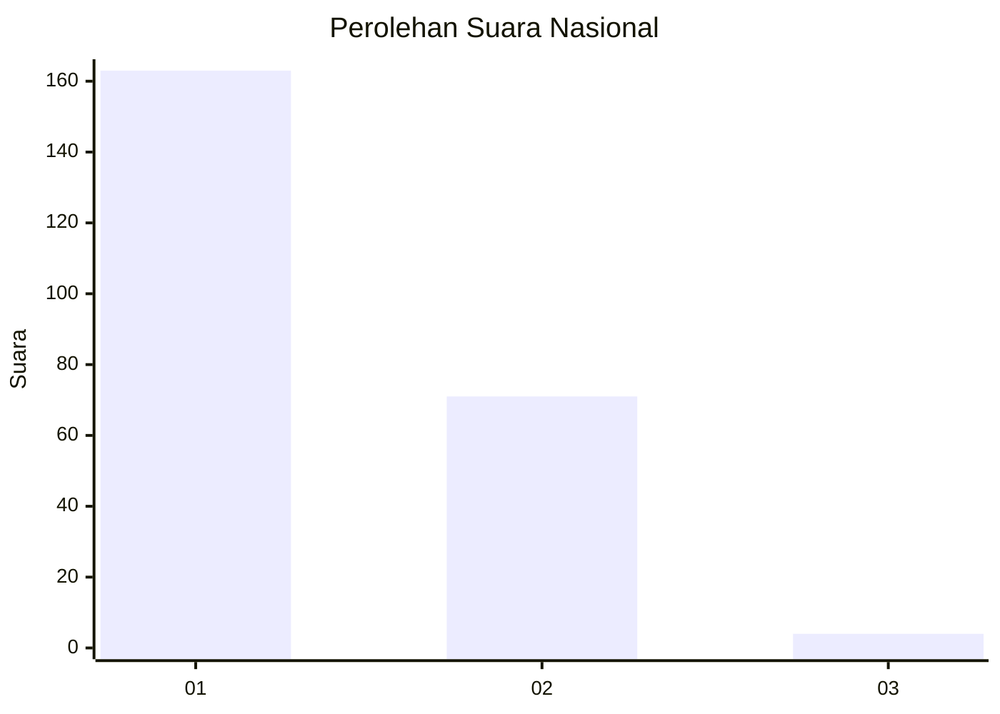
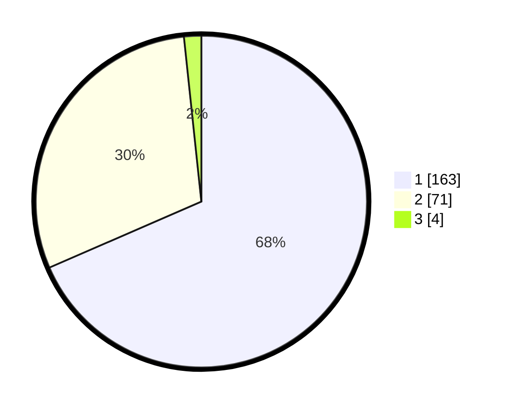

# Hasil

## Grafik

## Tabel

| No. | Nama Paslon    | Suara | Suara (raw) | Persentase |
|:--- |:-------------- | -----:| -----------:| ----------:|
| 1   | ANIES MUHAIMIN | 163   | [163][p-1]  | 68,49      |
| 2   | PRABOWO GIBRAN | 71    | [71][p-2]   | 29,83      |
| 3   | GANJAR MAHFUD  | 4     | [4][p-3]    | 1,68       |

[p-1]: https://github.com/gigit-pemilu/pemilu-2024/blob/main/pilpres/hitung-suara/sub/14-riau/sub/06--rokan-hulu/sub/08-rambah-hilir/sub/2013-sejati/sub/003-tps/sub/paslon-1.txt
[p-2]: https://github.com/gigit-pemilu/pemilu-2024/blob/main/pilpres/hitung-suara/sub/14-riau/sub/06--rokan-hulu/sub/08-rambah-hilir/sub/2013-sejati/sub/003-tps/sub/paslon-2.txt
[p-3]: https://github.com/gigit-pemilu/pemilu-2024/blob/main/pilpres/hitung-suara/sub/14-riau/sub/06--rokan-hulu/sub/08-rambah-hilir/sub/2013-sejati/sub/003-tps/sub/paslon-3.txt

## Foto C Plano

https://sirekap-obj-formc.kpu.go.id/b628/pemilu/ppwp/14/06/08/20/13/1406082013003-20240215-005333--3fdbd4a5-5d1d-427f-b455-e288dff2d732.jpg

https://sirekap-obj-formc.kpu.go.id/b628/pemilu/ppwp/14/06/08/20/13/1406082013003-20240215-011328--36dcf6ea-d827-45dd-8c54-a15bb4e954e4.jpg

https://sirekap-obj-formc.kpu.go.id/b628/pemilu/ppwp/14/06/08/20/13/1406082013003-20240216-142459--2b986b0c-a2ac-48f1-a36a-e21eeadeabee.jpg

## Metadata

| Key        | Value               |
| ---------- | ------------------- |
| Time Stamp | 2024-02-16 14:30:33 |

