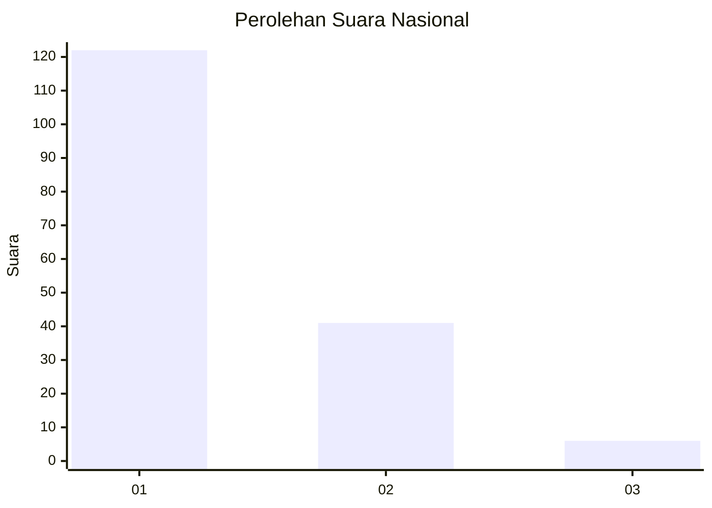
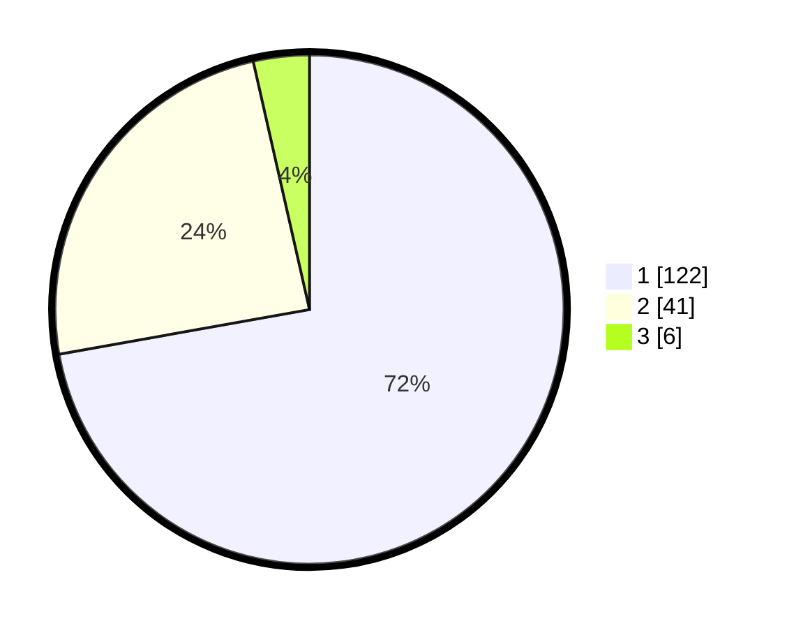

# Hasil

## Grafik

## Tabel

| No. | Nama Paslon    | Suara | Suara (raw) | Persentase |
|:--- |:-------------- | -----:| -----------:| ----------:|
| 1   | ANIES MUHAIMIN | 122   | [122][p-1]  | 72,19      |
| 2   | PRABOWO GIBRAN | 41    | [41][p-2]   | 24,26      |
| 3   | GANJAR MAHFUD  | 6     | [6][p-3]    | 3,55       |

[p-1]: https://github.com/gigit-pemilu/pemilu-2024/blob/main/pilpres/hitung-suara/sub/14-riau/sub/06--rokan-hulu/sub/08-rambah-hilir/sub/2013-sejati/sub/005-tps/sub/paslon-1.txt
[p-2]: https://github.com/gigit-pemilu/pemilu-2024/blob/main/pilpres/hitung-suara/sub/14-riau/sub/06--rokan-hulu/sub/08-rambah-hilir/sub/2013-sejati/sub/005-tps/sub/paslon-2.txt
[p-3]: https://github.com/gigit-pemilu/pemilu-2024/blob/main/pilpres/hitung-suara/sub/14-riau/sub/06--rokan-hulu/sub/08-rambah-hilir/sub/2013-sejati/sub/005-tps/sub/paslon-3.txt

## Foto C Plano

https://sirekap-obj-formc.kpu.go.id/a6da/pemilu/ppwp/14/06/08/20/13/1406082013005-20240215-092605--f2434bc9-d16c-44a6-b7cf-429cdefd55fa.jpg

https://sirekap-obj-formc.kpu.go.id/a6da/pemilu/ppwp/14/06/08/20/13/1406082013005-20240215-033626--ca924ca1-3b3b-407a-9a72-9a93851dcecc.jpg

https://sirekap-obj-formc.kpu.go.id/a6da/pemilu/ppwp/14/06/08/20/13/1406082013005-20240215-093035--bfdb885e-edee-4ca5-93e9-54dedbd10bb9.jpg

## Metadata

| Key        | Value               |
| ---------- | ------------------- |
| Time Stamp | 2024-02-15 22:30:27 |

