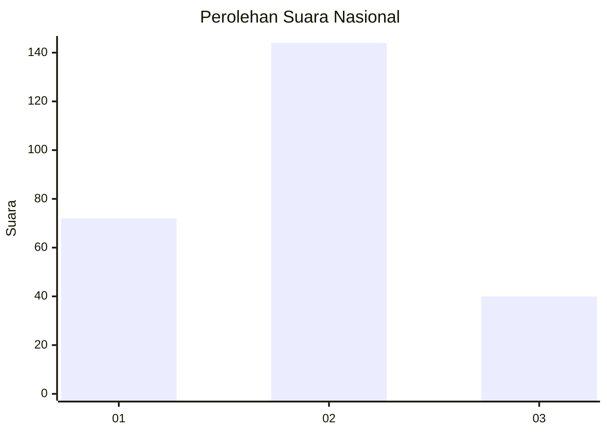
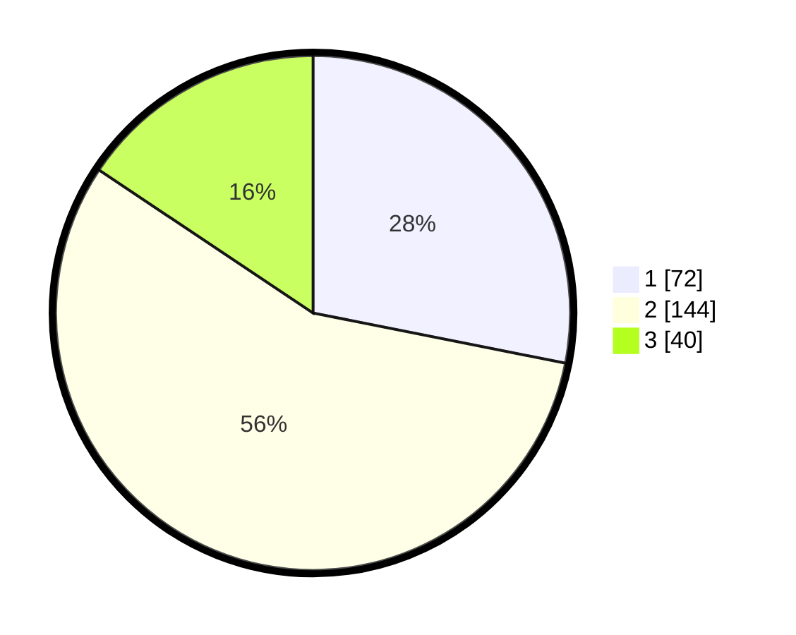

# Hasil

## Grafik

## Tabel

| No. | Nama Paslon    | Suara | Suara (raw) | Persentase |
|:--- |:-------------- | -----:| -----------:| ----------:|
| 1   | ANIES MUHAIMIN | 72    | [72][p-1]   | 28,13      |
| 2   | PRABOWO GIBRAN | 144   | [144][p-2]  | 56,25      |
| 3   | GANJAR MAHFUD  | 40    | [40][p-3]   | 15,63      |

[p-1]: https://github.com/gigit-pemilu/pemilu-2024/blob/main/pilpres/hitung-suara/sub/14-riau/sub/06--rokan-hulu/sub/09-tambusai-utara/sub/2001-tambusai-utara/sub/005-tps/sub/paslon-1.txt
[p-2]: https://github.com/gigit-pemilu/pemilu-2024/blob/main/pilpres/hitung-suara/sub/14-riau/sub/06--rokan-hulu/sub/09-tambusai-utara/sub/2001-tambusai-utara/sub/005-tps/sub/paslon-2.txt
[p-3]: https://github.com/gigit-pemilu/pemilu-2024/blob/main/pilpres/hitung-suara/sub/14-riau/sub/06--rokan-hulu/sub/09-tambusai-utara/sub/2001-tambusai-utara/sub/005-tps/sub/paslon-3.txt

## Foto C Plano

https://sirekap-obj-formc.kpu.go.id/3cf9/pemilu/ppwp/14/06/09/20/01/1406092001005-20240215-022419--77d12eb6-6c39-4d4e-b02d-282e6470c3b6.jpg

https://sirekap-obj-formc.kpu.go.id/3cf9/pemilu/ppwp/14/06/09/20/01/1406092001005-20240215-022530--0f870182-158b-49b7-ac23-c82f3b84771e.jpg

https://sirekap-obj-formc.kpu.go.id/3cf9/pemilu/ppwp/14/06/09/20/01/1406092001005-20240215-022647--f00d4fbc-6152-4552-8638-2f3932123adc.jpg

## Metadata

| Key        | Value               |
| ---------- | ------------------- |
| Time Stamp | 2024-02-15 22:30:27 |

