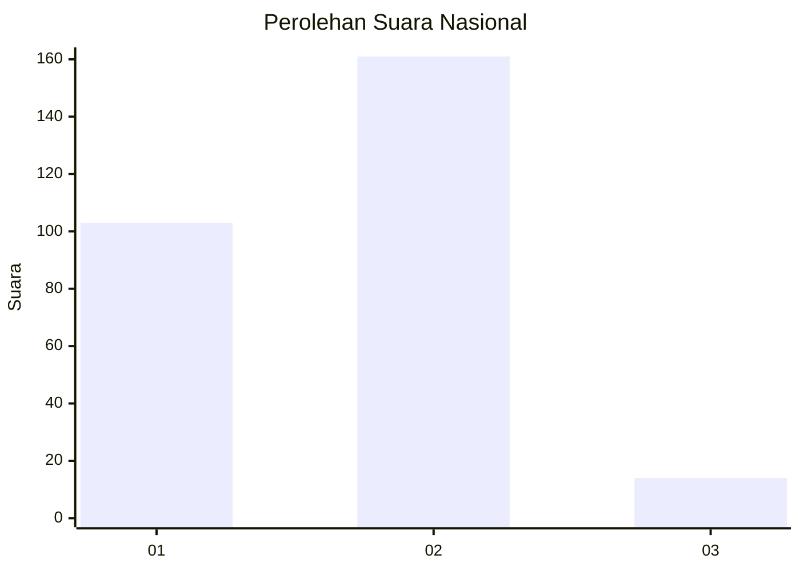
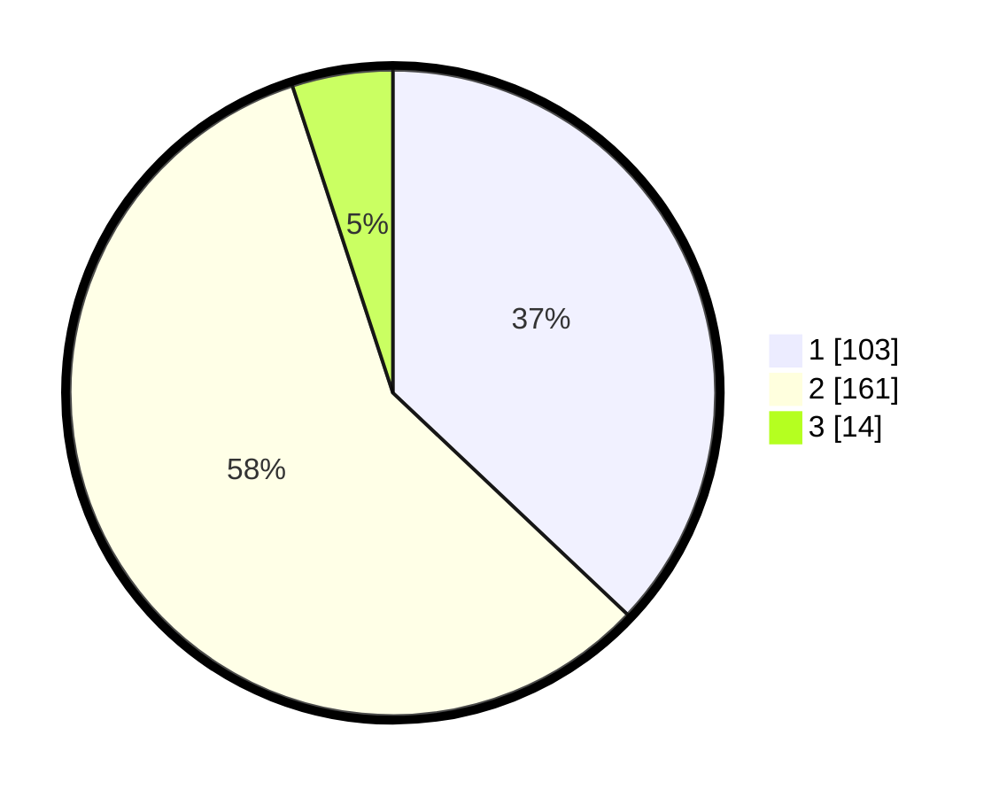

# Hasil

## Grafik

## Tabel

| No. | Nama Paslon    | Suara | Suara (raw) | Persentase |
|:--- |:-------------- | -----:| -----------:| ----------:|
| 1   | ANIES MUHAIMIN | 103   | [103][p-1]  | 37,05      |
| 2   | PRABOWO GIBRAN | 161   | [161][p-2]  | 57,91      |
| 3   | GANJAR MAHFUD  | 14    | [14][p-3]   | 5,04       |

[p-1]: https://github.com/gigit-pemilu/pemilu-2024/blob/main/pilpres/hitung-suara/sub/14-riau/sub/06--rokan-hulu/sub/09-tambusai-utara/sub/2002-mahato/sub/008-tps/sub/paslon-1.txt
[p-2]: https://github.com/gigit-pemilu/pemilu-2024/blob/main/pilpres/hitung-suara/sub/14-riau/sub/06--rokan-hulu/sub/09-tambusai-utara/sub/2002-mahato/sub/008-tps/sub/paslon-2.txt
[p-3]: https://github.com/gigit-pemilu/pemilu-2024/blob/main/pilpres/hitung-suara/sub/14-riau/sub/06--rokan-hulu/sub/09-tambusai-utara/sub/2002-mahato/sub/008-tps/sub/paslon-3.txt

## Foto C Plano

https://sirekap-obj-formc.kpu.go.id/d9e8/pemilu/ppwp/14/06/09/20/02/1406092002008-20240216-130905--524f0b27-2ab5-4aa2-b696-48826bb902a6.jpg

https://sirekap-obj-formc.kpu.go.id/d9e8/pemilu/ppwp/14/06/09/20/02/1406092002008-20240216-130914--98be6e20-be39-4a3a-9268-b0e5fc6673e8.jpg

https://sirekap-obj-formc.kpu.go.id/d9e8/pemilu/ppwp/14/06/09/20/02/1406092002008-20240216-130910--c6620588-023f-4cd4-b052-212376480b09.jpg

## Metadata

| Key        | Value               |
| ---------- | ------------------- |
| Time Stamp | 2024-02-16 21:01:00 |

## DATA PEMILIH TETAP

Jumlah pemilih dalam DPT: **289**.
 * L: **169**.
 * P: **120**.

## DATA PENGGUNA HAK PILIH

Jumlah pengguna hak pilih dalam DPT: **209**.
 * L: **85**.
 * P: **124**.

Jumlah pengguna hak pilih dalam DPTb: **0**.
 * L: **0**.
 * P: **0**.

Jumlah pengguna hak pilih dalam DPK: **77**.
 * L: **32**.
 * P: **45**.

Jumlah pengguna hak pilih: **286**.
 * L: **117**.
 * P: **169**.

## JUMLAH SUARA SAH DAN TIDAK SAH

JUMLAH SELURUH SUARA SAH: **278**.

JUMLAH SUARA TIDAK SAH: **8**.

JUMLAH SELURUH SUARA SAH DAN SUARA TIDAK SAH: **286**.

