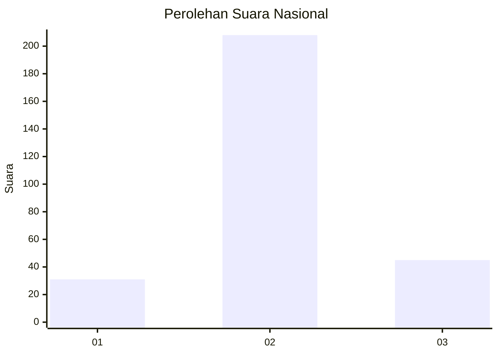
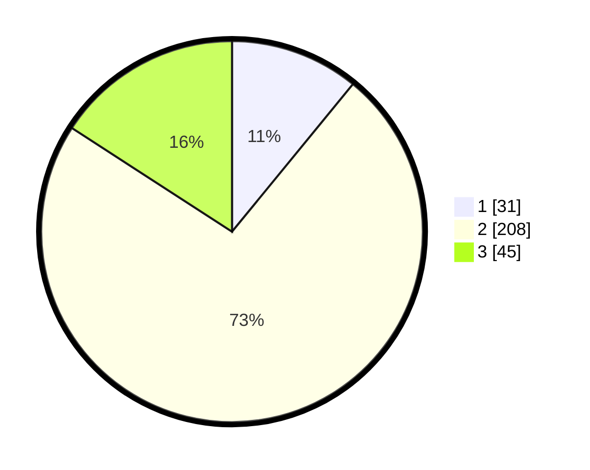

# Hasil

## Grafik

## Tabel

| No. | Nama Paslon    | Suara | Suara (raw) | Persentase |
|:--- |:-------------- | -----:| -----------:| ----------:|
| 1   | ANIES MUHAIMIN | 31    | [31][p-1]   | 10,92      |
| 2   | PRABOWO GIBRAN | 208   | [208][p-2]  | 73,24      |
| 3   | GANJAR MAHFUD  | 45    | [45][p-3]   | 15,85      |

[p-1]: https://github.com/gigit-pemilu/pemilu-2024/blob/main/pilpres/hitung-suara/sub/14-riau/sub/06--rokan-hulu/sub/09-tambusai-utara/sub/2002-mahato/sub/052-tps/sub/paslon-1.txt
[p-2]: https://github.com/gigit-pemilu/pemilu-2024/blob/main/pilpres/hitung-suara/sub/14-riau/sub/06--rokan-hulu/sub/09-tambusai-utara/sub/2002-mahato/sub/052-tps/sub/paslon-2.txt
[p-3]: https://github.com/gigit-pemilu/pemilu-2024/blob/main/pilpres/hitung-suara/sub/14-riau/sub/06--rokan-hulu/sub/09-tambusai-utara/sub/2002-mahato/sub/052-tps/sub/paslon-3.txt

## Foto C Plano

https://sirekap-obj-formc.kpu.go.id/ec90/pemilu/ppwp/14/06/09/20/02/1406092002052-20240215-002011--e65c8dd5-3b79-40ee-8e7f-bcd6729eecc8.jpg

https://sirekap-obj-formc.kpu.go.id/ec90/pemilu/ppwp/14/06/09/20/02/1406092002052-20240215-002107--e94251aa-df04-42ec-a50c-a3775befd4b3.jpg

https://sirekap-obj-formc.kpu.go.id/ec90/pemilu/ppwp/14/06/09/20/02/1406092002052-20240215-002321--84e6427b-9a07-44d9-8acc-bfa485d7d1d3.jpg

## Metadata

| Key        | Value               |
| ---------- | ------------------- |
| Time Stamp | 2024-02-15 22:30:27 |

