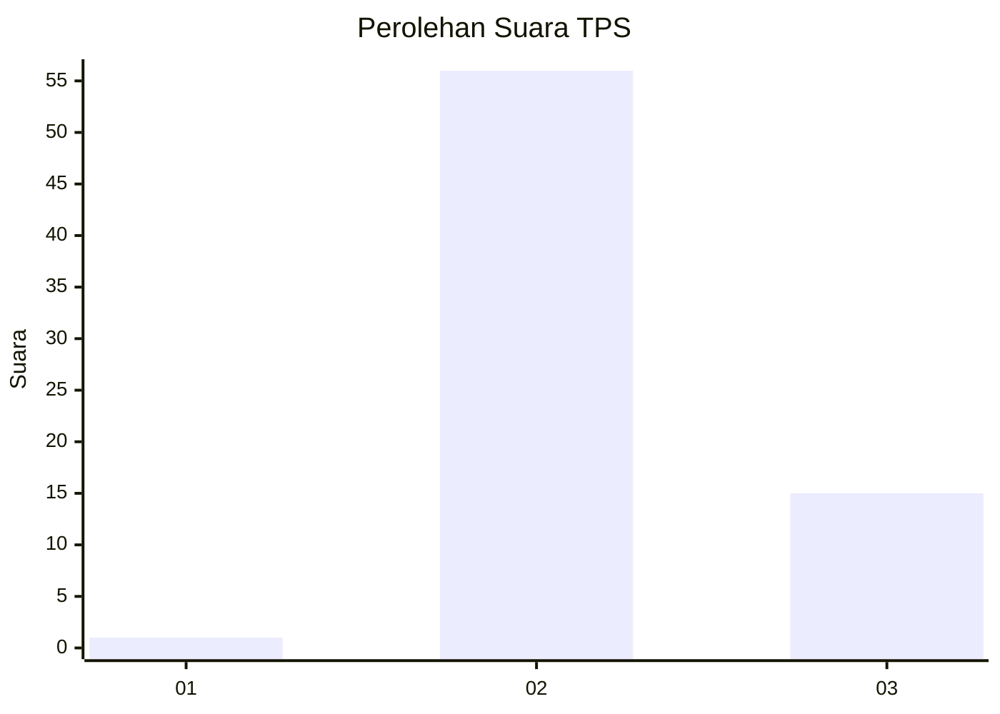

# Hasil

## Grafik

## Tabel

| No. | Nama Paslon    | Suara | Suara (raw) | Persentase |
|:--- |:-------------- | -----:| -----------:| ----------:|
| 1   | ANIES MUHAIMIN | 1     | [1][p-1]    | 1,39       |
| 2   | PRABOWO GIBRAN | 56    | [56][p-2]   | 77,78      |
| 3   | GANJAR MAHFUD  | 15    | [15][p-3]   | 20,83      |

[p-1]: https://github.com/gigit-pemilu/pemilu-2024-14-riau/blob/main/pilpres/hitung-suara/sub/14-riau/sub/06--rokan-hulu/sub/09-tambusai-utara/sub/2005-pagar-mayang/sub/010-tps/sub/paslon-1.txt
[p-2]: https://github.com/gigit-pemilu/pemilu-2024-14-riau/blob/main/pilpres/hitung-suara/sub/14-riau/sub/06--rokan-hulu/sub/09-tambusai-utara/sub/2005-pagar-mayang/sub/010-tps/sub/paslon-2.txt
[p-3]: https://github.com/gigit-pemilu/pemilu-2024-14-riau/blob/main/pilpres/hitung-suara/sub/14-riau/sub/06--rokan-hulu/sub/09-tambusai-utara/sub/2005-pagar-mayang/sub/010-tps/sub/paslon-3.txt

## Foto C Plano

https://sirekap-obj-formc.kpu.go.id/6986/pemilu/ppwp/14/06/09/20/05/1406092005010-20240214-230810--cf28cede-8d1c-4939-8e77-0a450879ea43.jpg

https://sirekap-obj-formc.kpu.go.id/6986/pemilu/ppwp/14/06/09/20/05/1406092005010-20240214-230540--3ab0e54c-18b4-448b-a39b-08d80bf19ad3.jpg

https://sirekap-obj-formc.kpu.go.id/6986/pemilu/ppwp/14/06/09/20/05/1406092005010-20240214-230345--46a24136-0c48-4202-b1ea-1d89c5ed1a4e.jpg

## Metadata

| Key        | Value               |
| ---------- | ------------------- |
| Time Stamp | 2024-02-15 22:40:13 |

