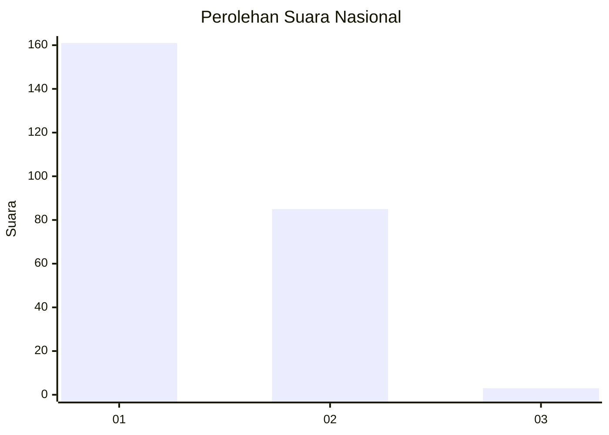
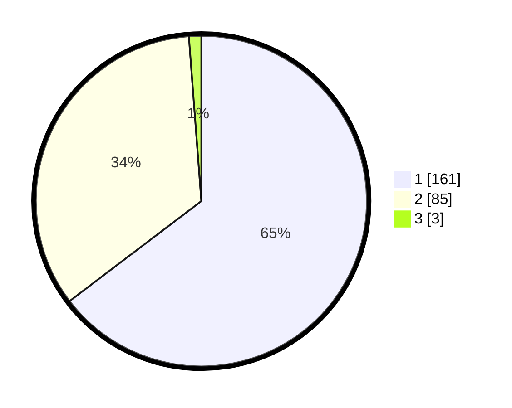

# Hasil

## Grafik

## Tabel

| No. | Nama Paslon    | Suara | Suara (raw) | Persentase |
|:--- |:-------------- | -----:| -----------:| ----------:|
| 1   | ANIES MUHAIMIN | 161   | [161][p-1]  | 64,66      |
| 2   | PRABOWO GIBRAN | 85    | [85][p-2]   | 34,14      |
| 3   | GANJAR MAHFUD  | 3     | [3][p-3]    | 1,20       |

[p-1]: https://github.com/gigit-pemilu/pemilu-2024/blob/main/pilpres/hitung-suara/sub/14-riau/sub/06--rokan-hulu/sub/10-bangun-purba/sub/2004-bangun-purba/sub/001-tps/sub/paslon-1.txt
[p-2]: https://github.com/gigit-pemilu/pemilu-2024/blob/main/pilpres/hitung-suara/sub/14-riau/sub/06--rokan-hulu/sub/10-bangun-purba/sub/2004-bangun-purba/sub/001-tps/sub/paslon-2.txt
[p-3]: https://github.com/gigit-pemilu/pemilu-2024/blob/main/pilpres/hitung-suara/sub/14-riau/sub/06--rokan-hulu/sub/10-bangun-purba/sub/2004-bangun-purba/sub/001-tps/sub/paslon-3.txt

## Foto C Plano

https://sirekap-obj-formc.kpu.go.id/928e/pemilu/ppwp/14/06/10/20/04/1406102004001-20240217-110832--cb665635-8ab4-40bf-a6a8-22fd8b156fda.jpg

https://sirekap-obj-formc.kpu.go.id/928e/pemilu/ppwp/14/06/10/20/04/1406102004001-20240217-110923--fd7c904b-de8a-4b19-96b3-85f6c5df5052.jpg

https://sirekap-obj-formc.kpu.go.id/928e/pemilu/ppwp/14/06/10/20/04/1406102004001-20240217-111051--7a0f8e9d-ce3d-4505-8fc0-9e6f9362dd98.jpg

## Metadata

| Key        | Value               |
| ---------- | ------------------- |
| Time Stamp | 2024-02-17 13:37:34 |

