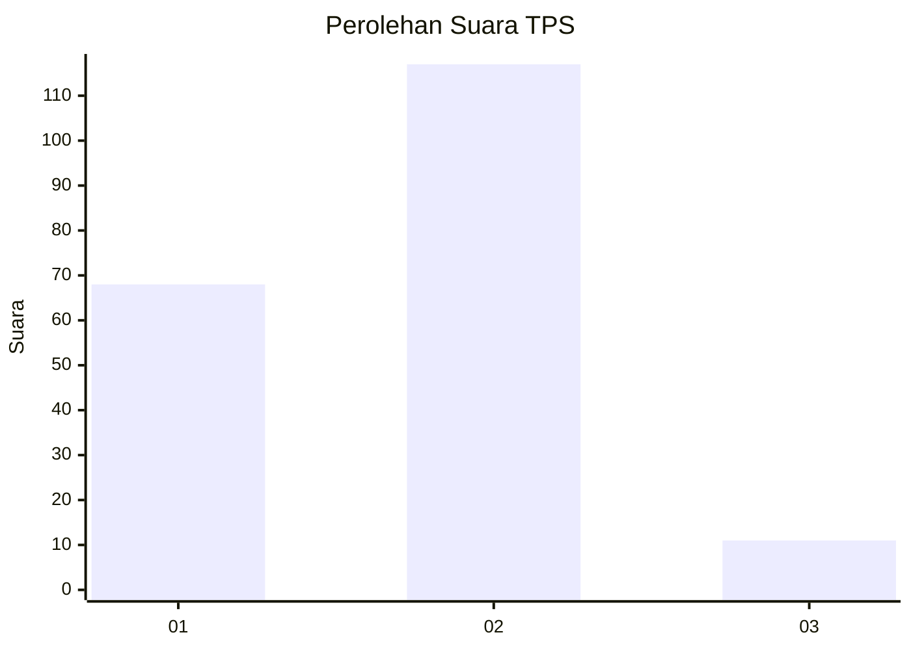
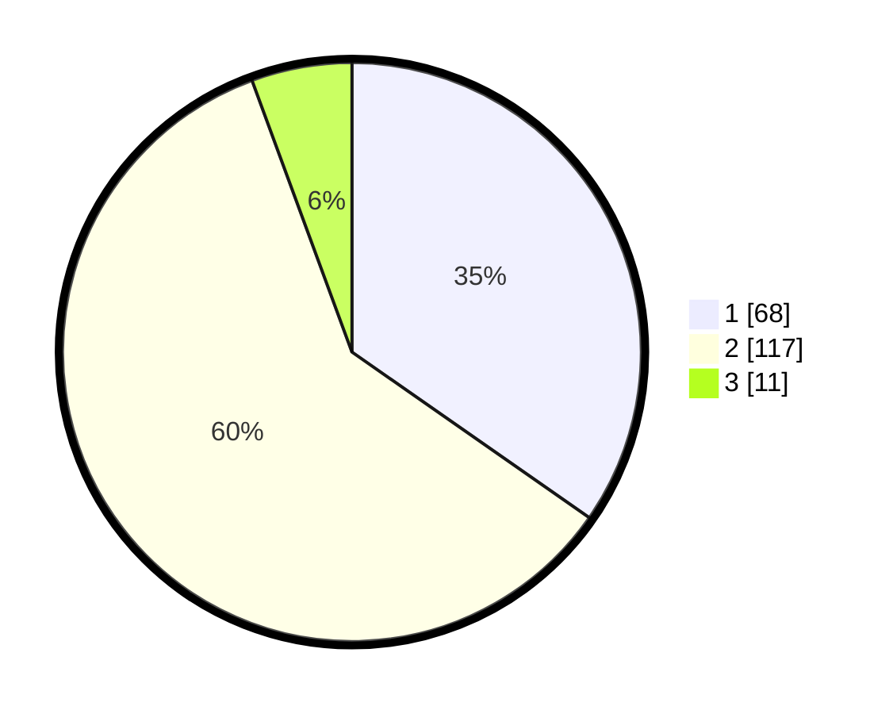

# Hasil

## Grafik

## Tabel

| No. | Nama Paslon    | Suara | Suara (raw) | Persentase |
|:--- |:-------------- | -----:| -----------:| ----------:|
| 1   | ANIES MUHAIMIN | 68    | [68][p-1]   | 34,69      |
| 2   | PRABOWO GIBRAN | 117   | [117][p-2]  | 59,69      |
| 3   | GANJAR MAHFUD  | 11    | [11][p-3]   | 5,61       |

[p-1]: https://github.com/gigit-pemilu/pemilu-2024-14-riau/blob/main/pilpres/hitung-suara/sub/14-riau/sub/06--rokan-hulu/sub/11-tandun/sub/2008-koto-tandun/sub/003-tps/sub/paslon-1.txt
[p-2]: https://github.com/gigit-pemilu/pemilu-2024-14-riau/blob/main/pilpres/hitung-suara/sub/14-riau/sub/06--rokan-hulu/sub/11-tandun/sub/2008-koto-tandun/sub/003-tps/sub/paslon-2.txt
[p-3]: https://github.com/gigit-pemilu/pemilu-2024-14-riau/blob/main/pilpres/hitung-suara/sub/14-riau/sub/06--rokan-hulu/sub/11-tandun/sub/2008-koto-tandun/sub/003-tps/sub/paslon-3.txt

## Foto C Plano

https://sirekap-obj-formc.kpu.go.id/b0e5/pemilu/ppwp/14/06/11/20/08/1406112008003-20240216-154932--10a73bc4-8ab1-47c5-a36f-757a4c214d78.jpg

https://sirekap-obj-formc.kpu.go.id/b0e5/pemilu/ppwp/14/06/11/20/08/1406112008003-20240216-155427--f40cac1b-fc66-4b6a-afae-dcf945b2ebdb.jpg

https://sirekap-obj-formc.kpu.go.id/b0e5/pemilu/ppwp/14/06/11/20/08/1406112008003-20240216-155229--e41830f2-d342-406d-9de6-2025a922537e.jpg

## Metadata

| Key        | Value               |
| ---------- | ------------------- |
| Time Stamp | 2024-02-19 12:00:00 |

## DATA PEMILIH TETAP

Jumlah pemilih dalam DPT: **245**.
 * L: **185**.
 * P: **630**.

## DATA PENGGUNA HAK PILIH

Jumlah pengguna hak pilih dalam DPT: **697**.
 * L: **39**.
 * P: **9**.

Jumlah pengguna hak pilih dalam DPTb: **555**.
 * L: **225**.
 * P: **272**.

Jumlah pengguna hak pilih dalam DPK: **887**.
 * L: **828**.
 * P: **224**.

Jumlah pengguna hak pilih: **698**.
 * L: **889**.
 * P: **109**.

## JUMLAH SUARA SAH DAN TIDAK SAH

JUMLAH SELURUH SUARA SAH: **196**.

JUMLAH SUARA TIDAK SAH: **2**.

JUMLAH SELURUH SUARA SAH DAN SUARA TIDAK SAH: **198**.

