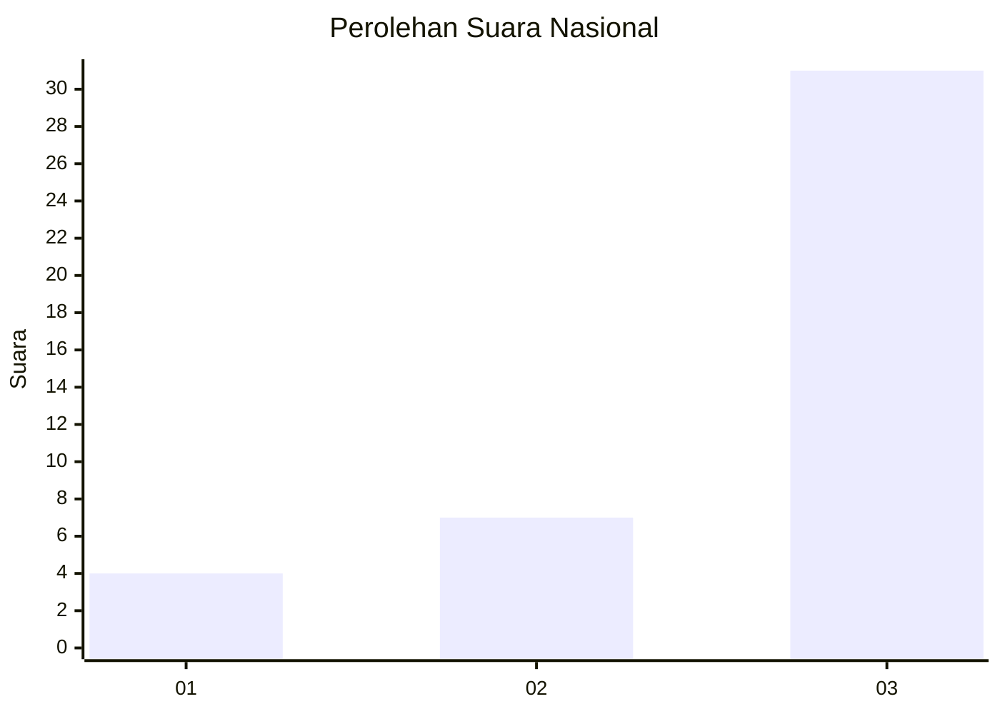
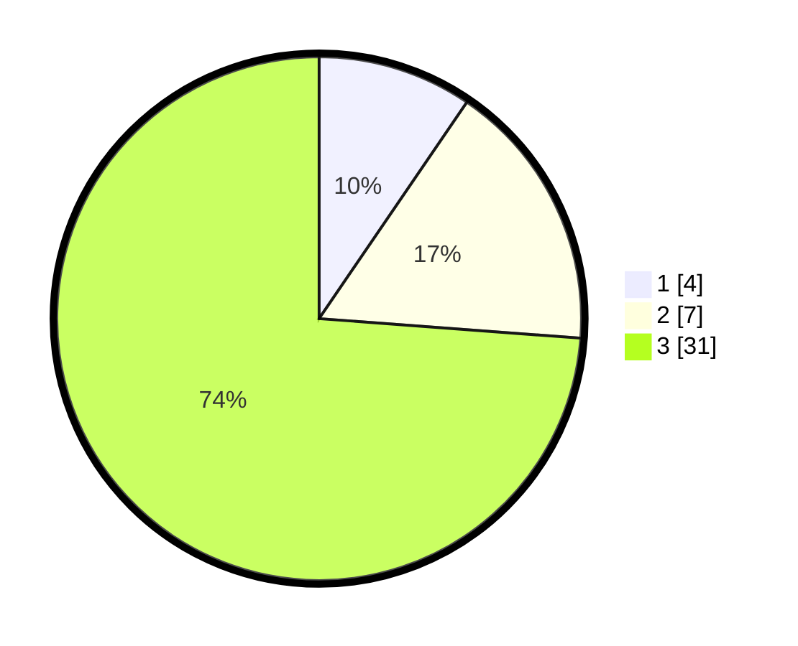

# Hasil

## Grafik

## Tabel

| No. | Nama Paslon    | Suara | Suara (raw) | Persentase |
|:--- |:-------------- | -----:| -----------:| ----------:|
| 1   | ANIES MUHAIMIN | 4     | [4][p-1]    | 9,52       |
| 2   | PRABOWO GIBRAN | 7     | [7][p-2]    | 16,67      |
| 3   | GANJAR MAHFUD  | 31    | [31][p-3]   | 73,81      |

[p-1]: https://github.com/gigit-pemilu/pemilu-2024/blob/main/pilpres/hitung-suara/sub/14-riau/sub/06--rokan-hulu/sub/11-tandun/sub/2009-tandun-barat/sub/004-tps/sub/paslon-1.txt
[p-2]: https://github.com/gigit-pemilu/pemilu-2024/blob/main/pilpres/hitung-suara/sub/14-riau/sub/06--rokan-hulu/sub/11-tandun/sub/2009-tandun-barat/sub/004-tps/sub/paslon-2.txt
[p-3]: https://github.com/gigit-pemilu/pemilu-2024/blob/main/pilpres/hitung-suara/sub/14-riau/sub/06--rokan-hulu/sub/11-tandun/sub/2009-tandun-barat/sub/004-tps/sub/paslon-3.txt

## Foto C Plano

https://sirekap-obj-formc.kpu.go.id/bb8c/pemilu/ppwp/14/06/11/20/09/1406112009004-20240216-134928--5da32452-b763-4be7-b440-4d80138dda35.jpg

https://sirekap-obj-formc.kpu.go.id/bb8c/pemilu/ppwp/14/06/11/20/09/1406112009004-20240216-182023--49908146-e8c6-4b15-ab08-1050c7e2fc72.jpg

https://sirekap-obj-formc.kpu.go.id/bb8c/pemilu/ppwp/14/06/11/20/09/1406112009004-20240216-183018--a9e55a85-ffd9-4ebf-a0d3-3d33560f9eef.jpg

## Metadata

| Key        | Value               |
| ---------- | ------------------- |
| Time Stamp | 2024-02-20 17:00:00 |

