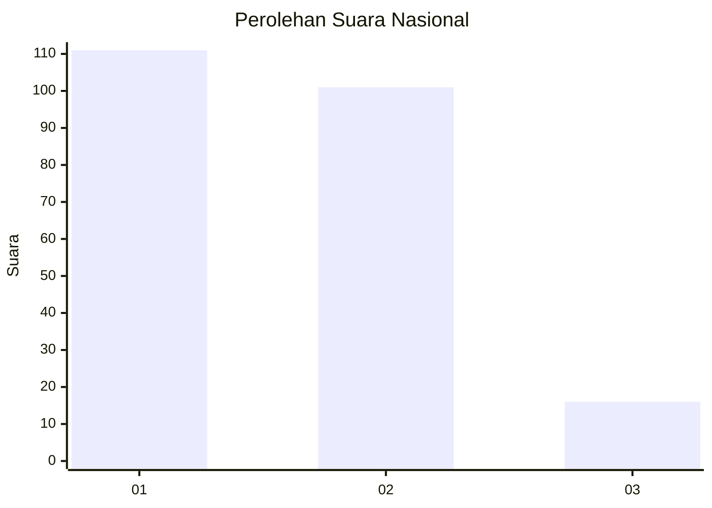
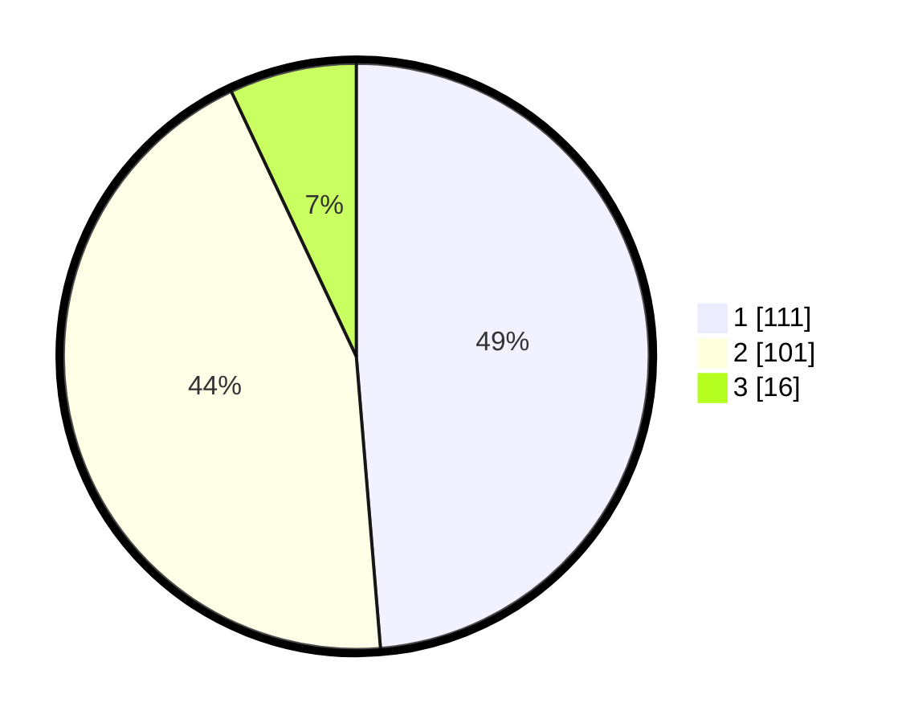

# Hasil

## Grafik

## Tabel

| No. | Nama Paslon    | Suara | Suara (raw) | Persentase |
|:--- |:-------------- | -----:| -----------:| ----------:|
| 1   | ANIES MUHAIMIN | 111   | [111][p-1]  | 48,68      |
| 2   | PRABOWO GIBRAN | 101   | [101][p-2]  | 44,30      |
| 3   | GANJAR MAHFUD  | 16    | [16][p-3]   | 7,02       |

[p-1]: https://github.com/gigit-pemilu/pemilu-2024/blob/main/pilpres/hitung-suara/sub/14-riau/sub/06--rokan-hulu/sub/12-kabun/sub/2001-kabun/sub/003-tps/sub/paslon-1.txt
[p-2]: https://github.com/gigit-pemilu/pemilu-2024/blob/main/pilpres/hitung-suara/sub/14-riau/sub/06--rokan-hulu/sub/12-kabun/sub/2001-kabun/sub/003-tps/sub/paslon-2.txt
[p-3]: https://github.com/gigit-pemilu/pemilu-2024/blob/main/pilpres/hitung-suara/sub/14-riau/sub/06--rokan-hulu/sub/12-kabun/sub/2001-kabun/sub/003-tps/sub/paslon-3.txt

## Foto C Plano

https://sirekap-obj-formc.kpu.go.id/5c86/pemilu/ppwp/14/06/12/20/01/1406122001003-20240214-213432--77a8ece9-2db0-40e0-a209-8c18d17b4e3b.jpg

https://sirekap-obj-formc.kpu.go.id/5c86/pemilu/ppwp/14/06/12/20/01/1406122001003-20240214-213037--fb8d8b2c-a12e-40d9-9815-18da6c7910e5.jpg

https://sirekap-obj-formc.kpu.go.id/5c86/pemilu/ppwp/14/06/12/20/01/1406122001003-20240214-213253--a45129dc-0a16-4316-bb68-284f5eb001c4.jpg

## Metadata

| Key        | Value               |
| ---------- | ------------------- |
| Time Stamp | 2024-02-15 18:00:26 |

