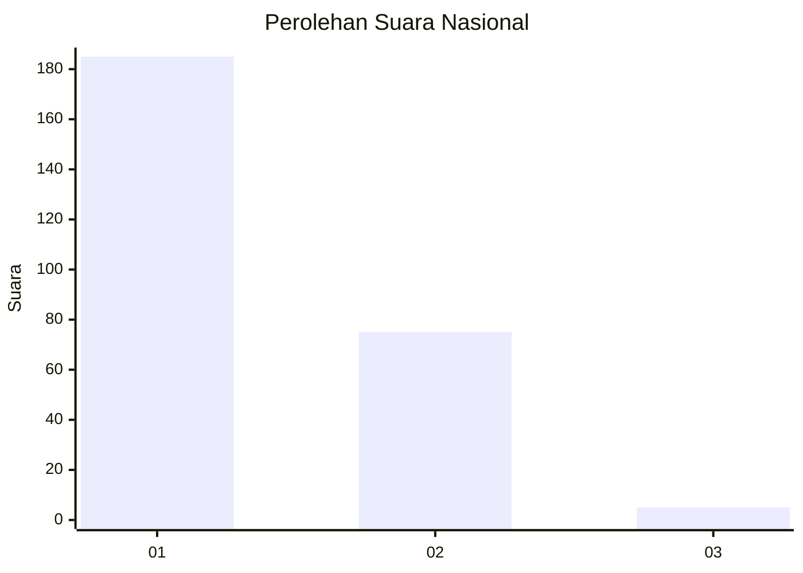
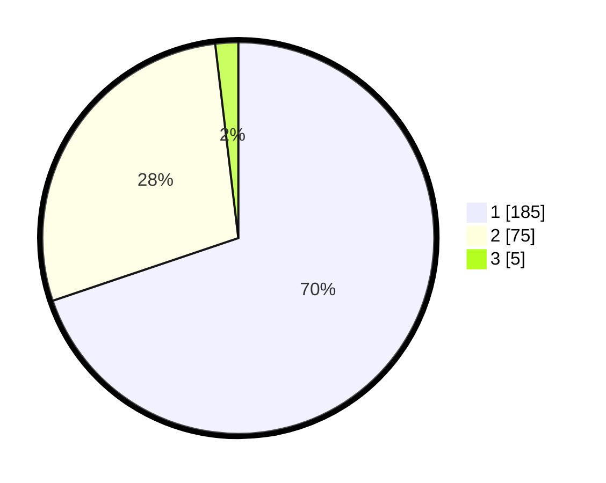

# Hasil

## Grafik

## Tabel

| No. | Nama Paslon    | Suara | Suara (raw) | Persentase |
|:--- |:-------------- | -----:| -----------:| ----------:|
| 1   | ANIES MUHAIMIN | 185   | [185][p-1]  | 69,81      |
| 2   | PRABOWO GIBRAN | 75    | [75][p-2]   | 28,30      |
| 3   | GANJAR MAHFUD  | 5     | [5][p-3]    | 1,89       |

[p-1]: https://github.com/gigit-pemilu/pemilu-2024/blob/main/pilpres/hitung-suara/sub/14-riau/sub/06--rokan-hulu/sub/12-kabun/sub/2001-kabun/sub/011-tps/sub/paslon-1.txt
[p-2]: https://github.com/gigit-pemilu/pemilu-2024/blob/main/pilpres/hitung-suara/sub/14-riau/sub/06--rokan-hulu/sub/12-kabun/sub/2001-kabun/sub/011-tps/sub/paslon-2.txt
[p-3]: https://github.com/gigit-pemilu/pemilu-2024/blob/main/pilpres/hitung-suara/sub/14-riau/sub/06--rokan-hulu/sub/12-kabun/sub/2001-kabun/sub/011-tps/sub/paslon-3.txt

## Foto C Plano

https://sirekap-obj-formc.kpu.go.id/a9fd/pemilu/ppwp/14/06/12/20/01/1406122001011-20240217-123259--db7af402-f79d-4e4a-b8fa-ed7e3fcc64de.jpg

https://sirekap-obj-formc.kpu.go.id/a9fd/pemilu/ppwp/14/06/12/20/01/1406122001011-20240217-123426--437f22b0-1483-49c4-86a0-066e40c86031.jpg

https://sirekap-obj-formc.kpu.go.id/a9fd/pemilu/ppwp/14/06/12/20/01/1406122001011-20240217-123612--e3f4f9ed-ad7f-4d45-afb1-c9cfb931bccc.jpg

## Metadata

| Key        | Value               |
| ---------- | ------------------- |
| Time Stamp | 2024-02-19 11:00:00 |

## DATA PEMILIH TETAP

Jumlah pemilih dalam DPT: **262**.
 * L: **349**.
 * P: **333**.

## DATA PENGGUNA HAK PILIH

Jumlah pengguna hak pilih dalam DPT: **334**.
 * L: **833**.
 * P: **828**.

Jumlah pengguna hak pilih dalam DPTb: **2**.
 * L: **808**.
 * P: **8**.

Jumlah pengguna hak pilih dalam DPK: **34**.
 * L: **5**.
 * P: **6**.

Jumlah pengguna hak pilih: **263**.
 * L: **439**.
 * P: **728**.

## JUMLAH SUARA SAH DAN TIDAK SAH

JUMLAH SELURUH SUARA SAH: **265**.

JUMLAH SUARA TIDAK SAH: **2**.

JUMLAH SELURUH SUARA SAH DAN SUARA TIDAK SAH: **267**.

