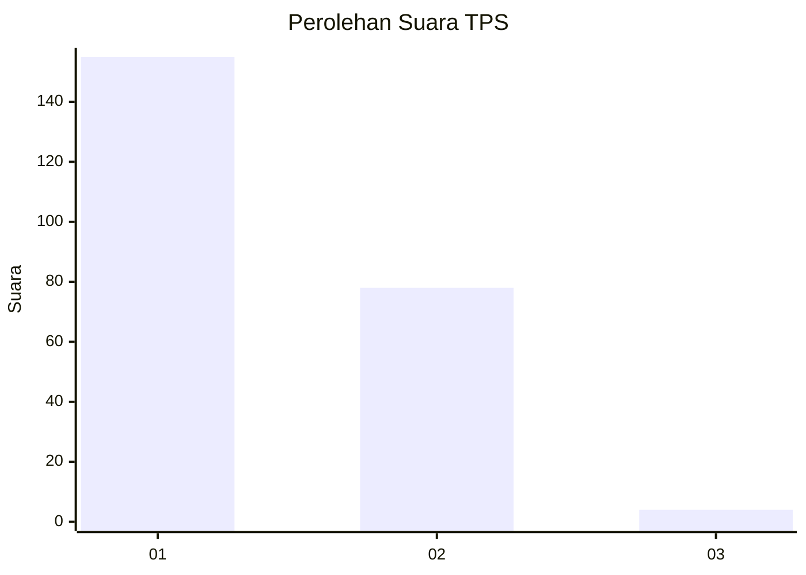
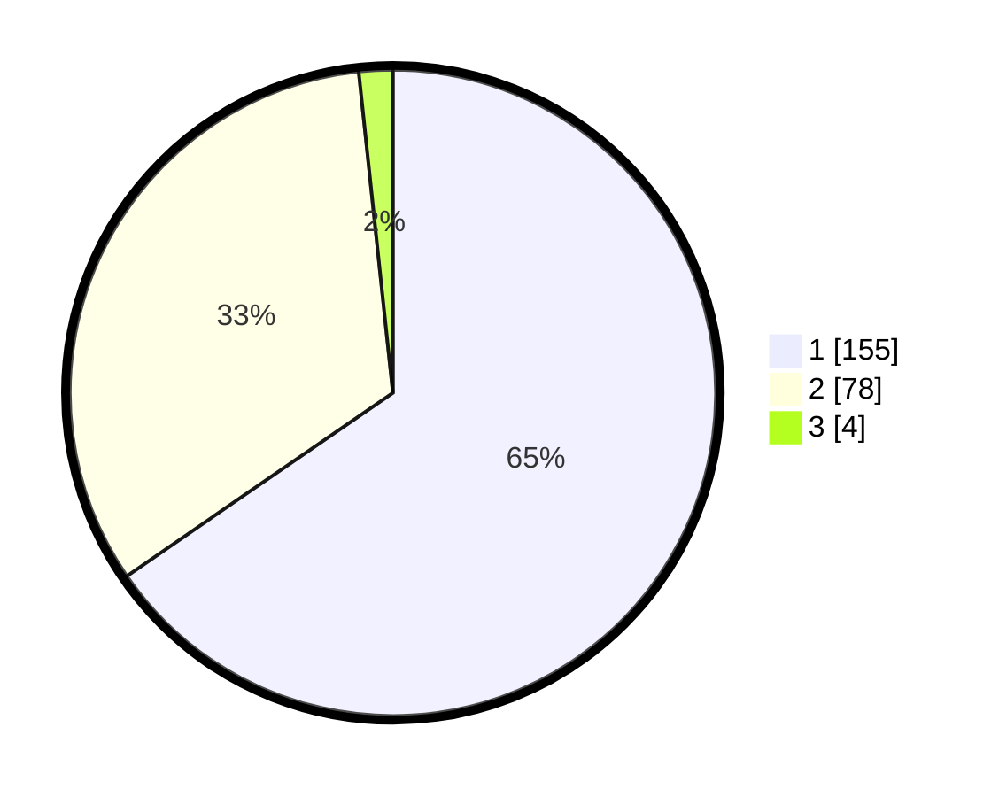

# Hasil

## Grafik

## Tabel

| No. | Nama Paslon    | Suara | Suara (raw) | Persentase |
|:--- |:-------------- | -----:| -----------:| ----------:|
| 1   | ANIES MUHAIMIN | 155   | [155][p-1]  | 65,40      |
| 2   | PRABOWO GIBRAN | 78    | [78][p-2]   | 32,91      |
| 3   | GANJAR MAHFUD  | 4     | [4][p-3]    | 1,69       |

[p-1]: https://github.com/gigit-pemilu/pemilu-2024-14-riau/blob/main/pilpres/hitung-suara/sub/14-riau/sub/06--rokan-hulu/sub/12-kabun/sub/2002-aliantan/sub/008-tps/sub/paslon-1.txt
[p-2]: https://github.com/gigit-pemilu/pemilu-2024-14-riau/blob/main/pilpres/hitung-suara/sub/14-riau/sub/06--rokan-hulu/sub/12-kabun/sub/2002-aliantan/sub/008-tps/sub/paslon-2.txt
[p-3]: https://github.com/gigit-pemilu/pemilu-2024-14-riau/blob/main/pilpres/hitung-suara/sub/14-riau/sub/06--rokan-hulu/sub/12-kabun/sub/2002-aliantan/sub/008-tps/sub/paslon-3.txt

## Foto C Plano

https://sirekap-obj-formc.kpu.go.id/8382/pemilu/ppwp/14/06/12/20/02/1406122002008-20240214-205955--1818d76f-ab1a-4a3a-a16d-e275c4efdeef.jpg

https://sirekap-obj-formc.kpu.go.id/8382/pemilu/ppwp/14/06/12/20/02/1406122002008-20240214-204514--66710906-a824-47a8-8d86-a3071a9b370b.jpg

https://sirekap-obj-formc.kpu.go.id/8382/pemilu/ppwp/14/06/12/20/02/1406122002008-20240214-210337--438a36c8-f3ad-45d5-be56-b495ff0e148c.jpg

## Metadata

| Key        | Value               |
| ---------- | ------------------- |
| Time Stamp | 2024-02-15 23:29:50 |

