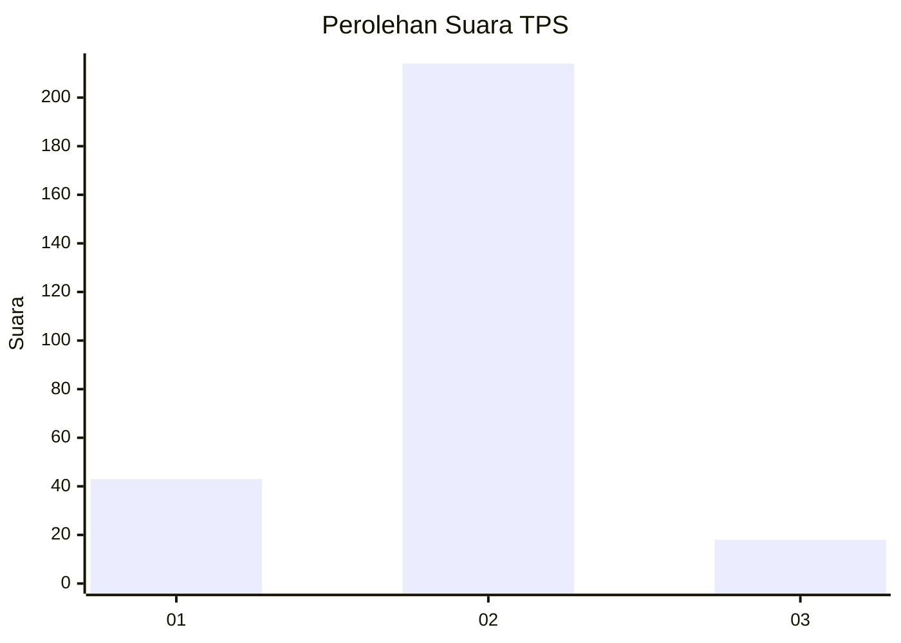
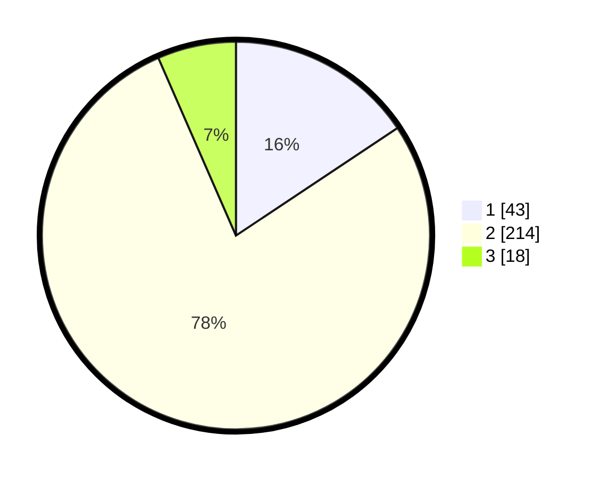

# Hasil

## Grafik

## Tabel

| No. | Nama Paslon    | Suara | Suara (raw) | Persentase |
|:--- |:-------------- | -----:| -----------:| ----------:|
| 1   | ANIES MUHAIMIN | 43    | [43][p-1]   | 15,64      |
| 2   | PRABOWO GIBRAN | 214   | [214][p-2]  | 77,82      |
| 3   | GANJAR MAHFUD  | 18    | [18][p-3]   | 6,55       |

[p-1]: https://github.com/gigit-pemilu/pemilu-2024-14-riau/blob/main/pilpres/hitung-suara/sub/14-riau/sub/06--rokan-hulu/sub/15-kepenuhan-hulu/sub/2004-muara-jaya/sub/007-tps/sub/paslon-1.txt
[p-2]: https://github.com/gigit-pemilu/pemilu-2024-14-riau/blob/main/pilpres/hitung-suara/sub/14-riau/sub/06--rokan-hulu/sub/15-kepenuhan-hulu/sub/2004-muara-jaya/sub/007-tps/sub/paslon-2.txt
[p-3]: https://github.com/gigit-pemilu/pemilu-2024-14-riau/blob/main/pilpres/hitung-suara/sub/14-riau/sub/06--rokan-hulu/sub/15-kepenuhan-hulu/sub/2004-muara-jaya/sub/007-tps/sub/paslon-3.txt

## Foto C Plano

https://sirekap-obj-formc.kpu.go.id/7629/pemilu/ppwp/14/06/15/20/04/1406152004007-20240217-211223--35206f7f-eb8a-4742-bf44-60ff80cc7b9f.jpg

https://sirekap-obj-formc.kpu.go.id/7629/pemilu/ppwp/14/06/15/20/04/1406152004007-20240217-211548--e184d0b1-6ed6-4591-a871-b7d8ae3ef88e.jpg

https://sirekap-obj-formc.kpu.go.id/7629/pemilu/ppwp/14/06/15/20/04/1406152004007-20240217-212209--e6393e48-0dc3-47bf-89ee-af3d7a5ab767.jpg

## Metadata

| Key        | Value               |
| ---------- | ------------------- |
| Time Stamp | 2024-02-19 06:16:00 |

