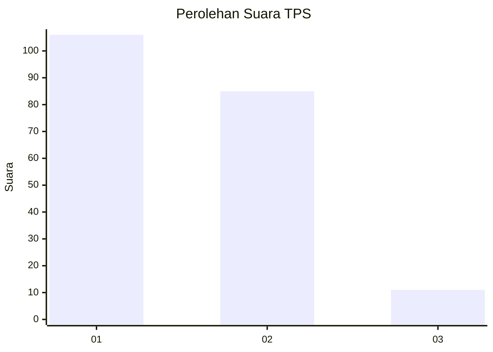
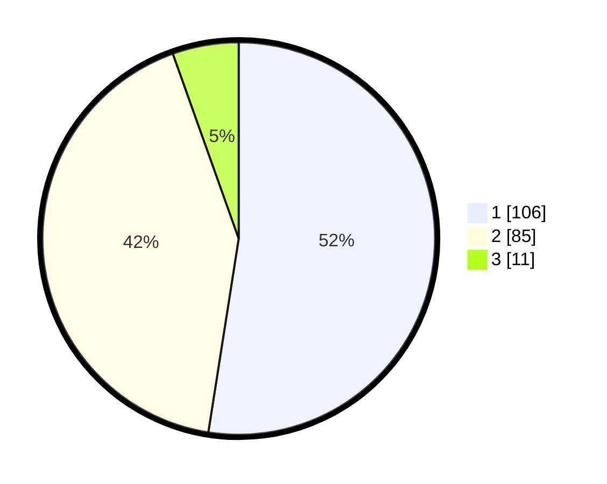

# Hasil

## Grafik

## Tabel

| No. | Nama Paslon    | Suara | Suara (raw) | Persentase |
|:--- |:-------------- | -----:| -----------:| ----------:|
| 1   | ANIES MUHAIMIN | 106   | [106][p-1]  | 52,48      |
| 2   | PRABOWO GIBRAN | 85    | [85][p-2]   | 42,08      |
| 3   | GANJAR MAHFUD  | 11    | [11][p-3]   | 5,45       |

[p-1]: https://github.com/gigit-pemilu/pemilu-2024-14-riau/blob/main/pilpres/hitung-suara/sub/14-riau/sub/06--rokan-hulu/sub/16-pendalian-iv-koto/sub/2001-pendalian/sub/003-tps/sub/paslon-1.txt
[p-2]: https://github.com/gigit-pemilu/pemilu-2024-14-riau/blob/main/pilpres/hitung-suara/sub/14-riau/sub/06--rokan-hulu/sub/16-pendalian-iv-koto/sub/2001-pendalian/sub/003-tps/sub/paslon-2.txt
[p-3]: https://github.com/gigit-pemilu/pemilu-2024-14-riau/blob/main/pilpres/hitung-suara/sub/14-riau/sub/06--rokan-hulu/sub/16-pendalian-iv-koto/sub/2001-pendalian/sub/003-tps/sub/paslon-3.txt

## Foto C Plano

https://sirekap-obj-formc.kpu.go.id/5cf2/pemilu/ppwp/14/06/16/20/01/1406162001003-20240214-155459--8d1008fa-addb-40b2-a7fa-b720f8fbf39a.jpg

https://sirekap-obj-formc.kpu.go.id/5cf2/pemilu/ppwp/14/06/16/20/01/1406162001003-20240214-155650--0bae387a-74a8-49fd-a9c4-5dd953db3c8f.jpg

https://sirekap-obj-formc.kpu.go.id/5cf2/pemilu/ppwp/14/06/16/20/01/1406162001003-20240218-220745--2e61f2a0-59a3-4481-861c-4efc67982046.jpg

## Metadata

| Key        | Value               |
| ---------- | ------------------- |
| Time Stamp | 2024-02-19 06:16:00 |

