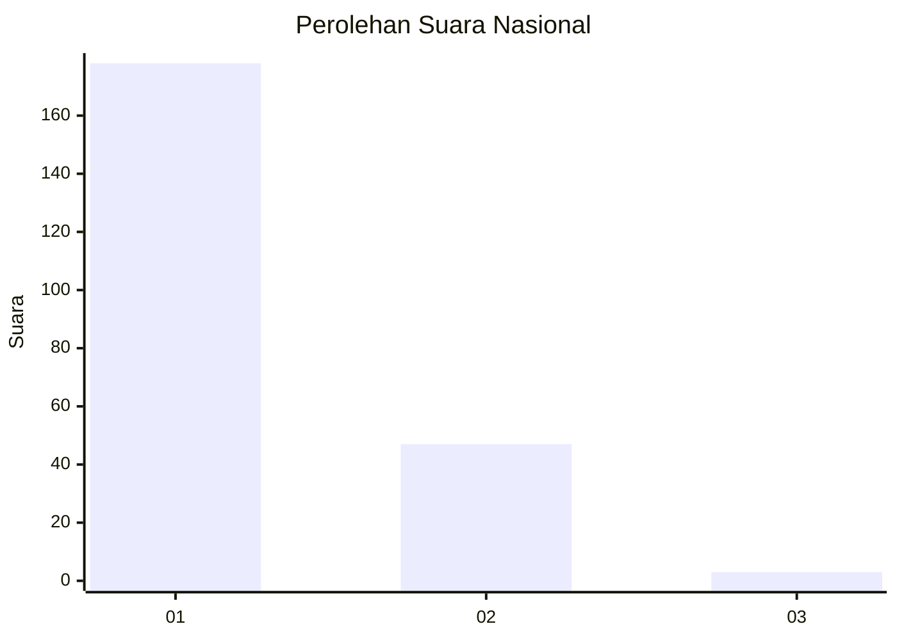
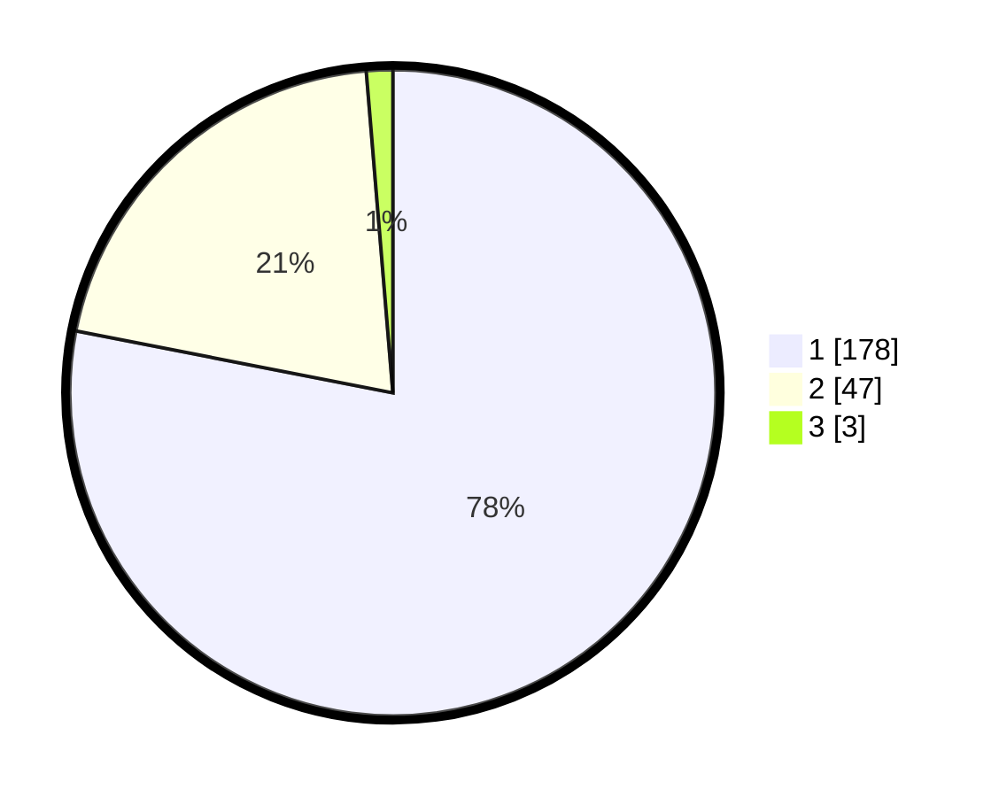

# Hasil

## Grafik

## Tabel

| No. | Nama Paslon    | Suara | Suara (raw) | Persentase |
|:--- |:-------------- | -----:| -----------:| ----------:|
| 1   | ANIES MUHAIMIN | 178   | [178][p-1]  | 78,07      |
| 2   | PRABOWO GIBRAN | 47    | [47][p-2]   | 20,61      |
| 3   | GANJAR MAHFUD  | 3     | [3][p-3]    | 1,32       |

[p-1]: https://github.com/gigit-pemilu/pemilu-2024/blob/main/pilpres/hitung-suara/sub/14-riau/sub/07--rokan-hilir/sub/01-kubu/sub/1010-telukmerbau/sub/004-tps/sub/paslon-1.txt
[p-2]: https://github.com/gigit-pemilu/pemilu-2024/blob/main/pilpres/hitung-suara/sub/14-riau/sub/07--rokan-hilir/sub/01-kubu/sub/1010-telukmerbau/sub/004-tps/sub/paslon-2.txt
[p-3]: https://github.com/gigit-pemilu/pemilu-2024/blob/main/pilpres/hitung-suara/sub/14-riau/sub/07--rokan-hilir/sub/01-kubu/sub/1010-telukmerbau/sub/004-tps/sub/paslon-3.txt

## Foto C Plano

https://sirekap-obj-formc.kpu.go.id/d828/pemilu/ppwp/14/07/01/10/10/1407011010004-20240215-033127--6d194b13-fcd0-44bb-b6e4-3d986e4e0b44.jpg

https://sirekap-obj-formc.kpu.go.id/d828/pemilu/ppwp/14/07/01/10/10/1407011010004-20240215-033311--6f0f54a1-68d0-4a82-932d-9108fe6ff826.jpg

https://sirekap-obj-formc.kpu.go.id/d828/pemilu/ppwp/14/07/01/10/10/1407011010004-20240215-033411--0a012509-6648-4fe6-815e-16cecd1da6b2.jpg

## Metadata

| Key        | Value               |
| ---------- | ------------------- |
| Time Stamp | 2024-02-16 12:51:22 |

