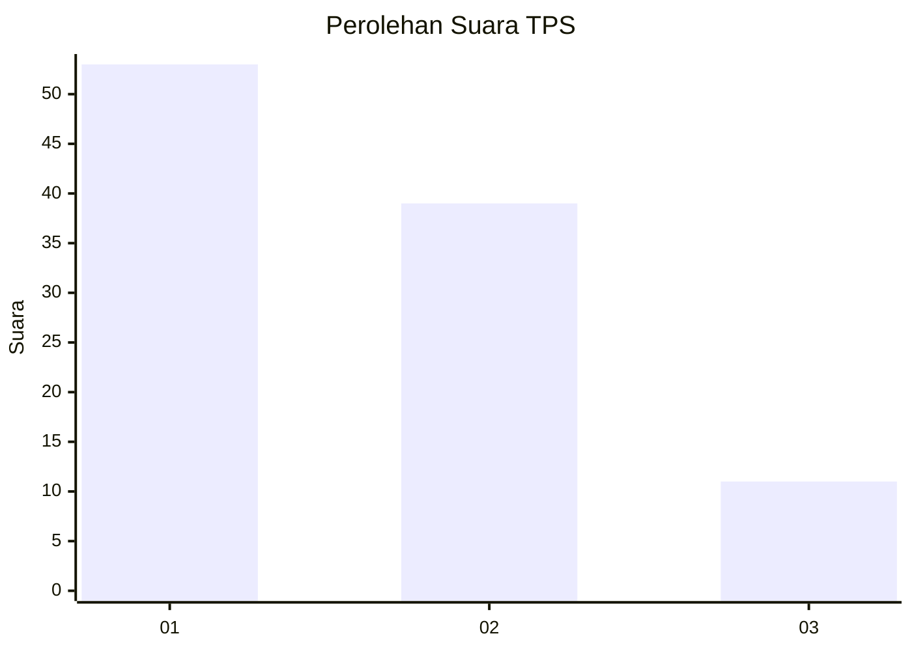
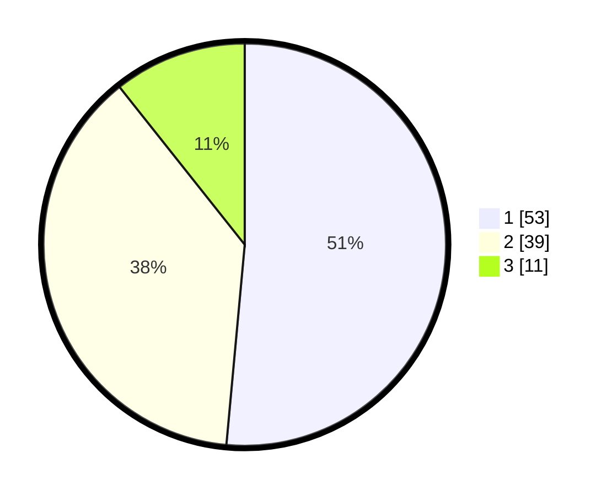

# Hasil

## Grafik

## Tabel

| No. | Nama Paslon    | Suara | Suara (raw) | Persentase |
|:--- |:-------------- | -----:| -----------:| ----------:|
| 1   | ANIES MUHAIMIN | 53    | [53][p-1]   | 51,46      |
| 2   | PRABOWO GIBRAN | 39    | [39][p-2]   | 37,86      |
| 3   | GANJAR MAHFUD  | 11    | [11][p-3]   | 10,68      |

[p-1]: https://github.com/gigit-pemilu/pemilu-2024-14-riau/blob/main/pilpres/hitung-suara/sub/14-riau/sub/07--rokan-hilir/sub/01-kubu/sub/1010-telukmerbau/sub/006-tps/sub/paslon-1.txt
[p-2]: https://github.com/gigit-pemilu/pemilu-2024-14-riau/blob/main/pilpres/hitung-suara/sub/14-riau/sub/07--rokan-hilir/sub/01-kubu/sub/1010-telukmerbau/sub/006-tps/sub/paslon-2.txt
[p-3]: https://github.com/gigit-pemilu/pemilu-2024-14-riau/blob/main/pilpres/hitung-suara/sub/14-riau/sub/07--rokan-hilir/sub/01-kubu/sub/1010-telukmerbau/sub/006-tps/sub/paslon-3.txt

## Foto C Plano

https://sirekap-obj-formc.kpu.go.id/3d78/pemilu/ppwp/14/07/01/10/10/1407011010006-20240214-193346--779d7fd8-f4a1-45a2-819e-851db1f2fa8b.jpg

https://sirekap-obj-formc.kpu.go.id/3d78/pemilu/ppwp/14/07/01/10/10/1407011010006-20240214-193559--7d24385a-5de8-4d80-8b6c-575ea8f58f28.jpg

https://sirekap-obj-formc.kpu.go.id/3d78/pemilu/ppwp/14/07/01/10/10/1407011010006-20240214-193626--4f566613-48a1-4d41-ad7a-687522b9a05e.jpg

## Metadata

| Key        | Value               |
| ---------- | ------------------- |
| Time Stamp | 2024-02-16 12:51:22 |

