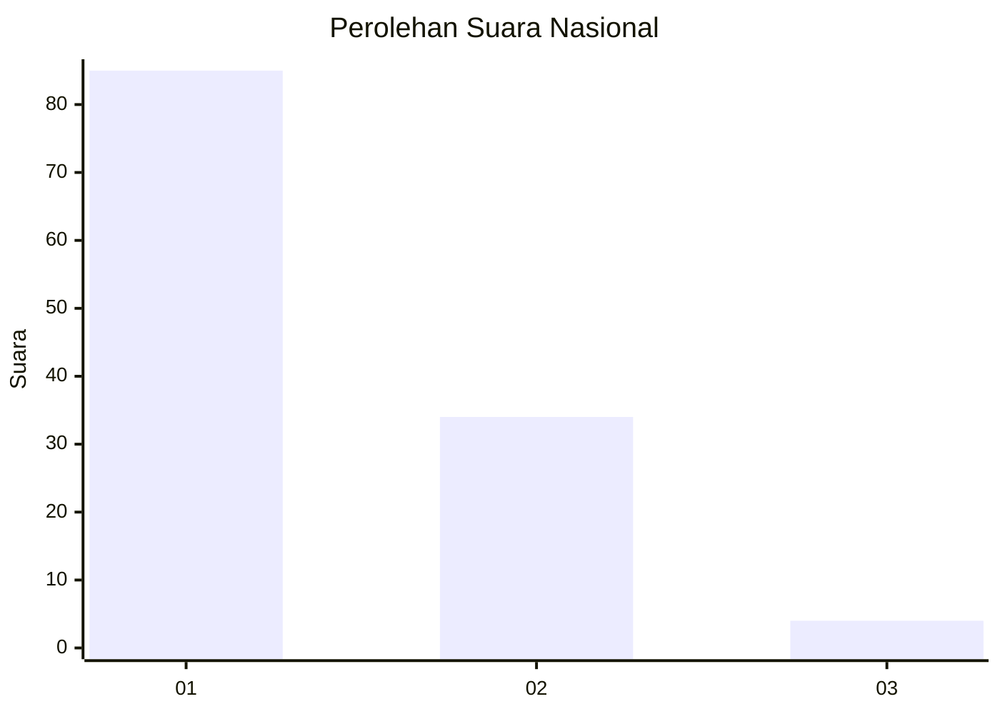
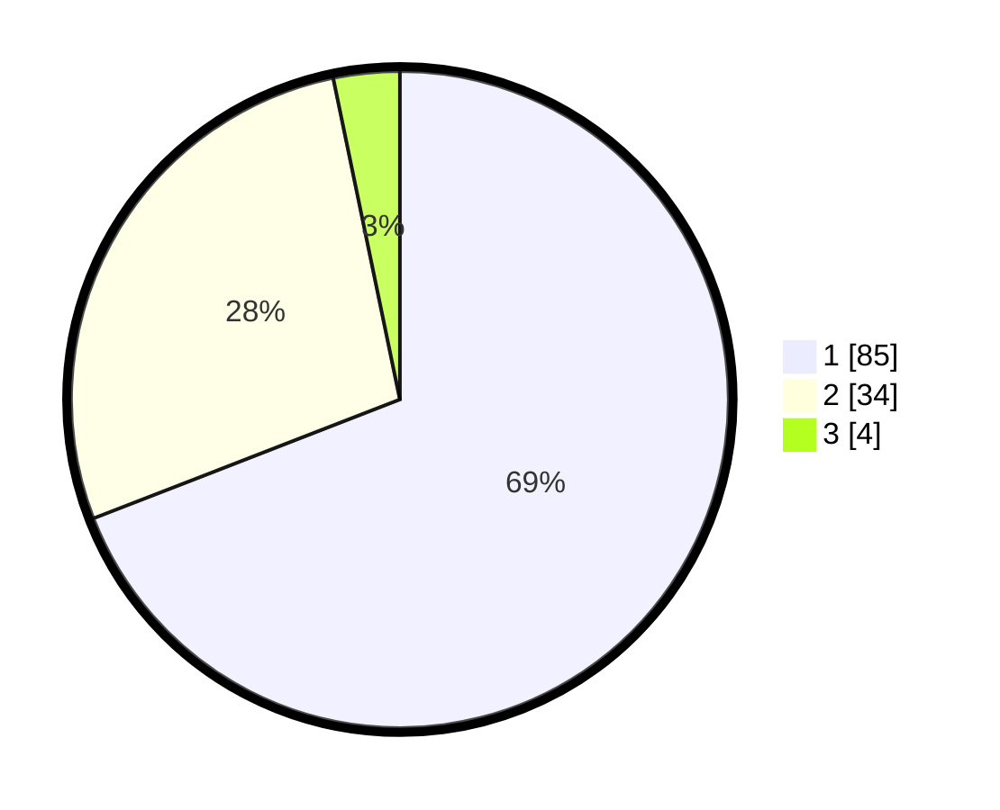

# Hasil

## Grafik

## Tabel

| No. | Nama Paslon    | Suara | Suara (raw) | Persentase |
|:--- |:-------------- | -----:| -----------:| ----------:|
| 1   | ANIES MUHAIMIN | 85    | [85][p-1]   | 69,11      |
| 2   | PRABOWO GIBRAN | 34    | [34][p-2]   | 27,64      |
| 3   | GANJAR MAHFUD  | 4     | [4][p-3]    | 3,25       |

[p-1]: https://github.com/gigit-pemilu/pemilu-2024/blob/main/pilpres/hitung-suara/sub/14-riau/sub/07--rokan-hilir/sub/01-kubu/sub/1010-telukmerbau/sub/007-tps/sub/paslon-1.txt
[p-2]: https://github.com/gigit-pemilu/pemilu-2024/blob/main/pilpres/hitung-suara/sub/14-riau/sub/07--rokan-hilir/sub/01-kubu/sub/1010-telukmerbau/sub/007-tps/sub/paslon-2.txt
[p-3]: https://github.com/gigit-pemilu/pemilu-2024/blob/main/pilpres/hitung-suara/sub/14-riau/sub/07--rokan-hilir/sub/01-kubu/sub/1010-telukmerbau/sub/007-tps/sub/paslon-3.txt

## Foto C Plano

https://sirekap-obj-formc.kpu.go.id/94b0/pemilu/ppwp/14/07/01/10/10/1407011010007-20240218-151826--7668a5cd-b986-4a7c-9f56-2e8f1c1acf20.jpg

https://sirekap-obj-formc.kpu.go.id/94b0/pemilu/ppwp/14/07/01/10/10/1407011010007-20240218-152240--fd6297a4-4086-4e7f-acdd-1291ee4d3bf6.jpg

https://sirekap-obj-formc.kpu.go.id/94b0/pemilu/ppwp/14/07/01/10/10/1407011010007-20240218-152321--cf74820a-d96d-4602-9ca0-0562008f877e.jpg

## Metadata

| Key        | Value               |
| ---------- | ------------------- |
| Time Stamp | 2024-02-19 06:16:00 |

## DATA PEMILIH TETAP

Jumlah pemilih dalam DPT: **163**.
 * L: **85**.
 * P: **78**.

## DATA PENGGUNA HAK PILIH

Jumlah pengguna hak pilih dalam DPT: **123**.
 * L: **59**.
 * P: **64**.

Jumlah pengguna hak pilih dalam DPTb: **1**.
 * L: **1**.
 * P: **0**.

Jumlah pengguna hak pilih dalam DPK: **0**.
 * L: **0**.
 * P: **0**.

Jumlah pengguna hak pilih: **124**.
 * L: **60**.
 * P: **64**.

## JUMLAH SUARA SAH DAN TIDAK SAH

JUMLAH SELURUH SUARA SAH: **121**.

JUMLAH SUARA TIDAK SAH: **3**.

JUMLAH SELURUH SUARA SAH DAN SUARA TIDAK SAH: **124**.

