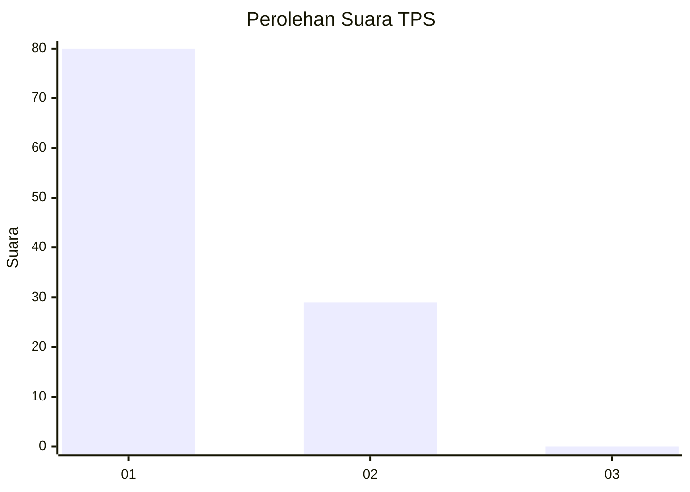
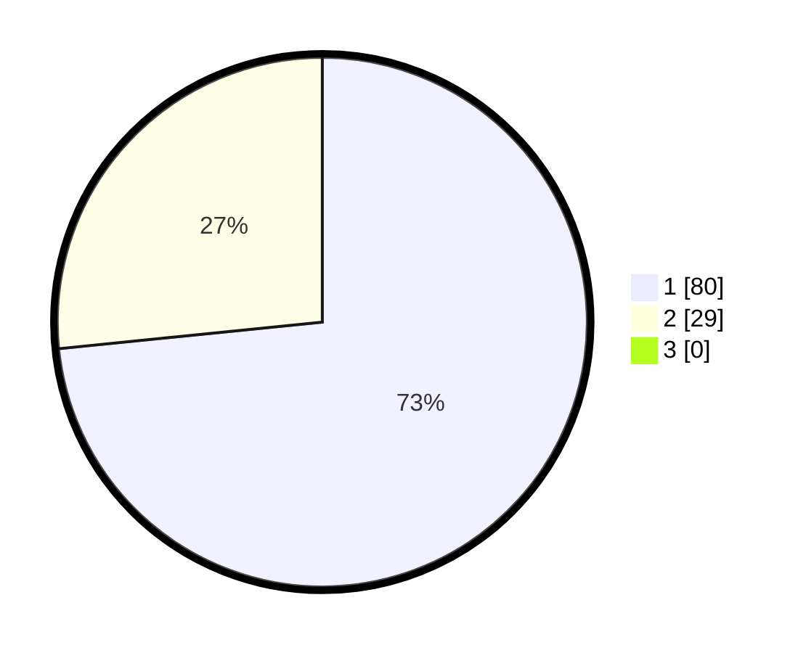

# Hasil

## Grafik

## Tabel

| No. | Nama Paslon    | Suara | Suara (raw) | Persentase |
|:--- |:-------------- | -----:| -----------:| ----------:|
| 1   | ANIES MUHAIMIN | 80    | [80][p-1]   | 73,39      |
| 2   | PRABOWO GIBRAN | 29    | [29][p-2]   | 26,61      |
| 3   | GANJAR MAHFUD  | 0     | [0][p-3]    | 0,00       |

[p-1]: https://github.com/gigit-pemilu/pemilu-2024-14-riau/blob/main/pilpres/hitung-suara/sub/14-riau/sub/07--rokan-hilir/sub/01-kubu/sub/1010-telukmerbau/sub/009-tps/sub/paslon-1.txt
[p-2]: https://github.com/gigit-pemilu/pemilu-2024-14-riau/blob/main/pilpres/hitung-suara/sub/14-riau/sub/07--rokan-hilir/sub/01-kubu/sub/1010-telukmerbau/sub/009-tps/sub/paslon-2.txt
[p-3]: https://github.com/gigit-pemilu/pemilu-2024-14-riau/blob/main/pilpres/hitung-suara/sub/14-riau/sub/07--rokan-hilir/sub/01-kubu/sub/1010-telukmerbau/sub/009-tps/sub/paslon-3.txt

## Foto C Plano

https://sirekap-obj-formc.kpu.go.id/bb25/pemilu/ppwp/14/07/01/10/10/1407011010009-20240214-230723--ab5f95f8-436e-44a7-b28f-aa6afd667b89.jpg

https://sirekap-obj-formc.kpu.go.id/bb25/pemilu/ppwp/14/07/01/10/10/1407011010009-20240214-230944--1b927a1e-635d-45a0-8669-1b93f3f73840.jpg

https://sirekap-obj-formc.kpu.go.id/bb25/pemilu/ppwp/14/07/01/10/10/1407011010009-20240214-231107--abd37e42-ccd1-4b32-8997-cb68f1e2e5ee.jpg

## Metadata

| Key        | Value               |
| ---------- | ------------------- |
| Time Stamp | 2024-02-16 12:51:22 |

