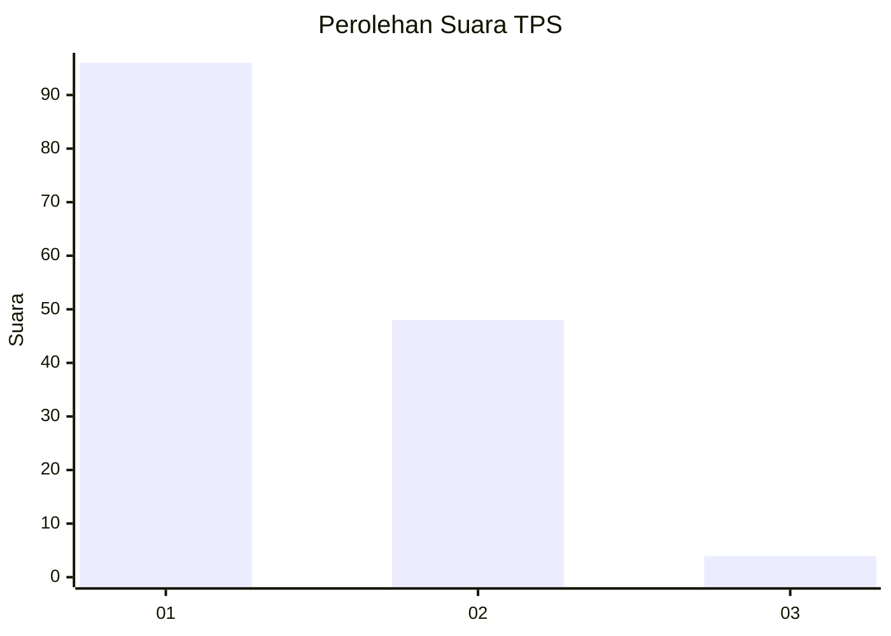
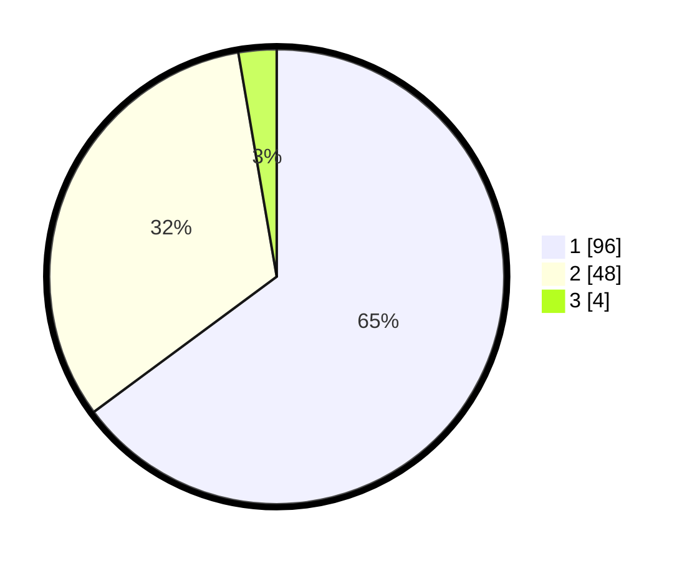

# Hasil

## Grafik

## Tabel

| No. | Nama Paslon    | Suara | Suara (raw) | Persentase |
|:--- |:-------------- | -----:| -----------:| ----------:|
| 1   | ANIES MUHAIMIN | 96    | [96][p-1]   | 64,86      |
| 2   | PRABOWO GIBRAN | 48    | [48][p-2]   | 32,43      |
| 3   | GANJAR MAHFUD  | 4     | [4][p-3]    | 2,70       |

[p-1]: https://github.com/gigit-pemilu/pemilu-2024-14-riau/blob/main/pilpres/hitung-suara/sub/14-riau/sub/07--rokan-hilir/sub/01-kubu/sub/2003-sungaikubu/sub/005-tps/sub/paslon-1.txt
[p-2]: https://github.com/gigit-pemilu/pemilu-2024-14-riau/blob/main/pilpres/hitung-suara/sub/14-riau/sub/07--rokan-hilir/sub/01-kubu/sub/2003-sungaikubu/sub/005-tps/sub/paslon-2.txt
[p-3]: https://github.com/gigit-pemilu/pemilu-2024-14-riau/blob/main/pilpres/hitung-suara/sub/14-riau/sub/07--rokan-hilir/sub/01-kubu/sub/2003-sungaikubu/sub/005-tps/sub/paslon-3.txt

## Foto C Plano

https://sirekap-obj-formc.kpu.go.id/20a1/pemilu/ppwp/14/07/01/20/03/1407012003005-20240214-214133--26efd21e-c712-42b7-8077-eaaed7e8d086.jpg

https://sirekap-obj-formc.kpu.go.id/20a1/pemilu/ppwp/14/07/01/20/03/1407012003005-20240214-214324--a77c3887-9d02-43e6-9077-71f464b34ee1.jpg

https://sirekap-obj-formc.kpu.go.id/20a1/pemilu/ppwp/14/07/01/20/03/1407012003005-20240214-214454--7570fcf5-282c-463d-a963-1fcde01d325e.jpg

## Metadata

| Key        | Value               |
| ---------- | ------------------- |
| Time Stamp | 2024-02-16 12:51:22 |

