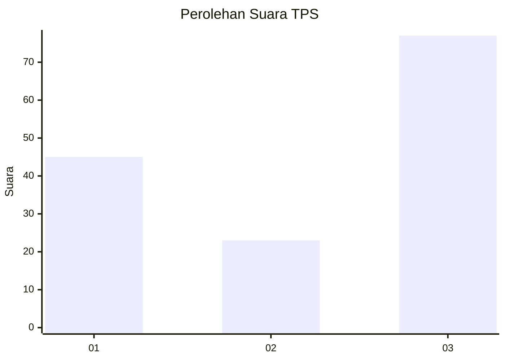
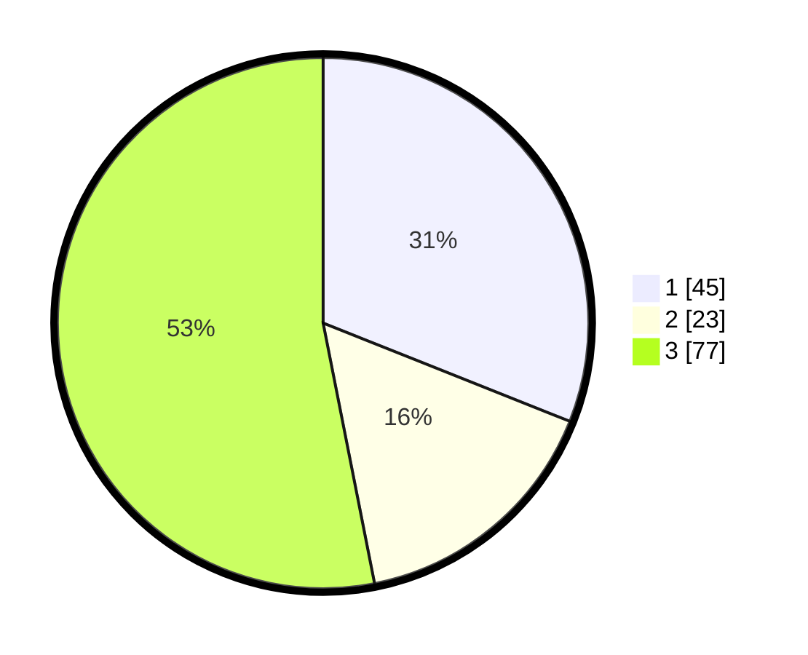

# Hasil

## Grafik

## Tabel

| No. | Nama Paslon    | Suara | Suara (raw) | Persentase |
|:--- |:-------------- | -----:| -----------:| ----------:|
| 1   | ANIES MUHAIMIN | 45    | [45][p-1]   | 31,03      |
| 2   | PRABOWO GIBRAN | 23    | [23][p-2]   | 15,86      |
| 3   | GANJAR MAHFUD  | 77    | [77][p-3]   | 53,10      |

[p-1]: https://github.com/gigit-pemilu/pemilu-2024-14-riau/blob/main/pilpres/hitung-suara/sub/14-riau/sub/07--rokan-hilir/sub/01-kubu/sub/2012-telukpiyai/sub/007-tps/sub/paslon-1.txt
[p-2]: https://github.com/gigit-pemilu/pemilu-2024-14-riau/blob/main/pilpres/hitung-suara/sub/14-riau/sub/07--rokan-hilir/sub/01-kubu/sub/2012-telukpiyai/sub/007-tps/sub/paslon-2.txt
[p-3]: https://github.com/gigit-pemilu/pemilu-2024-14-riau/blob/main/pilpres/hitung-suara/sub/14-riau/sub/07--rokan-hilir/sub/01-kubu/sub/2012-telukpiyai/sub/007-tps/sub/paslon-3.txt

## Foto C Plano

https://sirekap-obj-formc.kpu.go.id/b2dc/pemilu/ppwp/14/07/01/20/12/1407012012007-20240215-020433--ac8b72d3-111c-4bad-b935-4d380e4c5742.jpg

https://sirekap-obj-formc.kpu.go.id/b2dc/pemilu/ppwp/14/07/01/20/12/1407012012007-20240215-035352--1e9056e6-5a4b-4523-ae57-4b8e6d3cf72d.jpg

https://sirekap-obj-formc.kpu.go.id/b2dc/pemilu/ppwp/14/07/01/20/12/1407012012007-20240215-010029--bb7e7c30-492b-4acf-882d-8d1d382a2a19.jpg

## Metadata

| Key        | Value               |
| ---------- | ------------------- |
| Time Stamp | 2024-02-16 09:30:28 |

