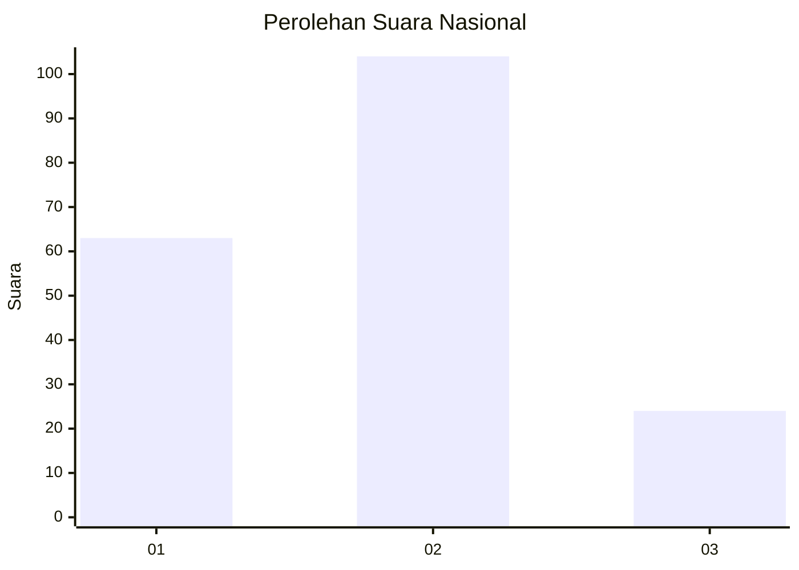
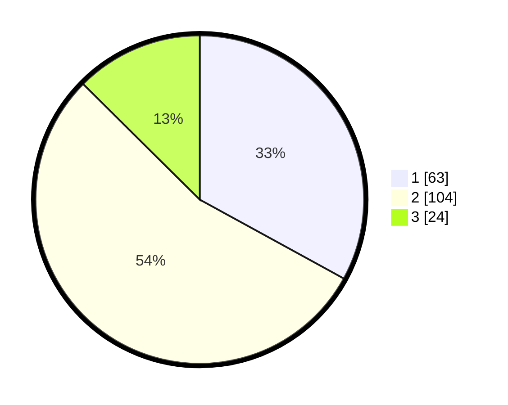

# Hasil

## Grafik

## Tabel

| No. | Nama Paslon    | Suara | Suara (raw) | Persentase |
|:--- |:-------------- | -----:| -----------:| ----------:|
| 1   | ANIES MUHAIMIN | 63    | [63][p-1]   | 32,98      |
| 2   | PRABOWO GIBRAN | 104   | [104][p-2]  | 54,45      |
| 3   | GANJAR MAHFUD  | 24    | [24][p-3]   | 12,57      |

[p-1]: https://github.com/gigit-pemilu/pemilu-2024/blob/main/pilpres/hitung-suara/sub/14-riau/sub/07--rokan-hilir/sub/01-kubu/sub/2013-sungaisegajah/sub/003-tps/sub/paslon-1.txt
[p-2]: https://github.com/gigit-pemilu/pemilu-2024/blob/main/pilpres/hitung-suara/sub/14-riau/sub/07--rokan-hilir/sub/01-kubu/sub/2013-sungaisegajah/sub/003-tps/sub/paslon-2.txt
[p-3]: https://github.com/gigit-pemilu/pemilu-2024/blob/main/pilpres/hitung-suara/sub/14-riau/sub/07--rokan-hilir/sub/01-kubu/sub/2013-sungaisegajah/sub/003-tps/sub/paslon-3.txt

## Foto C Plano

https://sirekap-obj-formc.kpu.go.id/58c8/pemilu/ppwp/14/07/01/20/13/1407012013003-20240215-003843--1833706f-dba2-4215-8853-eb32bcc40824.jpg

https://sirekap-obj-formc.kpu.go.id/58c8/pemilu/ppwp/14/07/01/20/13/1407012013003-20240215-005534--0a6135f2-1d33-45a8-b01f-5e7ced9b0dad.jpg

https://sirekap-obj-formc.kpu.go.id/58c8/pemilu/ppwp/14/07/01/20/13/1407012013003-20240216-102912--e6f8863f-129c-4ed6-a0f1-5f90da6ffaa1.jpg

## Metadata

| Key        | Value               |
| ---------- | ------------------- |
| Time Stamp | 2024-02-16 12:51:22 |

