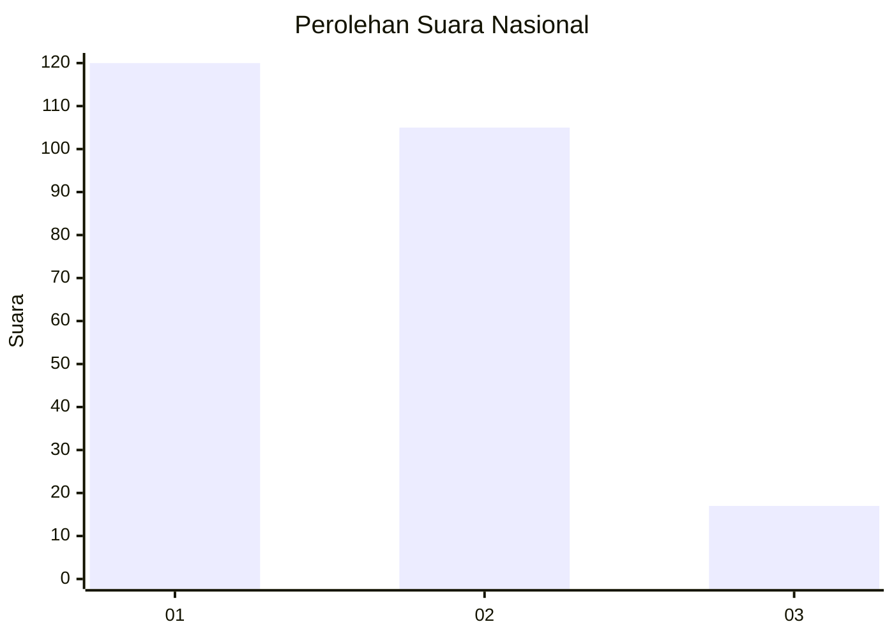
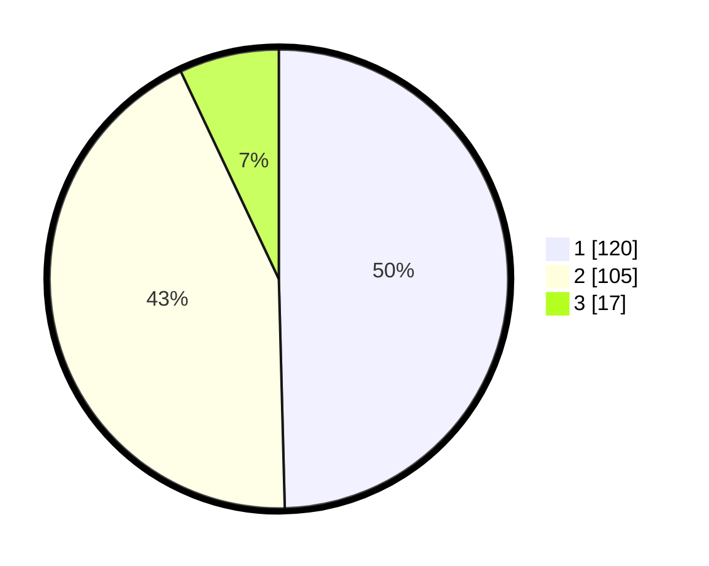

# Hasil

## Grafik

## Tabel

| No. | Nama Paslon    | Suara | Suara (raw) | Persentase |
|:--- |:-------------- | -----:| -----------:| ----------:|
| 1   | ANIES MUHAIMIN | 120   | [120][p-1]  | 49,59      |
| 2   | PRABOWO GIBRAN | 105   | [105][p-2]  | 43,39      |
| 3   | GANJAR MAHFUD  | 17    | [17][p-3]   | 7,02       |

[p-1]: https://github.com/gigit-pemilu/pemilu-2024/blob/main/pilpres/hitung-suara/sub/14-riau/sub/07--rokan-hilir/sub/01-kubu/sub/2013-sungaisegajah/sub/004-tps/sub/paslon-1.txt
[p-2]: https://github.com/gigit-pemilu/pemilu-2024/blob/main/pilpres/hitung-suara/sub/14-riau/sub/07--rokan-hilir/sub/01-kubu/sub/2013-sungaisegajah/sub/004-tps/sub/paslon-2.txt
[p-3]: https://github.com/gigit-pemilu/pemilu-2024/blob/main/pilpres/hitung-suara/sub/14-riau/sub/07--rokan-hilir/sub/01-kubu/sub/2013-sungaisegajah/sub/004-tps/sub/paslon-3.txt

## Foto C Plano

https://sirekap-obj-formc.kpu.go.id/6aa3/pemilu/ppwp/14/07/01/20/13/1407012013004-20240215-025237--0bc429b3-a972-4fe3-9cda-622bc814bb0f.jpg

https://sirekap-obj-formc.kpu.go.id/6aa3/pemilu/ppwp/14/07/01/20/13/1407012013004-20240215-025544--9628f137-afc3-43b2-abef-86785efa447d.jpg

https://sirekap-obj-formc.kpu.go.id/6aa3/pemilu/ppwp/14/07/01/20/13/1407012013004-20240215-025750--46cf1926-9926-4ee6-aeb9-226e7ab5717e.jpg

## Metadata

| Key        | Value               |
| ---------- | ------------------- |
| Time Stamp | 2024-02-16 10:00:28 |

