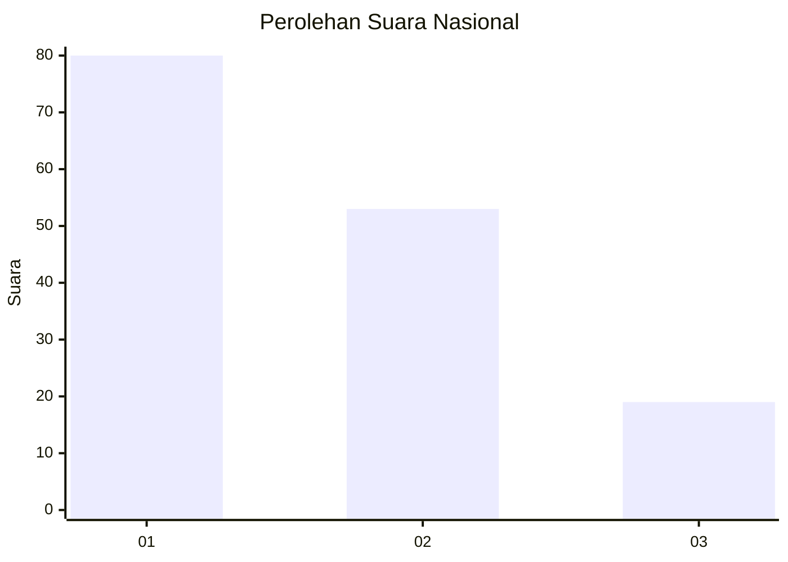
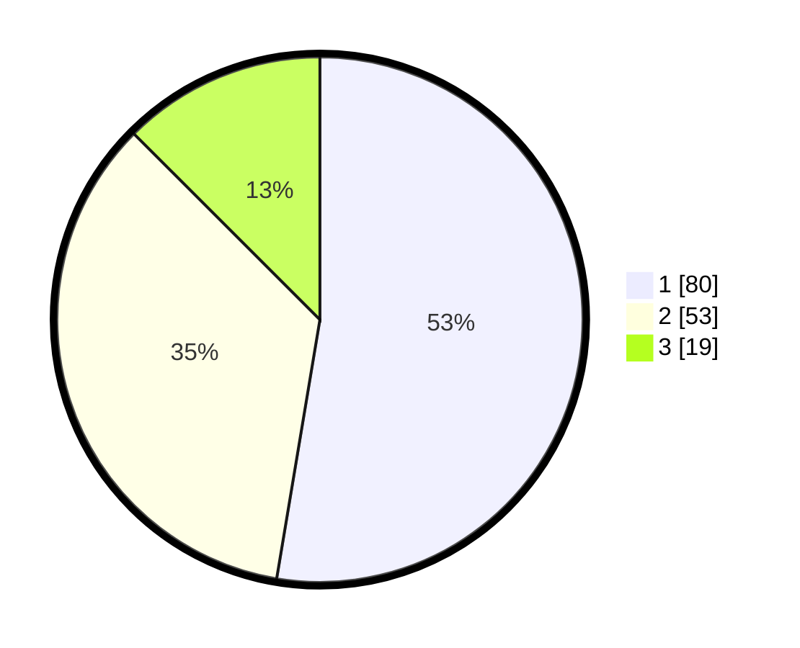

# Hasil

## Grafik

## Tabel

| No. | Nama Paslon    | Suara | Suara (raw) | Persentase |
|:--- |:-------------- | -----:| -----------:| ----------:|
| 1   | ANIES MUHAIMIN | 80    | [80][p-1]   | 52,63      |
| 2   | PRABOWO GIBRAN | 53    | [53][p-2]   | 34,87      |
| 3   | GANJAR MAHFUD  | 19    | [19][p-3]   | 12,50      |

[p-1]: https://github.com/gigit-pemilu/pemilu-2024/blob/main/pilpres/hitung-suara/sub/14-riau/sub/07--rokan-hilir/sub/01-kubu/sub/2013-sungaisegajah/sub/009-tps/sub/paslon-1.txt
[p-2]: https://github.com/gigit-pemilu/pemilu-2024/blob/main/pilpres/hitung-suara/sub/14-riau/sub/07--rokan-hilir/sub/01-kubu/sub/2013-sungaisegajah/sub/009-tps/sub/paslon-2.txt
[p-3]: https://github.com/gigit-pemilu/pemilu-2024/blob/main/pilpres/hitung-suara/sub/14-riau/sub/07--rokan-hilir/sub/01-kubu/sub/2013-sungaisegajah/sub/009-tps/sub/paslon-3.txt

## Foto C Plano

https://sirekap-obj-formc.kpu.go.id/f4d2/pemilu/ppwp/14/07/01/20/13/1407012013009-20240215-194508--ed2b779d-4ae2-4ef9-92c7-a885459e7c45.jpg

https://sirekap-obj-formc.kpu.go.id/f4d2/pemilu/ppwp/14/07/01/20/13/1407012013009-20240215-194624--cd9d272b-aea6-47af-a9d6-ef0947770486.jpg

https://sirekap-obj-formc.kpu.go.id/f4d2/pemilu/ppwp/14/07/01/20/13/1407012013009-20240215-194651--89327b9a-be8e-4657-b11e-8aae82069f25.jpg

## Metadata

| Key        | Value               |
| ---------- | ------------------- |
| Time Stamp | 2024-02-16 10:00:28 |

