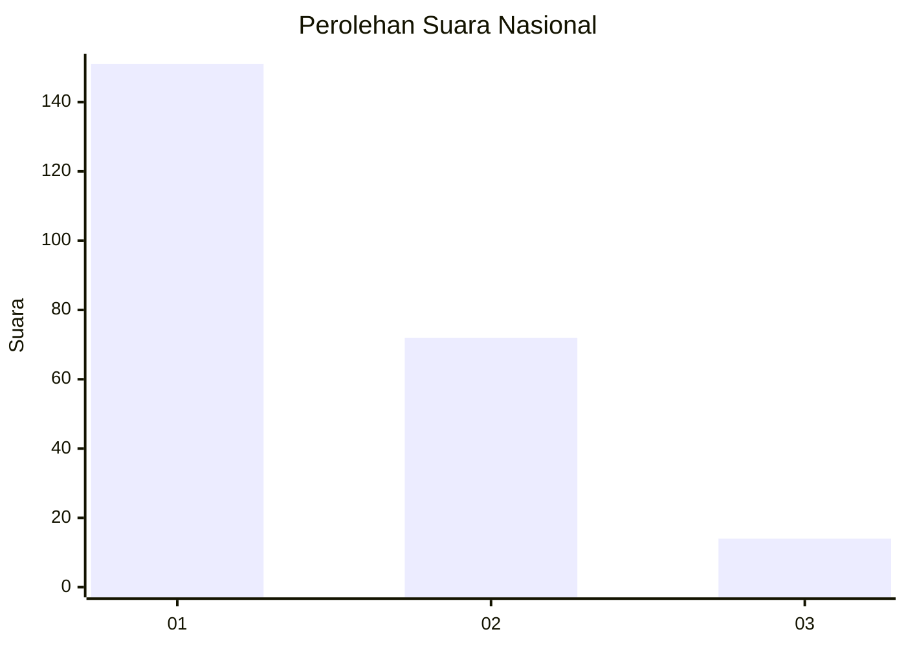
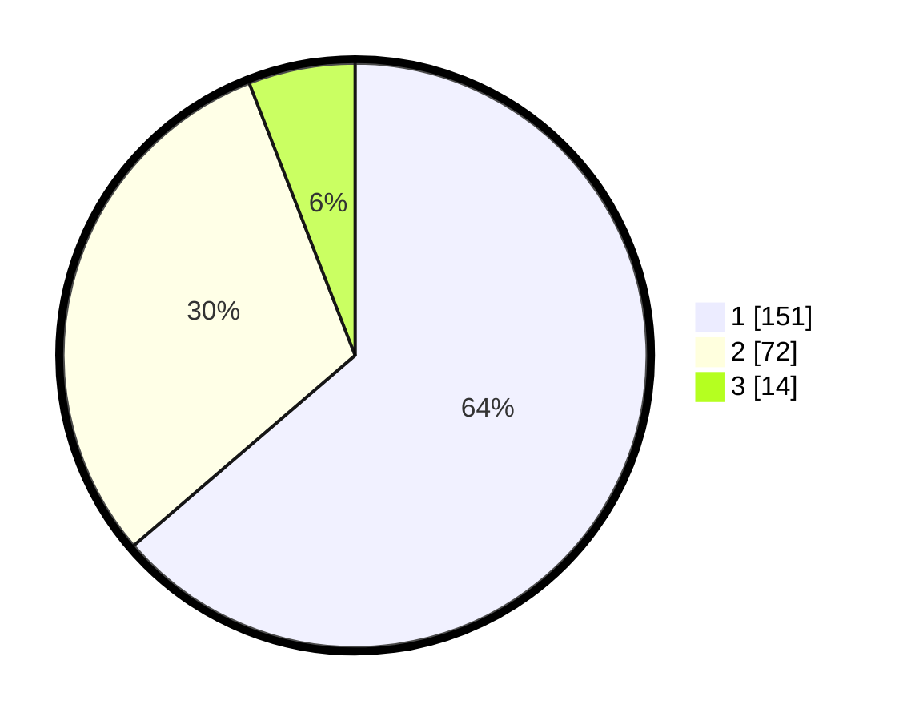

# Hasil

## Grafik

## Tabel

| No. | Nama Paslon    | Suara | Suara (raw) | Persentase |
|:--- |:-------------- | -----:| -----------:| ----------:|
| 1   | ANIES MUHAIMIN | 151   | [151][p-1]  | 63,71      |
| 2   | PRABOWO GIBRAN | 72    | [72][p-2]   | 30,38      |
| 3   | GANJAR MAHFUD  | 14    | [14][p-3]   | 5,91       |

[p-1]: https://github.com/gigit-pemilu/pemilu-2024/blob/main/pilpres/hitung-suara/sub/14-riau/sub/07--rokan-hilir/sub/01-kubu/sub/2020-telukpiyai-pesisir/sub/001-tps/sub/paslon-1.txt
[p-2]: https://github.com/gigit-pemilu/pemilu-2024/blob/main/pilpres/hitung-suara/sub/14-riau/sub/07--rokan-hilir/sub/01-kubu/sub/2020-telukpiyai-pesisir/sub/001-tps/sub/paslon-2.txt
[p-3]: https://github.com/gigit-pemilu/pemilu-2024/blob/main/pilpres/hitung-suara/sub/14-riau/sub/07--rokan-hilir/sub/01-kubu/sub/2020-telukpiyai-pesisir/sub/001-tps/sub/paslon-3.txt

## Foto C Plano

https://sirekap-obj-formc.kpu.go.id/0bdf/pemilu/ppwp/14/07/01/20/20/1407012020001-20240214-221255--cb7091c2-8059-4308-974e-9a040700adae.jpg

https://sirekap-obj-formc.kpu.go.id/0bdf/pemilu/ppwp/14/07/01/20/20/1407012020001-20240214-221425--a03927c0-cf98-4331-b22c-36f9391099cd.jpg

https://sirekap-obj-formc.kpu.go.id/0bdf/pemilu/ppwp/14/07/01/20/20/1407012020001-20240214-221512--5ef0ea4f-86a3-46a1-a97a-327337ff95ca.jpg

## Metadata

| Key        | Value               |
| ---------- | ------------------- |
| Time Stamp | 2024-02-16 10:00:28 |

