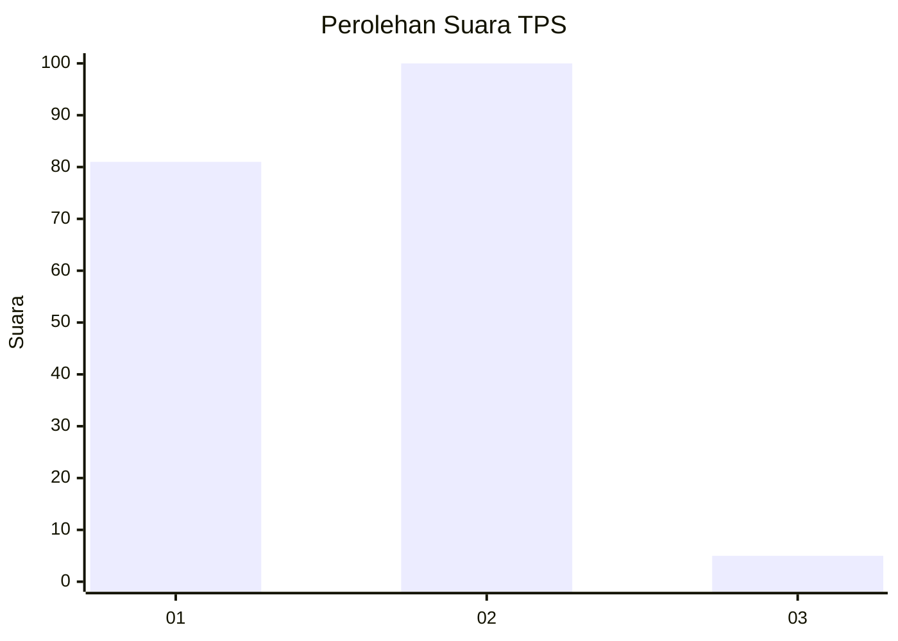
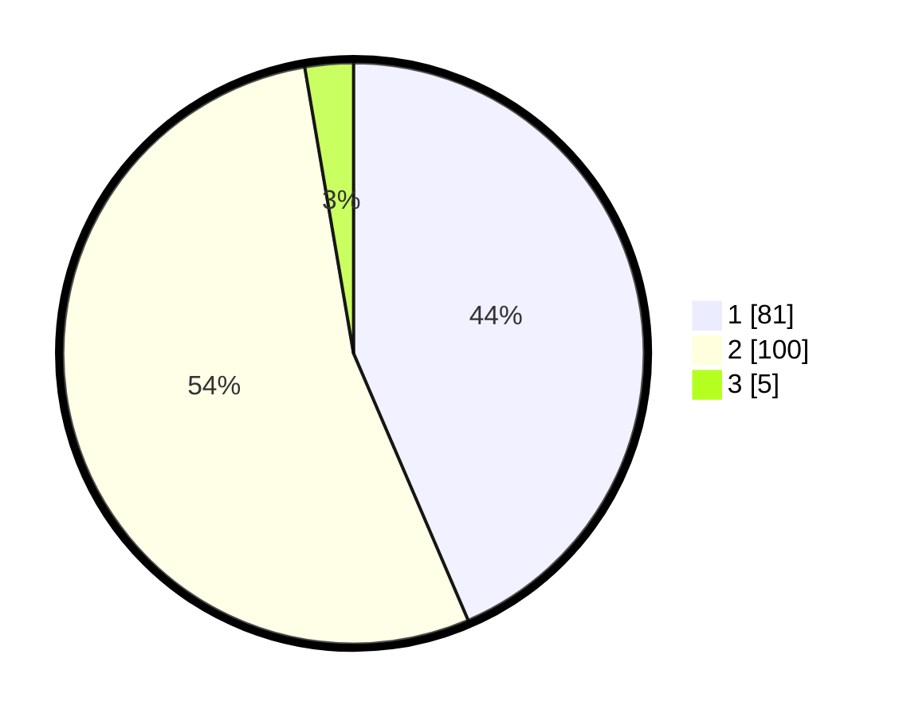

# Hasil

## Grafik

## Tabel

| No. | Nama Paslon    | Suara | Suara (raw) | Persentase |
|:--- |:-------------- | -----:| -----------:| ----------:|
| 1   | ANIES MUHAIMIN | 81    | [81][p-1]   | 43,55      |
| 2   | PRABOWO GIBRAN | 100   | [100][p-2]  | 53,76      |
| 3   | GANJAR MAHFUD  | 5     | [5][p-3]    | 2,69       |

[p-1]: https://github.com/gigit-pemilu/pemilu-2024-14-riau/blob/main/pilpres/hitung-suara/sub/14-riau/sub/07--rokan-hilir/sub/01-kubu/sub/2021-sungaikubu-hulu/sub/001-tps/sub/paslon-1.txt
[p-2]: https://github.com/gigit-pemilu/pemilu-2024-14-riau/blob/main/pilpres/hitung-suara/sub/14-riau/sub/07--rokan-hilir/sub/01-kubu/sub/2021-sungaikubu-hulu/sub/001-tps/sub/paslon-2.txt
[p-3]: https://github.com/gigit-pemilu/pemilu-2024-14-riau/blob/main/pilpres/hitung-suara/sub/14-riau/sub/07--rokan-hilir/sub/01-kubu/sub/2021-sungaikubu-hulu/sub/001-tps/sub/paslon-3.txt

## Foto C Plano

https://sirekap-obj-formc.kpu.go.id/85e3/pemilu/ppwp/14/07/01/20/21/1407012021001-20240215-060428--36fa624d-1b92-4f3d-8d5b-8e3750d283f5.jpg

https://sirekap-obj-formc.kpu.go.id/85e3/pemilu/ppwp/14/07/01/20/21/1407012021001-20240215-060610--fd91f260-aa17-4278-b1bf-1858a43990f1.jpg

https://sirekap-obj-formc.kpu.go.id/85e3/pemilu/ppwp/14/07/01/20/21/1407012021001-20240215-060728--ae6dafbd-83c8-4db0-9670-ea4c7b27ebd9.jpg

## Metadata

| Key        | Value               |
| ---------- | ------------------- |
| Time Stamp | 2024-02-16 10:00:28 |

