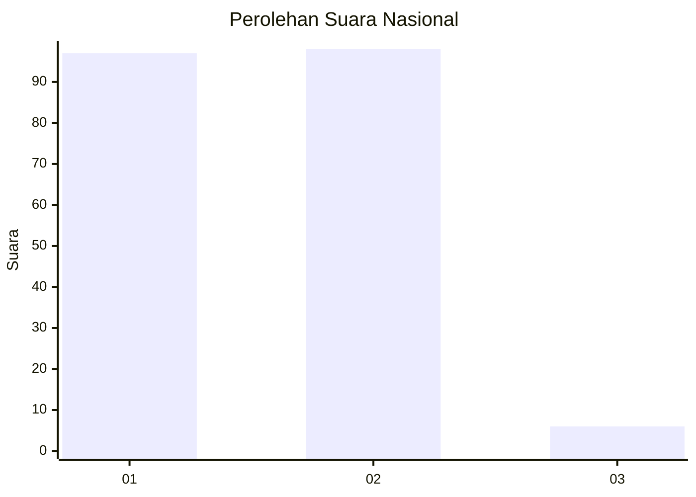
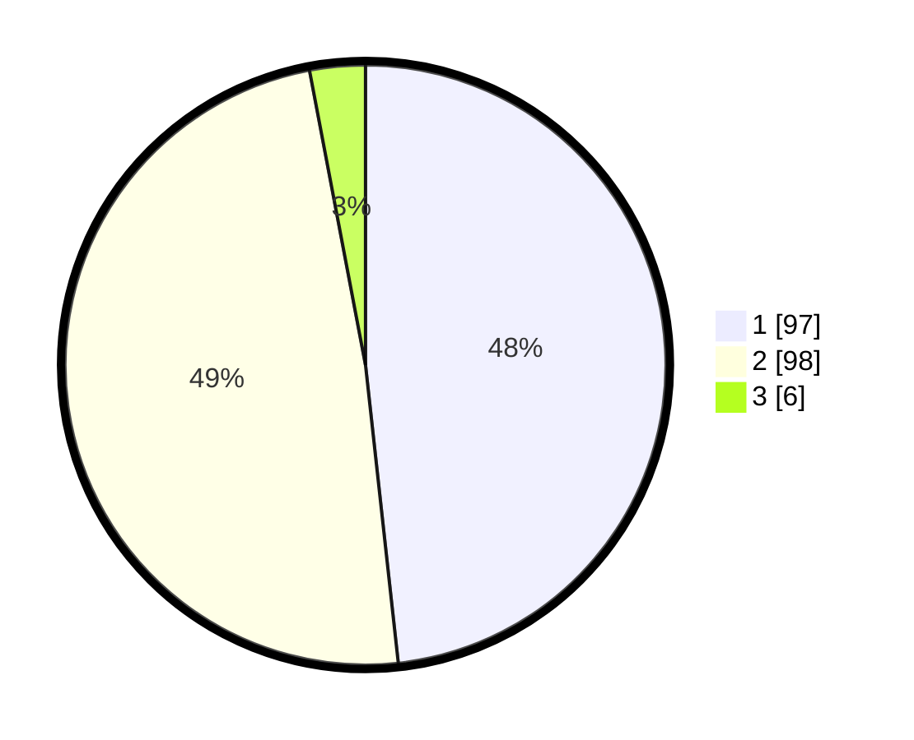

# Hasil

## Grafik

## Tabel

| No. | Nama Paslon    | Suara | Suara (raw) | Persentase |
|:--- |:-------------- | -----:| -----------:| ----------:|
| 1   | ANIES MUHAIMIN | 97    | [97][p-1]   | 48,26      |
| 2   | PRABOWO GIBRAN | 98    | [98][p-2]   | 48,76      |
| 3   | GANJAR MAHFUD  | 6     | [6][p-3]    | 2,99       |

[p-1]: https://github.com/gigit-pemilu/pemilu-2024/blob/main/pilpres/hitung-suara/sub/14-riau/sub/07--rokan-hilir/sub/01-kubu/sub/2021-sungaikubu-hulu/sub/005-tps/sub/paslon-1.txt
[p-2]: https://github.com/gigit-pemilu/pemilu-2024/blob/main/pilpres/hitung-suara/sub/14-riau/sub/07--rokan-hilir/sub/01-kubu/sub/2021-sungaikubu-hulu/sub/005-tps/sub/paslon-2.txt
[p-3]: https://github.com/gigit-pemilu/pemilu-2024/blob/main/pilpres/hitung-suara/sub/14-riau/sub/07--rokan-hilir/sub/01-kubu/sub/2021-sungaikubu-hulu/sub/005-tps/sub/paslon-3.txt

## Foto C Plano

https://sirekap-obj-formc.kpu.go.id/1a00/pemilu/ppwp/14/07/01/20/21/1407012021005-20240215-030358--3fb69114-4168-4d6b-9466-f5fa51cbbb0a.jpg

https://sirekap-obj-formc.kpu.go.id/1a00/pemilu/ppwp/14/07/01/20/21/1407012021005-20240215-030318--1d9855f2-2164-4fb8-9c32-eed95ebd5712.jpg

https://sirekap-obj-formc.kpu.go.id/1a00/pemilu/ppwp/14/07/01/20/21/1407012021005-20240215-030429--8b98db96-7b34-48fd-ada0-f5143f20e834.jpg

## Metadata

| Key        | Value               |
| ---------- | ------------------- |
| Time Stamp | 2024-02-16 12:51:22 |

