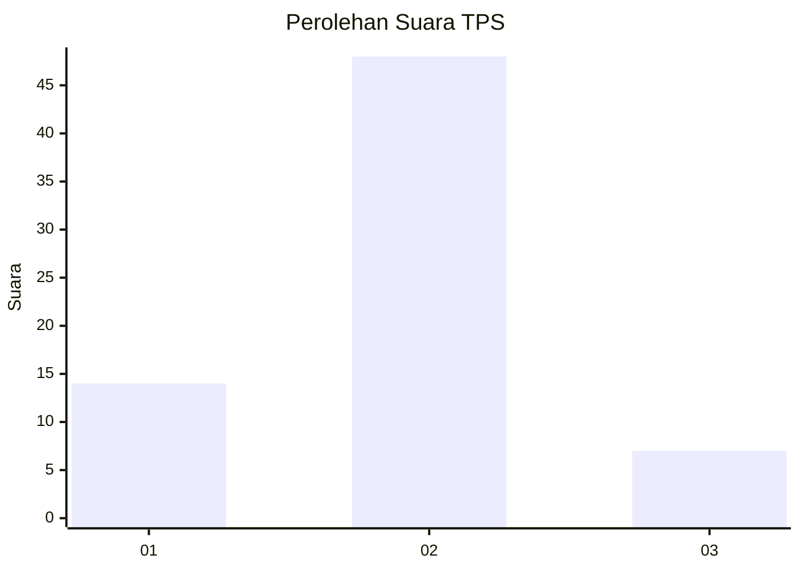
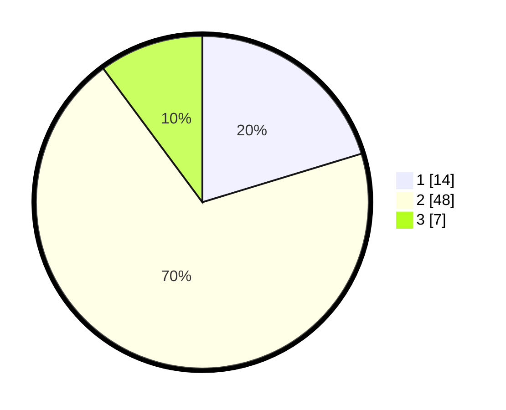

# Hasil

## Grafik

## Tabel

| No. | Nama Paslon    | Suara | Suara (raw) | Persentase |
|:--- |:-------------- | -----:| -----------:| ----------:|
| 1   | ANIES MUHAIMIN | 14    | [14][p-1]   | 20,29      |
| 2   | PRABOWO GIBRAN | 48    | [48][p-2]   | 69,57      |
| 3   | GANJAR MAHFUD  | 7     | [7][p-3]    | 10,14      |

[p-1]: https://github.com/gigit-pemilu/pemilu-2024-14-riau/blob/main/pilpres/hitung-suara/sub/14-riau/sub/07--rokan-hilir/sub/01-kubu/sub/2022-sungai-segajah-jaya/sub/006-tps/sub/paslon-1.txt
[p-2]: https://github.com/gigit-pemilu/pemilu-2024-14-riau/blob/main/pilpres/hitung-suara/sub/14-riau/sub/07--rokan-hilir/sub/01-kubu/sub/2022-sungai-segajah-jaya/sub/006-tps/sub/paslon-2.txt
[p-3]: https://github.com/gigit-pemilu/pemilu-2024-14-riau/blob/main/pilpres/hitung-suara/sub/14-riau/sub/07--rokan-hilir/sub/01-kubu/sub/2022-sungai-segajah-jaya/sub/006-tps/sub/paslon-3.txt

## Foto C Plano

https://sirekap-obj-formc.kpu.go.id/3264/pemilu/ppwp/14/07/01/20/22/1407012022006-20240214-141057--bda47f9d-f625-4ea7-a0c4-e999a0adeab8.jpg

https://sirekap-obj-formc.kpu.go.id/3264/pemilu/ppwp/14/07/01/20/22/1407012022006-20240214-214229--6ac3928c-0562-413f-a9c1-208e85059578.jpg

## Metadata

| Key        | Value               |
| ---------- | ------------------- |
| Time Stamp | 2024-02-15 22:30:27 |

