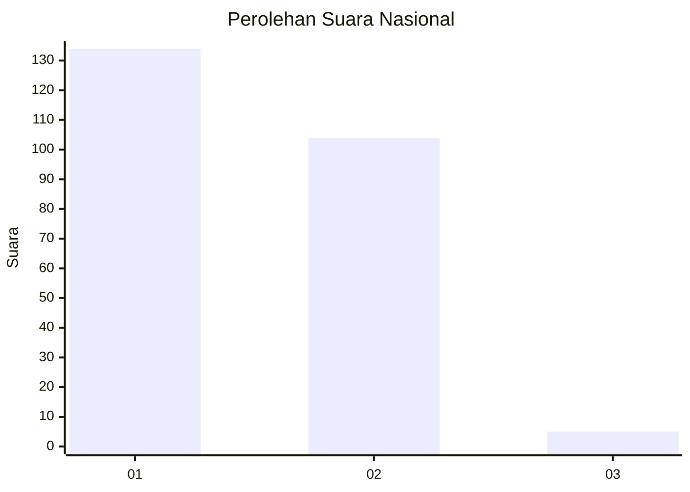
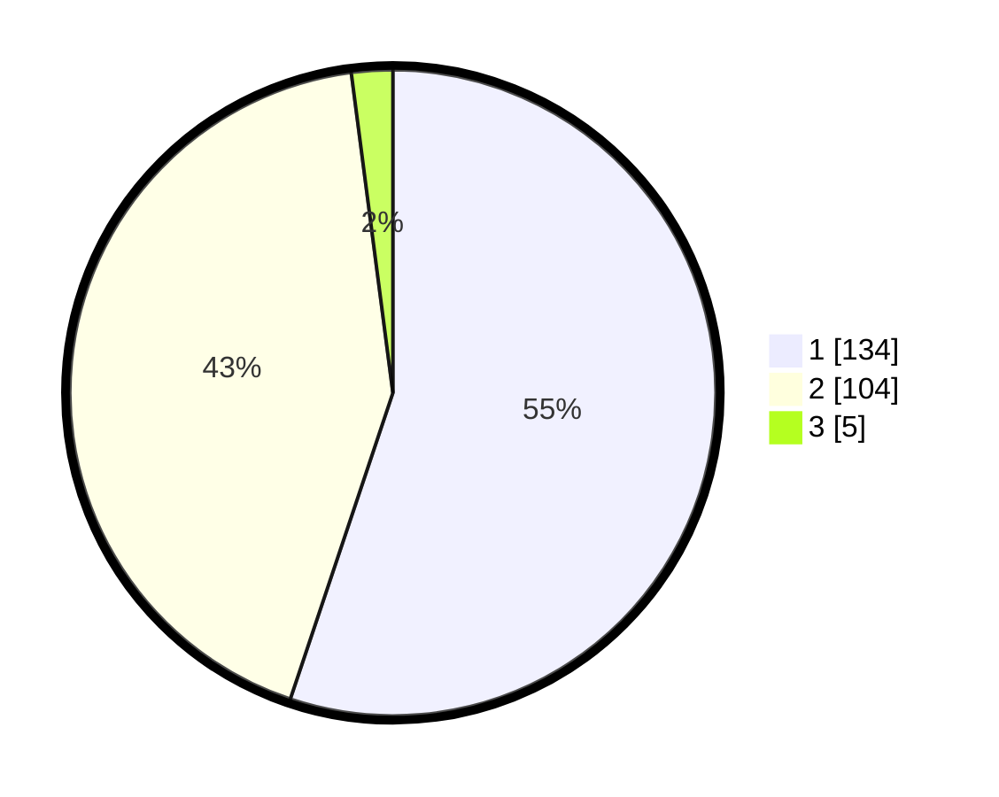

# Hasil

## Grafik

## Tabel

| No. | Nama Paslon    | Suara | Suara (raw) | Persentase |
|:--- |:-------------- | -----:| -----------:| ----------:|
| 1   | ANIES MUHAIMIN | 134   | [134][p-1]  | 55,14      |
| 2   | PRABOWO GIBRAN | 104   | [104][p-2]  | 42,80      |
| 3   | GANJAR MAHFUD  | 5     | [5][p-3]    | 2,06       |

[p-1]: https://github.com/gigit-pemilu/pemilu-2024/blob/main/pilpres/hitung-suara/sub/14-riau/sub/07--rokan-hilir/sub/02-bangko/sub/1011-bagan-punak/sub/003-tps/sub/paslon-1.txt
[p-2]: https://github.com/gigit-pemilu/pemilu-2024/blob/main/pilpres/hitung-suara/sub/14-riau/sub/07--rokan-hilir/sub/02-bangko/sub/1011-bagan-punak/sub/003-tps/sub/paslon-2.txt
[p-3]: https://github.com/gigit-pemilu/pemilu-2024/blob/main/pilpres/hitung-suara/sub/14-riau/sub/07--rokan-hilir/sub/02-bangko/sub/1011-bagan-punak/sub/003-tps/sub/paslon-3.txt

## Foto C Plano

https://sirekap-obj-formc.kpu.go.id/01e4/pemilu/ppwp/14/07/02/10/11/1407021011003-20240221-212553--faf3a123-8b47-4685-8f27-3673fc3d99fd.jpg

https://sirekap-obj-formc.kpu.go.id/01e4/pemilu/ppwp/14/07/02/10/11/1407021011003-20240218-173101--a46c8153-044c-448d-a62f-3a8552d318ad.jpg

https://sirekap-obj-formc.kpu.go.id/01e4/pemilu/ppwp/14/07/02/10/11/1407021011003-20240218-173143--f7eadb8a-3496-4bcd-ba50-ed1712e61f06.jpg

## Metadata

| Key        | Value               |
| ---------- | ------------------- |
| Time Stamp | 2024-02-21 22:00:00 |

