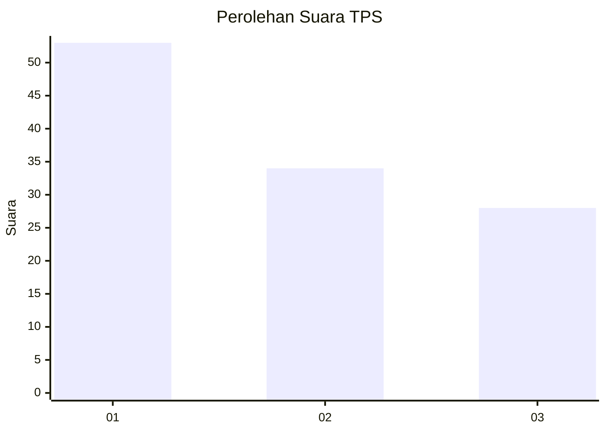
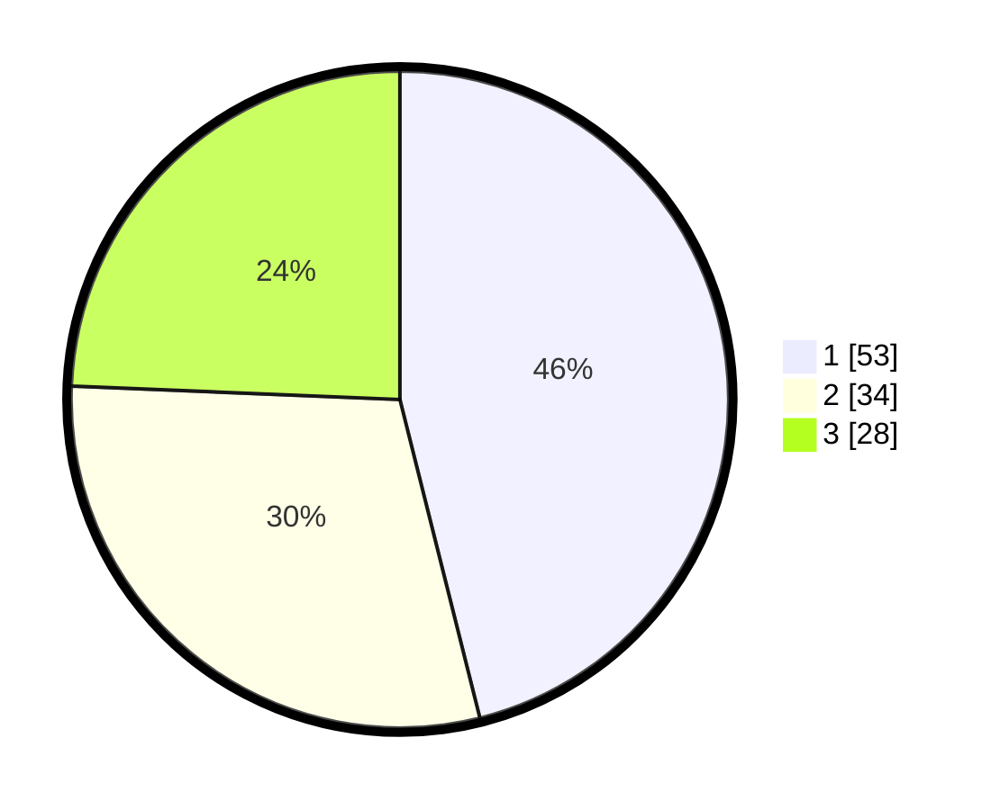

# Hasil

## Grafik

## Tabel

| No. | Nama Paslon    | Suara | Suara (raw) | Persentase |
|:--- |:-------------- | -----:| -----------:| ----------:|
| 1   | ANIES MUHAIMIN | 53    | [53][p-1]   | 46,09      |
| 2   | PRABOWO GIBRAN | 34    | [34][p-2]   | 29,57      |
| 3   | GANJAR MAHFUD  | 28    | [28][p-3]   | 24,35      |

[p-1]: https://github.com/gigit-pemilu/pemilu-2024-14-riau/blob/main/pilpres/hitung-suara/sub/14-riau/sub/07--rokan-hilir/sub/02-bangko/sub/1012-bagan-kota/sub/001-tps/sub/paslon-1.txt
[p-2]: https://github.com/gigit-pemilu/pemilu-2024-14-riau/blob/main/pilpres/hitung-suara/sub/14-riau/sub/07--rokan-hilir/sub/02-bangko/sub/1012-bagan-kota/sub/001-tps/sub/paslon-2.txt
[p-3]: https://github.com/gigit-pemilu/pemilu-2024-14-riau/blob/main/pilpres/hitung-suara/sub/14-riau/sub/07--rokan-hilir/sub/02-bangko/sub/1012-bagan-kota/sub/001-tps/sub/paslon-3.txt

## Foto C Plano

https://sirekap-obj-formc.kpu.go.id/72a8/pemilu/ppwp/14/07/02/10/12/1407021012001-20240217-090753--5c91e033-3819-4618-a982-741ead9e0409.jpg

https://sirekap-obj-formc.kpu.go.id/72a8/pemilu/ppwp/14/07/02/10/12/1407021012001-20240215-010532--d20f0f08-ae1c-43c8-9282-8486036836a4.jpg

https://sirekap-obj-formc.kpu.go.id/72a8/pemilu/ppwp/14/07/02/10/12/1407021012001-20240215-010625--efa8bf3c-a4ec-4d1d-9e22-5d236353eddf.jpg

## Metadata

| Key        | Value               |
| ---------- | ------------------- |
| Time Stamp | 2024-02-17 09:30:03 |

