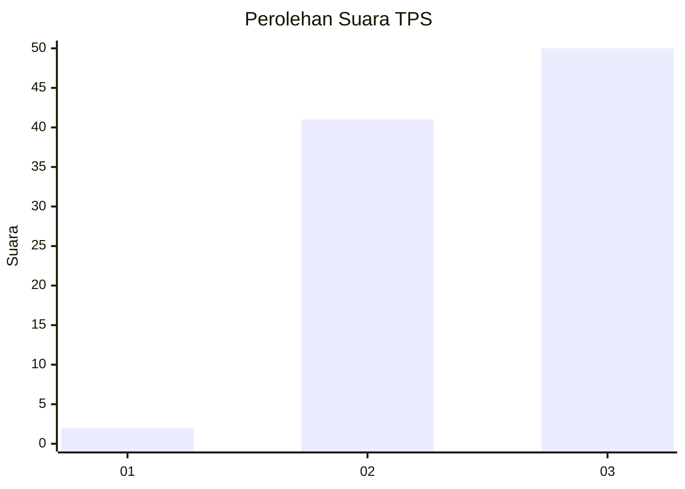
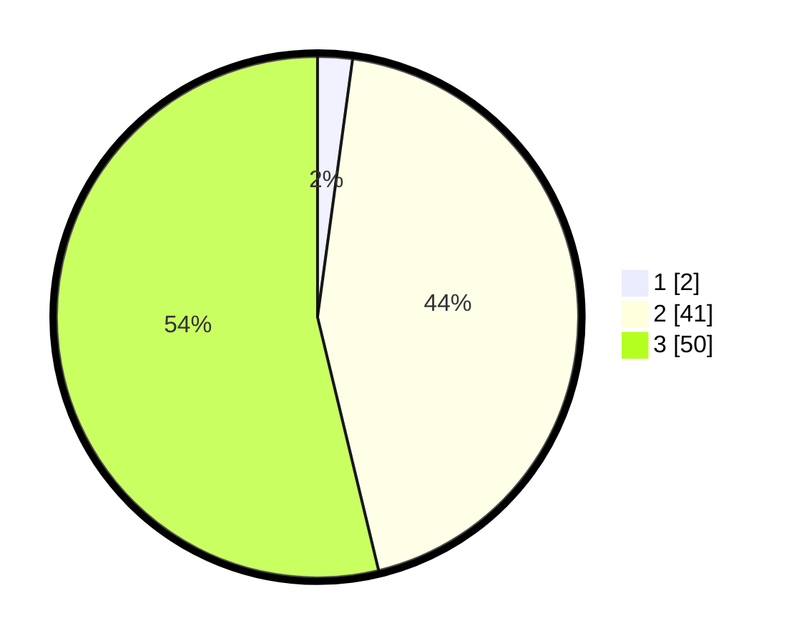

# Hasil

## Grafik

## Tabel

| No. | Nama Paslon    | Suara | Suara (raw) | Persentase |
|:--- |:-------------- | -----:| -----------:| ----------:|
| 1   | ANIES MUHAIMIN | 2     | [2][p-1]    | 2,15       |
| 2   | PRABOWO GIBRAN | 41    | [41][p-2]   | 44,09      |
| 3   | GANJAR MAHFUD  | 50    | [50][p-3]   | 53,76      |

[p-1]: https://github.com/gigit-pemilu/pemilu-2024-14-riau/blob/main/pilpres/hitung-suara/sub/14-riau/sub/07--rokan-hilir/sub/02-bangko/sub/1012-bagan-kota/sub/005-tps/sub/paslon-1.txt
[p-2]: https://github.com/gigit-pemilu/pemilu-2024-14-riau/blob/main/pilpres/hitung-suara/sub/14-riau/sub/07--rokan-hilir/sub/02-bangko/sub/1012-bagan-kota/sub/005-tps/sub/paslon-2.txt
[p-3]: https://github.com/gigit-pemilu/pemilu-2024-14-riau/blob/main/pilpres/hitung-suara/sub/14-riau/sub/07--rokan-hilir/sub/02-bangko/sub/1012-bagan-kota/sub/005-tps/sub/paslon-3.txt

## Foto C Plano

https://sirekap-obj-formc.kpu.go.id/fdb9/pemilu/ppwp/14/07/02/10/12/1407021012005-20240222-152207--dbc091f2-ccfd-4c35-8000-301c11c3cc18.jpg

https://sirekap-obj-formc.kpu.go.id/fdb9/pemilu/ppwp/14/07/02/10/12/1407021012005-20240222-152358--a0c62550-df3b-408a-b172-b7a74e1c3f14.jpg

https://sirekap-obj-formc.kpu.go.id/fdb9/pemilu/ppwp/14/07/02/10/12/1407021012005-20240214-235925--2634bb20-e661-4ba3-bb4b-6e76ecce9329.jpg

## Metadata

| Key        | Value               |
| ---------- | ------------------- |
| Time Stamp | 2024-02-25 13:00:00 |

