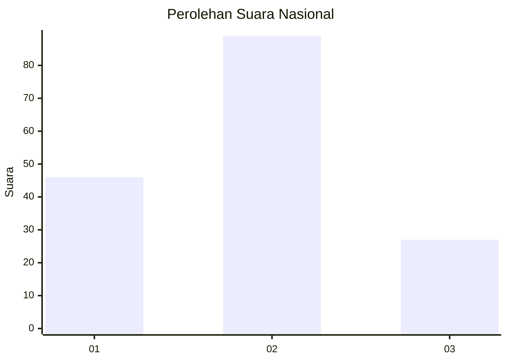
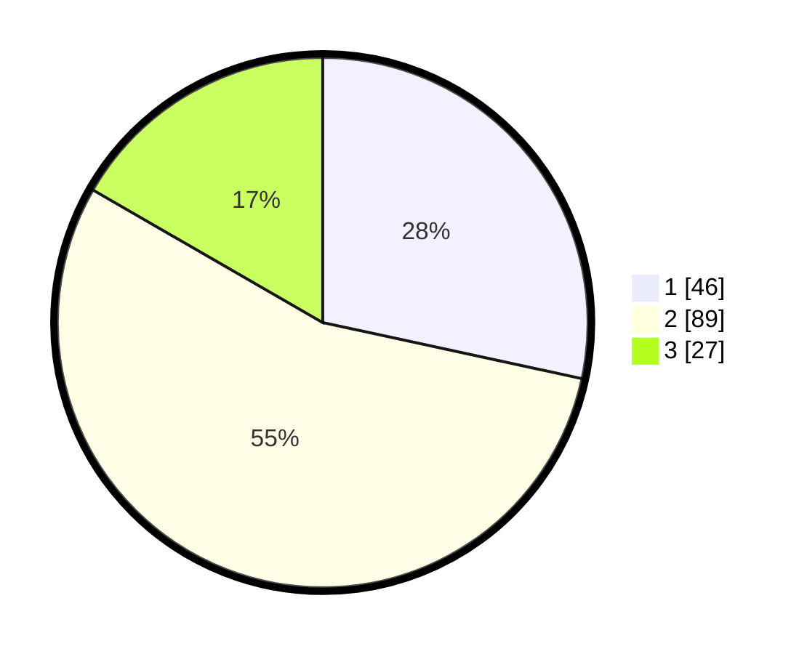

# Hasil

## Grafik

## Tabel

| No. | Nama Paslon    | Suara | Suara (raw) | Persentase |
|:--- |:-------------- | -----:| -----------:| ----------:|
| 1   | ANIES MUHAIMIN | 46    | [46][p-1]   | 28,40      |
| 2   | PRABOWO GIBRAN | 89    | [89][p-2]   | 54,94      |
| 3   | GANJAR MAHFUD  | 27    | [27][p-3]   | 16,67      |

[p-1]: https://github.com/gigit-pemilu/pemilu-2024/blob/main/pilpres/hitung-suara/sub/14-riau/sub/07--rokan-hilir/sub/02-bangko/sub/1015-bagan-hulu/sub/002-tps/sub/paslon-1.txt
[p-2]: https://github.com/gigit-pemilu/pemilu-2024/blob/main/pilpres/hitung-suara/sub/14-riau/sub/07--rokan-hilir/sub/02-bangko/sub/1015-bagan-hulu/sub/002-tps/sub/paslon-2.txt
[p-3]: https://github.com/gigit-pemilu/pemilu-2024/blob/main/pilpres/hitung-suara/sub/14-riau/sub/07--rokan-hilir/sub/02-bangko/sub/1015-bagan-hulu/sub/002-tps/sub/paslon-3.txt

## Foto C Plano

https://sirekap-obj-formc.kpu.go.id/71f8/pemilu/ppwp/14/07/02/10/15/1407021015002-20240221-170741--1558d9fa-11f9-405a-94e0-392d1aa3cdca.jpg

https://sirekap-obj-formc.kpu.go.id/71f8/pemilu/ppwp/14/07/02/10/15/1407021015002-20240221-170853--a455321a-faff-4e27-af4b-9ca43de35b1c.jpg

https://sirekap-obj-formc.kpu.go.id/71f8/pemilu/ppwp/14/07/02/10/15/1407021015002-20240221-171017--792bdbb1-e697-4782-91c6-f561dc550133.jpg

## Metadata

| Key        | Value               |
| ---------- | ------------------- |
| Time Stamp | 2024-02-21 18:00:00 |

## DATA PEMILIH TETAP

Jumlah pemilih dalam DPT: **267**.
 * L: **158**.
 * P: **129**.

## DATA PENGGUNA HAK PILIH

Jumlah pengguna hak pilih dalam DPT: **533**.
 * L: **255**.
 * P: **93**.

Jumlah pengguna hak pilih dalam DPTb: **771**.
 * L: **40**.
 * P: **701**.

Jumlah pengguna hak pilih dalam DPK: **878**.
 * L: **808**.
 * P: **0**.

Jumlah pengguna hak pilih: **175**.
 * L: **890**.
 * P: **809**.

## JUMLAH SUARA SAH DAN TIDAK SAH

JUMLAH SELURUH SUARA SAH: **172**.

JUMLAH SUARA TIDAK SAH: **2**.

JUMLAH SELURUH SUARA SAH DAN SUARA TIDAK SAH: **174**.

