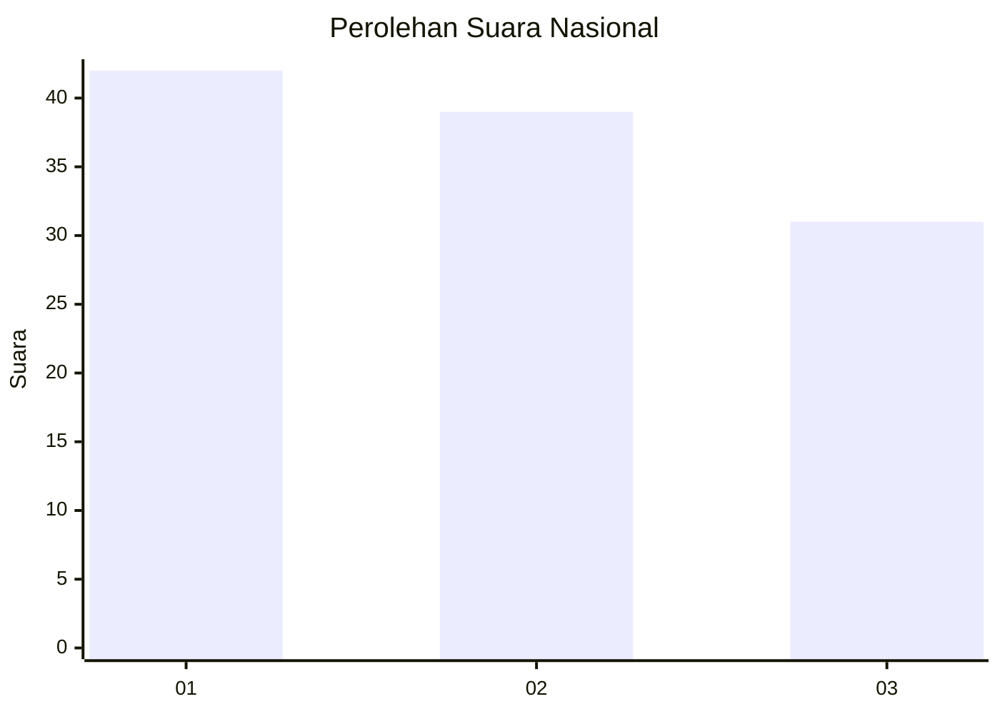
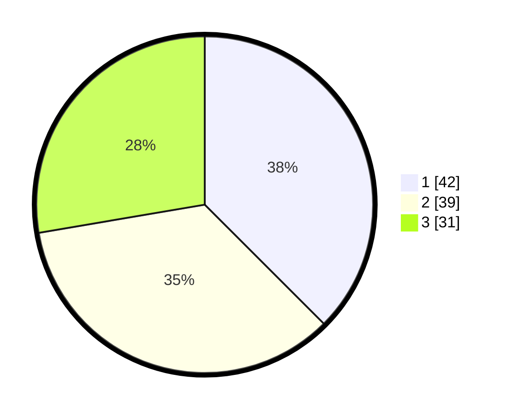

# Hasil

## Grafik

## Tabel

| No. | Nama Paslon    | Suara | Suara (raw) | Persentase |
|:--- |:-------------- | -----:| -----------:| ----------:|
| 1   | ANIES MUHAIMIN | 42    | [42][p-1]   | 37,50      |
| 2   | PRABOWO GIBRAN | 39    | [39][p-2]   | 34,82      |
| 3   | GANJAR MAHFUD  | 31    | [31][p-3]   | 27,68      |

[p-1]: https://github.com/gigit-pemilu/pemilu-2024/blob/main/pilpres/hitung-suara/sub/14-riau/sub/07--rokan-hilir/sub/02-bangko/sub/1015-bagan-hulu/sub/003-tps/sub/paslon-1.txt
[p-2]: https://github.com/gigit-pemilu/pemilu-2024/blob/main/pilpres/hitung-suara/sub/14-riau/sub/07--rokan-hilir/sub/02-bangko/sub/1015-bagan-hulu/sub/003-tps/sub/paslon-2.txt
[p-3]: https://github.com/gigit-pemilu/pemilu-2024/blob/main/pilpres/hitung-suara/sub/14-riau/sub/07--rokan-hilir/sub/02-bangko/sub/1015-bagan-hulu/sub/003-tps/sub/paslon-3.txt

## Foto C Plano

https://sirekap-obj-formc.kpu.go.id/fb41/pemilu/ppwp/14/07/02/10/15/1407021015003-20240215-023439--38a16564-b47f-4919-97a8-d8b3d4a86059.jpg

https://sirekap-obj-formc.kpu.go.id/fb41/pemilu/ppwp/14/07/02/10/15/1407021015003-20240215-023554--bffad8f0-6065-4f7c-99ce-f26968be947c.jpg

https://sirekap-obj-formc.kpu.go.id/fb41/pemilu/ppwp/14/07/02/10/15/1407021015003-20240215-023703--a97cfae4-f18b-4eb2-88eb-040d92a33003.jpg

## Metadata

| Key        | Value               |
| ---------- | ------------------- |
| Time Stamp | 2024-02-16 10:00:28 |

