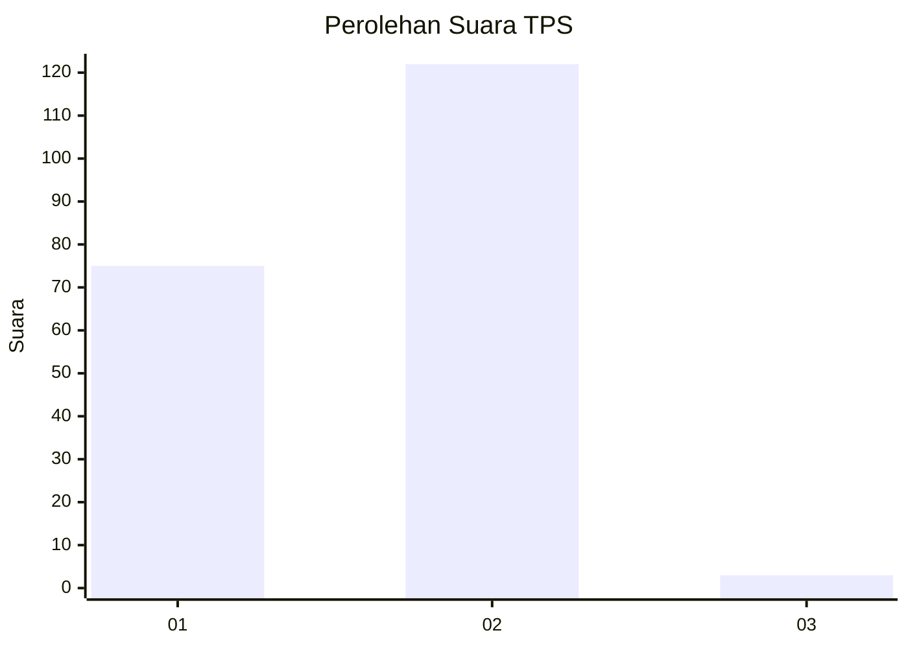
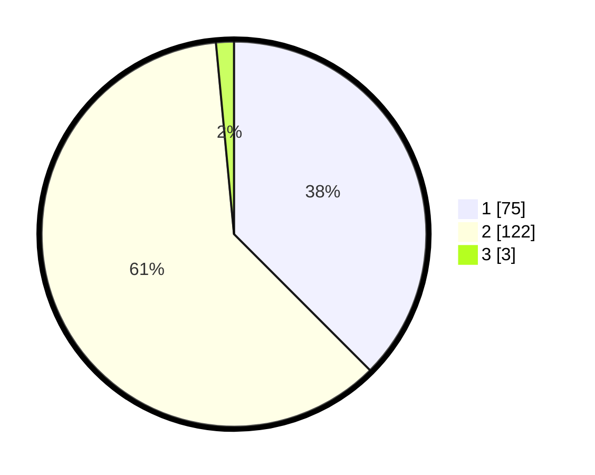

# Hasil

## Grafik

## Tabel

| No. | Nama Paslon    | Suara | Suara (raw) | Persentase |
|:--- |:-------------- | -----:| -----------:| ----------:|
| 1   | ANIES MUHAIMIN | 75    | [75][p-1]   | 37,50      |
| 2   | PRABOWO GIBRAN | 122   | [122][p-2]  | 61,00      |
| 3   | GANJAR MAHFUD  | 3     | [3][p-3]    | 1,50       |

[p-1]: https://github.com/gigit-pemilu/pemilu-2024-14-riau/blob/main/pilpres/hitung-suara/sub/14-riau/sub/07--rokan-hilir/sub/02-bangko/sub/2010-labuhan-tangga-besar/sub/007-tps/sub/paslon-1.txt
[p-2]: https://github.com/gigit-pemilu/pemilu-2024-14-riau/blob/main/pilpres/hitung-suara/sub/14-riau/sub/07--rokan-hilir/sub/02-bangko/sub/2010-labuhan-tangga-besar/sub/007-tps/sub/paslon-2.txt
[p-3]: https://github.com/gigit-pemilu/pemilu-2024-14-riau/blob/main/pilpres/hitung-suara/sub/14-riau/sub/07--rokan-hilir/sub/02-bangko/sub/2010-labuhan-tangga-besar/sub/007-tps/sub/paslon-3.txt

## Foto C Plano

https://sirekap-obj-formc.kpu.go.id/fc2c/pemilu/ppwp/14/07/02/20/10/1407022010007-20240215-085832--007ce83b-c1da-451a-b5dc-654f8245616e.jpg

https://sirekap-obj-formc.kpu.go.id/fc2c/pemilu/ppwp/14/07/02/20/10/1407022010007-20240215-090210--3e0103b5-54ee-4b7e-b01f-a92b5277faa4.jpg

https://sirekap-obj-formc.kpu.go.id/fc2c/pemilu/ppwp/14/07/02/20/10/1407022010007-20240215-090522--17474f48-abad-4a00-bf4c-8a1ef8f84ee2.jpg

## Metadata

| Key        | Value               |
| ---------- | ------------------- |
| Time Stamp | 2024-02-16 14:00:34 |

