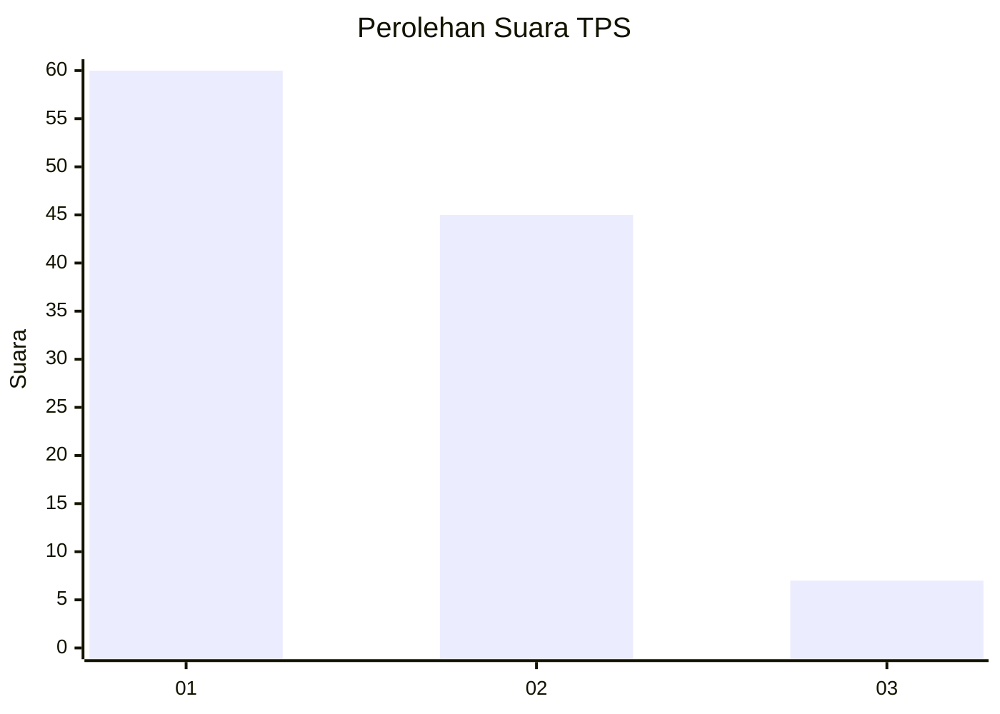
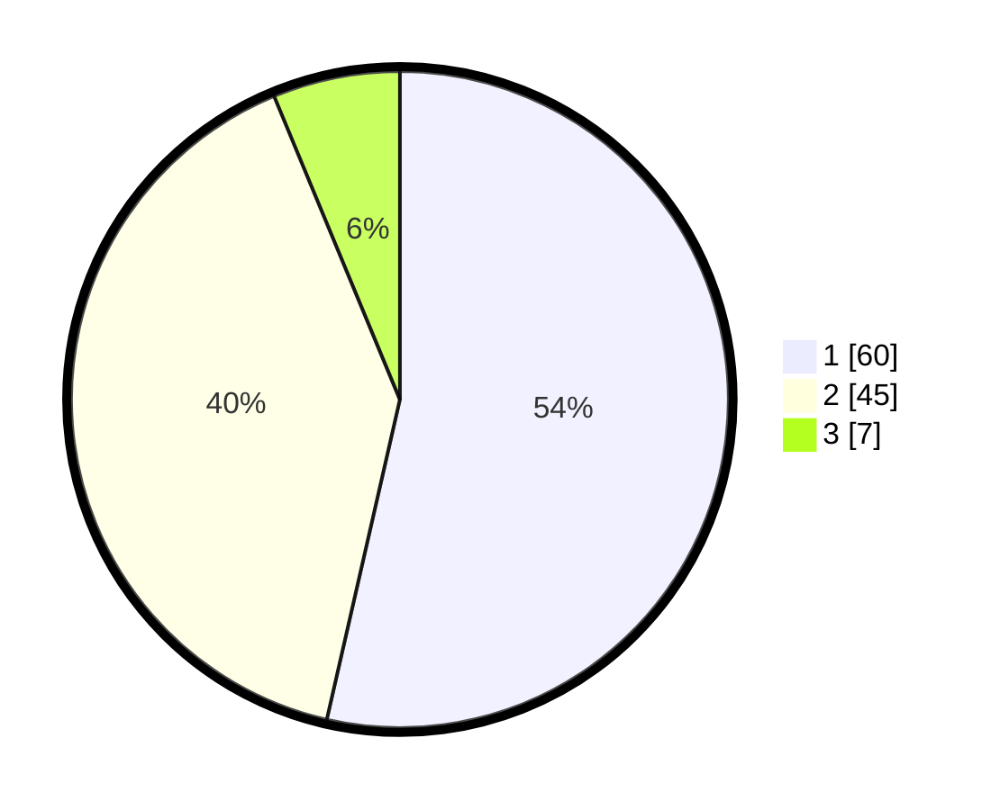

# Hasil

## Grafik

## Tabel

| No. | Nama Paslon    | Suara | Suara (raw) | Persentase |
|:--- |:-------------- | -----:| -----------:| ----------:|
| 1   | ANIES MUHAIMIN | 60    | [60][p-1]   | 53,57      |
| 2   | PRABOWO GIBRAN | 45    | [45][p-2]   | 40,18      |
| 3   | GANJAR MAHFUD  | 7     | [7][p-3]    | 6,25       |

[p-1]: https://github.com/gigit-pemilu/pemilu-2024-14-riau/blob/main/pilpres/hitung-suara/sub/14-riau/sub/07--rokan-hilir/sub/02-bangko/sub/2010-labuhan-tangga-besar/sub/008-tps/sub/paslon-1.txt
[p-2]: https://github.com/gigit-pemilu/pemilu-2024-14-riau/blob/main/pilpres/hitung-suara/sub/14-riau/sub/07--rokan-hilir/sub/02-bangko/sub/2010-labuhan-tangga-besar/sub/008-tps/sub/paslon-2.txt
[p-3]: https://github.com/gigit-pemilu/pemilu-2024-14-riau/blob/main/pilpres/hitung-suara/sub/14-riau/sub/07--rokan-hilir/sub/02-bangko/sub/2010-labuhan-tangga-besar/sub/008-tps/sub/paslon-3.txt

## Foto C Plano

https://sirekap-obj-formc.kpu.go.id/1b8c/pemilu/ppwp/14/07/02/20/10/1407022010008-20240215-012808--a0cad65f-f8c9-427c-8700-2a70021aba96.jpg

https://sirekap-obj-formc.kpu.go.id/1b8c/pemilu/ppwp/14/07/02/20/10/1407022010008-20240215-013114--7ea2aac3-a899-427f-98c3-26ad239a1e27.jpg

https://sirekap-obj-formc.kpu.go.id/1b8c/pemilu/ppwp/14/07/02/20/10/1407022010008-20240215-013404--648c5500-5951-4423-a2d8-8b184091ca6a.jpg

## Metadata

| Key        | Value               |
| ---------- | ------------------- |
| Time Stamp | 2024-02-16 10:00:28 |

