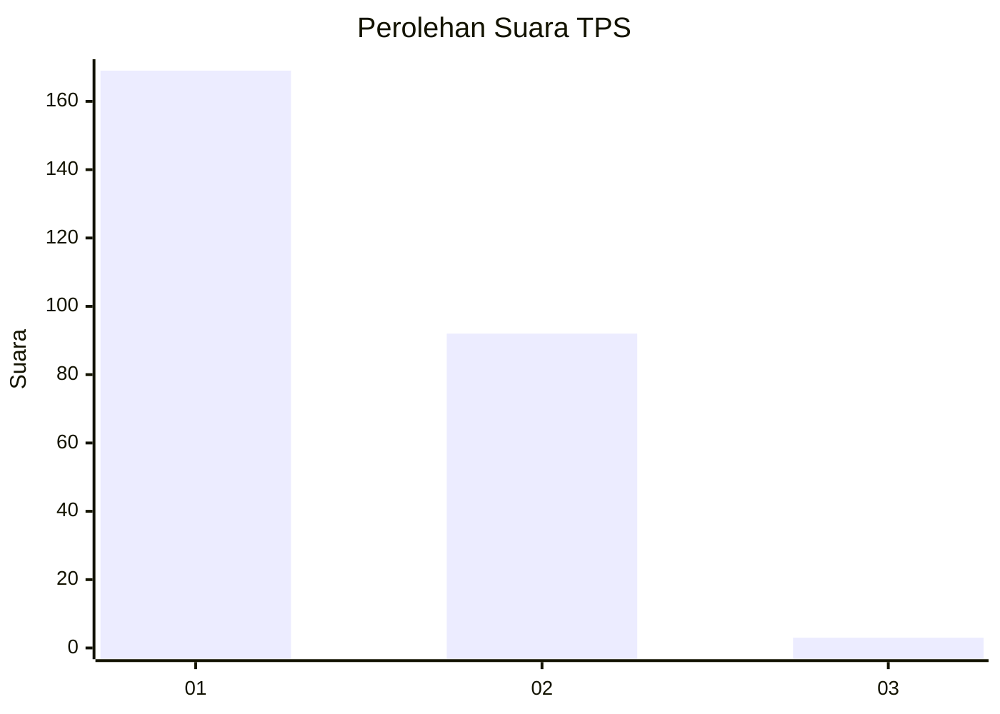
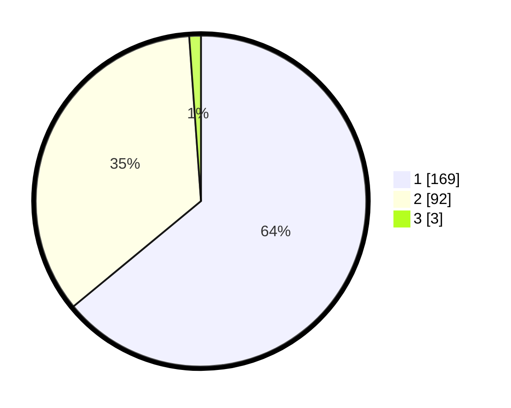

# Hasil

## Grafik

## Tabel

| No. | Nama Paslon    | Suara | Suara (raw) | Persentase |
|:--- |:-------------- | -----:| -----------:| ----------:|
| 1   | ANIES MUHAIMIN | 169   | [169][p-1]  | 64,02      |
| 2   | PRABOWO GIBRAN | 92    | [92][p-2]   | 34,85      |
| 3   | GANJAR MAHFUD  | 3     | [3][p-3]    | 1,14       |

[p-1]: https://github.com/gigit-pemilu/pemilu-2024-14-riau/blob/main/pilpres/hitung-suara/sub/14-riau/sub/07--rokan-hilir/sub/03-tanah-putih/sub/1007-sedinginan/sub/004-tps/sub/paslon-1.txt
[p-2]: https://github.com/gigit-pemilu/pemilu-2024-14-riau/blob/main/pilpres/hitung-suara/sub/14-riau/sub/07--rokan-hilir/sub/03-tanah-putih/sub/1007-sedinginan/sub/004-tps/sub/paslon-2.txt
[p-3]: https://github.com/gigit-pemilu/pemilu-2024-14-riau/blob/main/pilpres/hitung-suara/sub/14-riau/sub/07--rokan-hilir/sub/03-tanah-putih/sub/1007-sedinginan/sub/004-tps/sub/paslon-3.txt

## Foto C Plano

https://sirekap-obj-formc.kpu.go.id/afa4/pemilu/ppwp/14/07/03/10/07/1407031007004-20240215-010316--891eb606-d27e-43fa-b994-1a14078cfc15.jpg

https://sirekap-obj-formc.kpu.go.id/afa4/pemilu/ppwp/14/07/03/10/07/1407031007004-20240215-010038--b4cf4422-5a98-410a-a832-b6c31eb96626.jpg

https://sirekap-obj-formc.kpu.go.id/afa4/pemilu/ppwp/14/07/03/10/07/1407031007004-20240214-200711--5c0d196e-f87a-4aa8-baa1-835ebfaa65b7.jpg

## Metadata

| Key        | Value               |
| ---------- | ------------------- |
| Time Stamp | 2024-02-16 14:00:34 |

