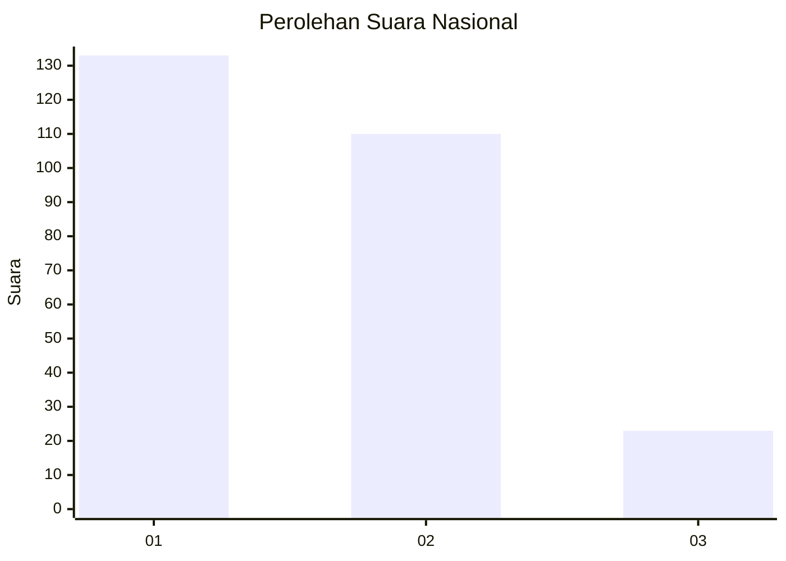
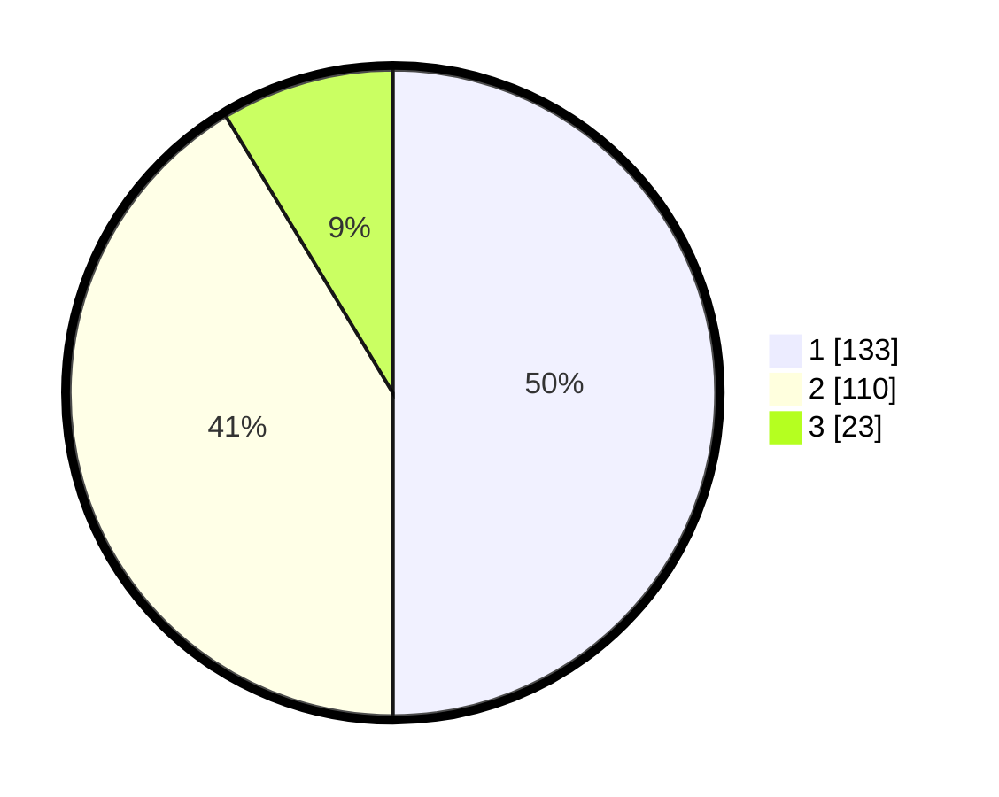

# Hasil

## Grafik

## Tabel

| No. | Nama Paslon    | Suara | Suara (raw) | Persentase |
|:--- |:-------------- | -----:| -----------:| ----------:|
| 1   | ANIES MUHAIMIN | 133   | [133][p-1]  | 50,00      |
| 2   | PRABOWO GIBRAN | 110   | [110][p-2]  | 41,35      |
| 3   | GANJAR MAHFUD  | 23    | [23][p-3]   | 8,65       |

[p-1]: https://github.com/gigit-pemilu/pemilu-2024/blob/main/pilpres/hitung-suara/sub/14-riau/sub/07--rokan-hilir/sub/03-tanah-putih/sub/1007-sedinginan/sub/005-tps/sub/paslon-1.txt
[p-2]: https://github.com/gigit-pemilu/pemilu-2024/blob/main/pilpres/hitung-suara/sub/14-riau/sub/07--rokan-hilir/sub/03-tanah-putih/sub/1007-sedinginan/sub/005-tps/sub/paslon-2.txt
[p-3]: https://github.com/gigit-pemilu/pemilu-2024/blob/main/pilpres/hitung-suara/sub/14-riau/sub/07--rokan-hilir/sub/03-tanah-putih/sub/1007-sedinginan/sub/005-tps/sub/paslon-3.txt

## Foto C Plano

https://sirekap-obj-formc.kpu.go.id/a848/pemilu/ppwp/14/07/03/10/07/1407031007005-20240219-171114--ec7fdb2a-ecbf-496c-abe6-5131bf654103.jpg

https://sirekap-obj-formc.kpu.go.id/a848/pemilu/ppwp/14/07/03/10/07/1407031007005-20240219-171744--0f1eba29-20d4-438d-ae7f-683bc7d4fb5e.jpg

https://sirekap-obj-formc.kpu.go.id/a848/pemilu/ppwp/14/07/03/10/07/1407031007005-20240219-171918--7324f028-385c-4a75-a22a-4912e8dfa8e7.jpg

## Metadata

| Key        | Value               |
| ---------- | ------------------- |
| Time Stamp | 2024-02-20 16:00:00 |

## DATA PEMILIH TETAP

Jumlah pemilih dalam DPT: **253**.
 * L: **150**.
 * P: **192**.

## DATA PENGGUNA HAK PILIH

Jumlah pengguna hak pilih dalam DPT: **263**.
 * L: **435**.
 * P: **129**.

Jumlah pengguna hak pilih dalam DPTb: **885**.
 * L: **808**.
 * P: **0**.

Jumlah pengguna hak pilih dalam DPK: **38**.
 * L: **50**.
 * P: **20**.

Jumlah pengguna hak pilih: **269**.
 * L: **437**.
 * P: **432**.

## JUMLAH SUARA SAH DAN TIDAK SAH

JUMLAH SELURUH SUARA SAH: **266**.

JUMLAH SUARA TIDAK SAH: **3**.

JUMLAH SELURUH SUARA SAH DAN SUARA TIDAK SAH: **269**.

