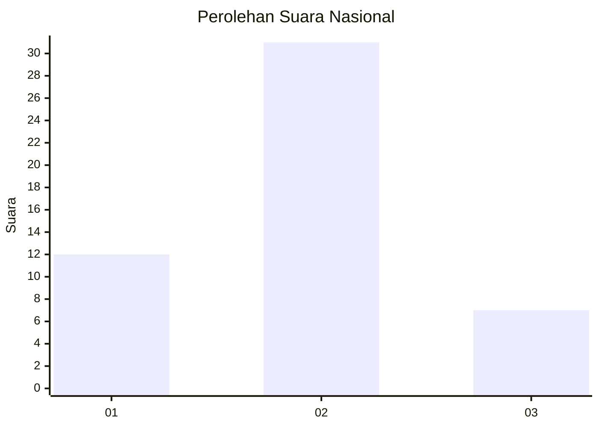
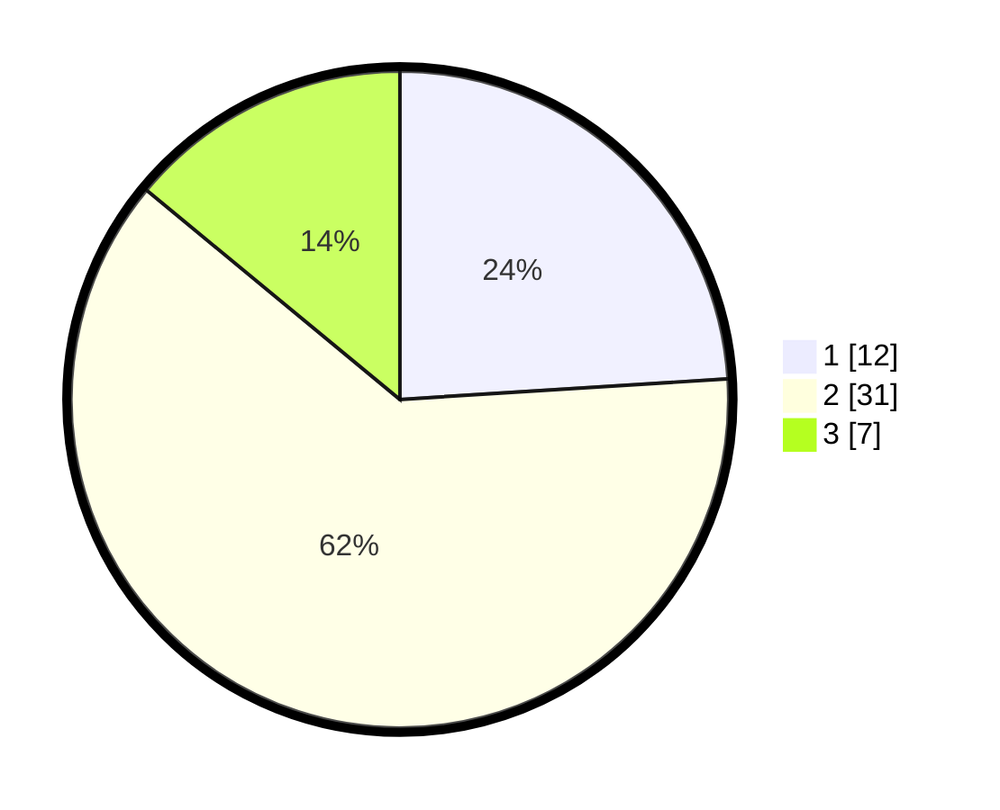

# Hasil

## Grafik

## Tabel

| No. | Nama Paslon    | Suara | Suara (raw) | Persentase |
|:--- |:-------------- | -----:| -----------:| ----------:|
| 1   | ANIES MUHAIMIN | 12    | [12][p-1]   | 24,00      |
| 2   | PRABOWO GIBRAN | 31    | [31][p-2]   | 62,00      |
| 3   | GANJAR MAHFUD  | 7     | [7][p-3]    | 14,00      |

[p-1]: https://github.com/gigit-pemilu/pemilu-2024/blob/main/pilpres/hitung-suara/sub/14-riau/sub/07--rokan-hilir/sub/03-tanah-putih/sub/2001-ujung-tanjung/sub/001-tps/sub/paslon-1.txt
[p-2]: https://github.com/gigit-pemilu/pemilu-2024/blob/main/pilpres/hitung-suara/sub/14-riau/sub/07--rokan-hilir/sub/03-tanah-putih/sub/2001-ujung-tanjung/sub/001-tps/sub/paslon-2.txt
[p-3]: https://github.com/gigit-pemilu/pemilu-2024/blob/main/pilpres/hitung-suara/sub/14-riau/sub/07--rokan-hilir/sub/03-tanah-putih/sub/2001-ujung-tanjung/sub/001-tps/sub/paslon-3.txt

## Foto C Plano

https://sirekap-obj-formc.kpu.go.id/986d/pemilu/ppwp/14/07/03/20/01/1407032001001-20240214-215138--3d506fd6-4110-4a92-81aa-d4b645ac9c53.jpg

https://sirekap-obj-formc.kpu.go.id/986d/pemilu/ppwp/14/07/03/20/01/1407032001001-20240214-155550--f54e5453-390b-41b3-aa69-5f5dee60d9e4.jpg

## Metadata

| Key        | Value               |
| ---------- | ------------------- |
| Time Stamp | 2024-02-15 22:30:27 |

